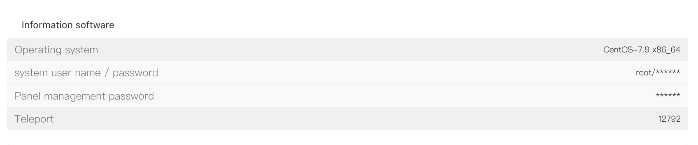

# Physical Server Control Panel

## I. Obtain the Panel Management Password

Log in to the platform and go to the **"Customer Center"**. Click **"My Products"**, locate the target server, and open the **"Product Details"** page.

On the **"Product Details"** page, go to the **"Server Information"** tab. In the **"Information software"** section, find **"Panel management password"** and click the **"\*"** icon to reveal the panel management password.

## II. Log in to the DCIM Service Panel

Open a browser and visit [**https://dsclient.raksmart.com**](https://dsclient.raksmart.com/ "https://dsclient.raksmart.com") to access the DCIM service panel login page.

On the login page:

- **Username:** enter the server’s **"Primary IP"**
- **Password:** enter the **"Panel management password"** obtained earlier

Then click **"Login"** to sign in.

## III. Server Operations

After logging in to the DCIM service panel, you can perform server actions such as **"Power on"**, **"Shut down"**, and **"Restart"**, making it convenient to manage and maintain your server remotely.
