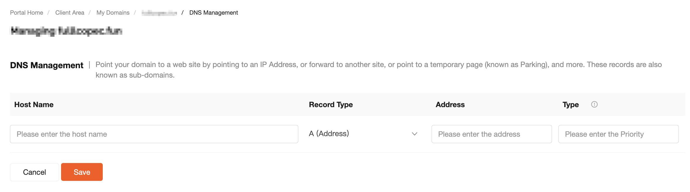
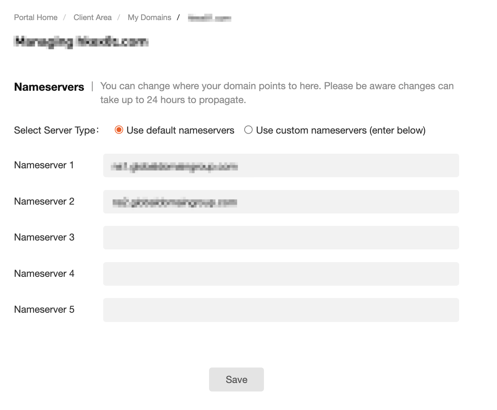

# DNS Management

## Overview

After a domain has been activated, you need to configure DNS settings in the platform backend. This allows the domain to be linked to the target server or service, so users can access the corresponding website, application, or other content through the domain name.

## 1. DNS Configuration Process

There are two DNS configuration methods. You should choose the appropriate one depending on your domain setup to ensure the records take effect correctly.

### Access Path

Go to:
Product Management → Domains & Websites → Domains

View your domain list

Click “Details” on the right to enter the management panel

---

### Method 1

#### Verification Notes

After the domain is activated, verification is required.

Please check your email inbox after placing the order, including the spam folder, and complete the verification promptly to ensure normal use of the domain.

#### Root Domain (Primary Domain)

Leave Hostname empty (or use @ if saving fails)

Enter the target IP address (e.g., 192.168.1.1)

This maps:
Example Domain → IP

If saving fails when the hostname is left blank, enter @ as the hostname and save again.

#### Subdomain

Enter hostname prefix (e.g., www)

Enter target IP

This maps:
www.example.com → IP

#### Nameservers

Use the default nameservers

****

---

### Method 2

#### Root Domain

Record type: A

Enter target IP (e.g., 192.168.1.1)

#### Subdomain

Hostname: prefix (e.g., www)

Record type: A

Enter target IP

#### Save Configuration

Click “Save” after completing setup.

DNS propagation may take 24–72 hours to fully take effect.

---

## 2. DNS Record Types

### A Record

Maps a domain to an IPv4 address.
Example:
Example Domain → 192.168.1.10

### AAAA Record

Maps a domain to an IPv6 address.
Example:
Example Domain → 2001:db8::1

### CNAME Record

Maps a domain alias to another domain.
Example:
www.example.com → Example Domain

Note: A CNAME record cannot coexist with an A record for the same hostname.

### Forward

Forwards requests for a domain to another URL.

The browser address bar will display the redirected URL.

Example:
old-site.com → https://new-site.com/page

### Stealth Forward

Keeps the original domain visible while loading content from another site, similar to an iframe.

### TXT Record

Stores text data for verification or configuration.

Common uses:

Domain ownership verification

Email authentication (SPF, DKIM)

Example:
v=spf1 include:\_spf.google.com ~all

### MX Record

Defines mail servers for receiving emails.
Example:
Example Domain → mail.example.com

### MXE Record

Allows email to be delivered directly to a server IP without complex configuration.

It automatically creates a special MX record.

### SPF Record

SPF is an anti-spam mechanism and is a type of TXT record.

It specifies which servers are allowed to send emails for your domain.

### URL Redirect

Redirects a domain using HTTP 301/302.

### URL Frame

Embeds another website inside your domain using a frame-based display.

---

## 3. Important Notes

### Accuracy of Records

Ensure hostname and IP values are correct.

Misconfiguration may cause:

Domain not resolving

Website inaccessible

### Propagation Time

DNS changes require global synchronization.

This may take 24–72 hours.

Temporary inconsistency is normal.

You can verify using:

nslookup Example Domain

ping Example Domain

### Nameserver Changes

Old DNS records will gradually become invalid.

Ensure new nameservers have the correct records configured.

Prevent service interruption.

### Domain Verification

Complete verification promptly.

Unverified domains may have DNS resolution suspended, which may affect accessibility.
