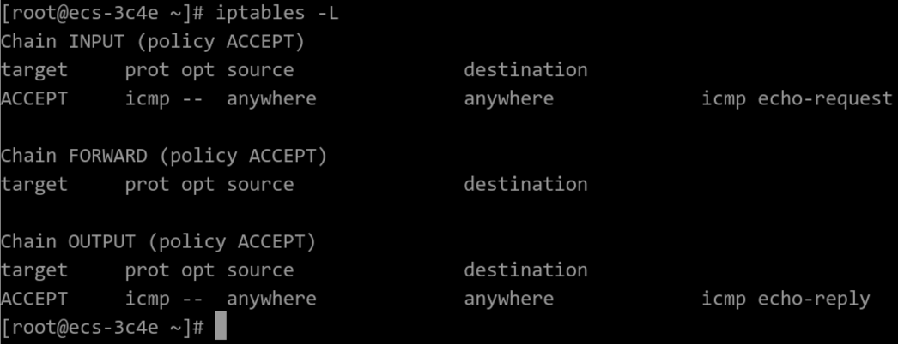
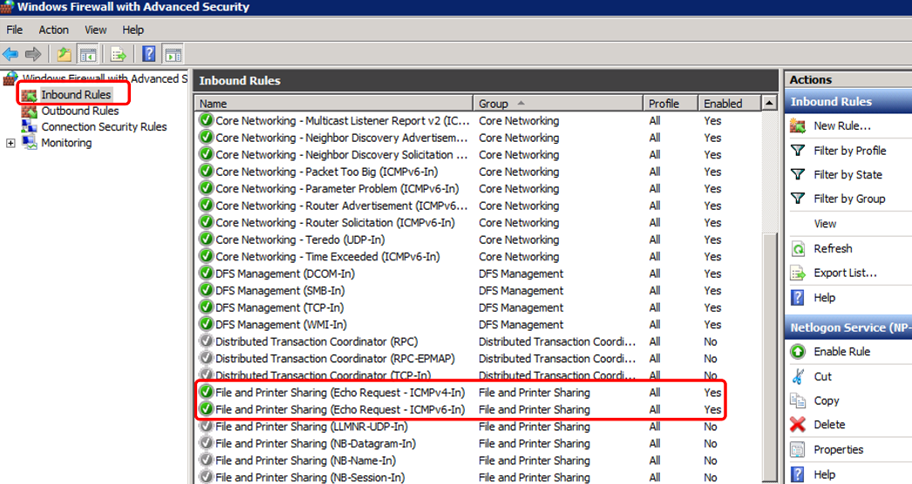
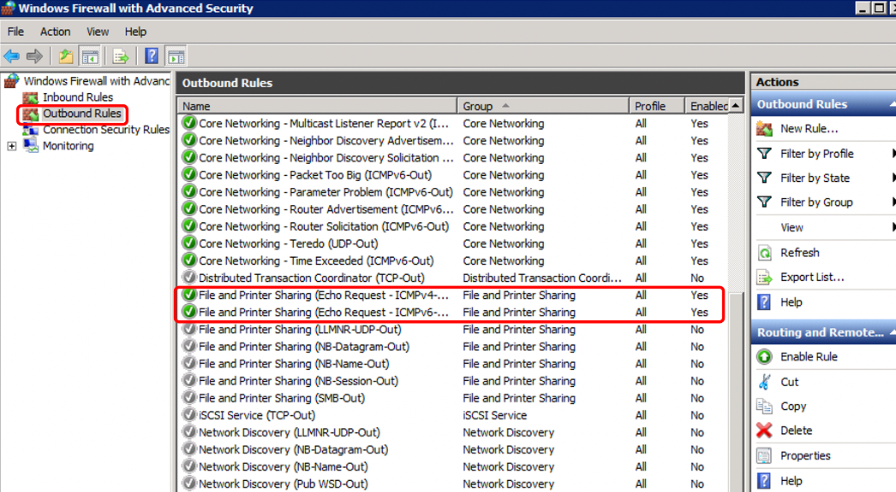
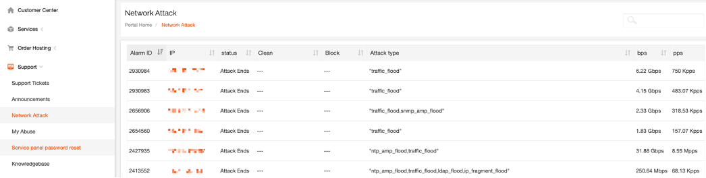
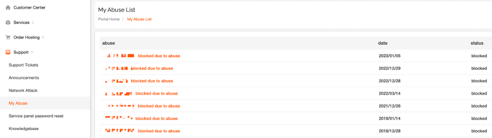

# How to troubleshoot when the server cannot be pinged

When the machine cannot communicate properly, you can use VNC to log in to the system and perform the following checks:

一．Checking the status of the system network interface card (NIC):

To check the status of the NIC, you can use the following commands:

- cat /sys/class/net/ethx/operstate`: This command displays the operational state of the network interface. If the output is "up," it means the NIC is enabled and functioning. If the output is "down," it means the NIC is disabled or not functioning properly.
- ethtool ethx | grep Link`: This command provides information about the link status of the NIC. If the output shows "Link detected: yes," it means the NIC is connected and functioning. If it shows "Link detected: no," it means the NIC is not connected or not functioning properly.
- systemctl restart network`: This command restarts the network service, including all network interfaces. It can be used to refresh the network settings and resolve any network-related issues.
- Note: Replace "ethx" with the actual network interface name, such as eth0, eth1, etc.

二．Checking the IP configuration in the network interface configuration file:

To check the IP configuration in the network interface configuration file, follow these steps:

1.  Open the network interface configuration file using a text editor.  The location of the file may vary depending on the Linux distribution, but common locations include `/etc/network/interfaces` or `/etc/sysconfig/network-scripts/ifcfg-ethx`.

2.  Look for the configuration lines related to the network interface you are checking (e.g., `eth0`).  The lines should include information such as IP address, netmask, gateway, and DNS servers.

3.  Verify that the IP configuration is correct, including the correct IP address, subnet mask, gateway, and DNS server addresses.  Make sure there are no syntax errors or typos in the configuration.

4.  If you make any changes to the configuration, save the file and exit the text editor.

5.  Restart the network service to apply the changes.  You can use the command `systemctl restart network` or `service networking restart` depending on your Linux distribution.

6.  After restarting the network service, use the `ip addr` or `ifconfig` command to check if the IP configuration has been applied correctly to the network interface.

If there are any configuration errors or the configuration is not successful, you may need to correct the configuration file and restart the network service again.

三.Checking if ICMP rules are added to the security group in a cloud instance or bare metal cloud

四.To check the firewall settings on a Linux system:

Linux System

1.Execute the following command to check the firewall status. This example uses CentOS 7:

#firewall-cmd --state  If the output shows "running," it means the firewall is enabled.

2.To check if there are any security rules restricting access within the server

#iptables -L  The output displayed below indicates that no ICMP rules are being restricted.

3.If ICMP rules are being restricted, please execute the following command to enable the corresponding rules.

#iptables -A INPUT -p icmp --icmp-type echo-request -j ACCEPT

#iptables -A OUTPUT -p icmp --icmp-type echo-reply -j ACCEPT

Windows System

1. To log in to a Windows server, click on the Windows icon at the bottom left corner of the desktop and select "Control Panel > Windows Firewall."

2. Click on "Turn Windows Firewall on or off."

Check and set the specific status of the firewall: whether it is turned on or off.

3. If the firewall status is "On," proceed to step 4.

4. Check the enablement status of ICMP rules in the firewall.

- On the "Windows Firewall" page, select "Advanced settings" from the left navigation pane.
- Enable the following rules:

Inbound Rule: "File and Printer Sharing (Echo Request - ICMPv4-In)"

Outbound Rule: "File and Printer Sharing (Echo Request - ICMPv4-Out)"

- If IPv6 is enabled, also enable the following rules:

Inbound Rule: "File and Printer Sharing (Echo Request - ICMPv6-In)"

Outbound Rule: "File and Printer Sharing (Echo Request - ICMPv6-Out)"

Inbound Rule

Outbound Rule

五.Check if it is due to ICMP (ping) being disabled, causing the inability to ping.

Windows system

Enable Ping settings using the command line

1. Open the Command Prompt window.

2.Execute the following command to enable Ping settings

netsh firewall set icmpsetting 8

Linux system

Check the server's kernel parameters:

1. Check the value of the configuration item "net.ipv4.icmp\_echo\_ignore\_all" in the file `/etc/sysctl.conf`. A value of 0 means Ping is allowed, and a value of 1 means Ping is disabled.

2. To temporarily allow Ping, use the following command: `echo 0 >/proc/sys/net/ipv4/icmp\_echo\_ignore\_all`.

To permanently allow Ping, modify the configuration in the following way: `net.ipv4.icmp\_echo\_ignore\_all=0`.

六．Check if the IP address has any network attacks or complaints resulting in suspension.

七．Check if the network is functioning properly.

1. Check the local network by performing a Ping test using a host in the same region.

Use a cloud server in the same region to Ping the unresponsive public IP. If the Ping is successful, it indicates that the virtual network is functioning properly. In this case, you should investigate any potential issues with the local network and then retest the Ping.

2. Check for any link failures.

Packet loss or high latency issues during Ping tests can be caused by network congestion, node failures, or high server loads.

Please refer to the specific troubleshooting steps for further investigation:[Installation and Usage of MTR Tool](https://billing.raksmart.com/whmcs/index.php?rp=/knowledgebase/576/Installation-and-Usage-of-MTR-Tool.html)
