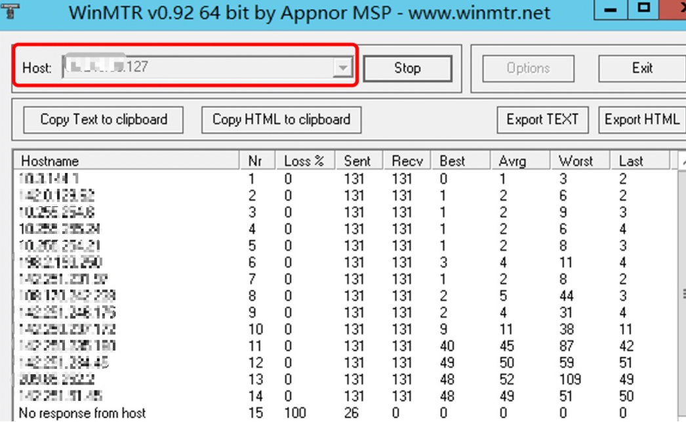
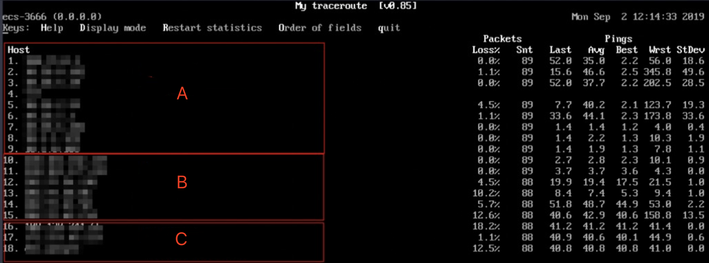
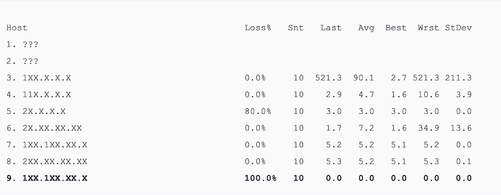
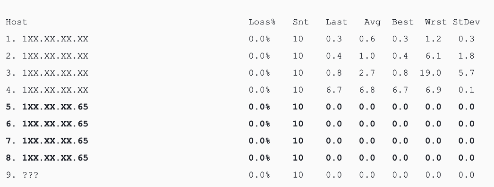

# Installation and Usage of MTR Tool

Packet loss or high latency may be caused by reasons such as network congestion, link node failures, high server load, or system configuration issues.

After ruling out server-related issues, you can further diagnose the problem using the MTR tool.

MTR is a route tracing and testing tool that allows you to view the latency and packet loss of all the routing nodes between your local machine and the server, as well as between the server and your local machine.  This helps in identifying the underlying issues.

一.Windows System

 

Installation:

 

Access the Internet through a web browser and search for the WinMTR installation package.

Alternatively, you can use the following link: \*\*http://tools.saiwa.cc/WinMTR\_x64.exe\*\* to download it directly without installation.

 

Usage:

 

1. In the WinMTR window, enter the destination server's IP address or domain name in the "Host" field, then click "Start".

 

2. Depending on the situation, wait for WinMTR to run for a period of time, then click "Stop" to end the test.

3.The main information in the test result is as follows:

- Hostname: IP address or domain name of each host that the packets pass through to reach the destination server.
- Nr: Number of nodes passed through.
- Loss%: Packet loss percentage for each corresponding node.
- Sent: Number of packets sent.
- Recv: Number of responses received.
- Best: Shortest response time.
- Avrg: Average response time.
- Worst: Longest response time.
- Last: Recent response time.

二.Linux System

Installation:

 

For CentOS: Execute the command "yum install mtr -y".

For Ubuntu or Debian: Execute the command "apt-get install mtr -y".

MTR Parameters Explanation

- -h/--help: Display the help menu.
- -v/--version: Display MTR version information.
- -r/--report: Output the results in report format.
- -p/--split: Opposite of --report, display the results of each individual trace.
- -c/--report-cycles: Specify the number of data packets sent per probe. The default value is 10.
- -s/--psize: Set the size of the data packets.
- -n/--no-dns: Disable DNS resolution for IP addresses.
- -a/--address: Set the source IP address for sending data packets, useful in scenarios with a single host having multiple IP addresses.
- -4: Use IPv4.
- -6: Use IPv6.

Execute the command：mtr 119.xx.xx.xx

The main output information is as follows:

- HOST: IP address or domain name of the node.
- Loss%: Packet loss percentage.
- Snt: Number of packets sent per second.
- Last: Latest response time.
- Avg: Average response time.
- Best: Shortest response time.
- Wrst: Longest response time.
- StDev: Standard deviation. A higher deviation indicates greater variation in response times of packets at that node.

三.Analysis and handling of reports from WinMTR and MTR

1. Local Network: Referring to the A area in the diagram, it represents the local LAN and the network provided by the local Internet service provider.

 

If there are anomalies in the nodes of the client's local network, it is necessary to investigate and analyze the local network accordingly.

 

If there are anomalies in the network provided by the local Internet service provider, it is necessary to report the issue to the local ISP.

 

2. ISP Backbone Network: Referring to the B area in the diagram, if there are anomalies in this area, you can use the IP address of the problematic node to identify the corresponding ISP and report the issue to them.

 

3. Target Endpoint Local Network: Referring to the C area in the diagram, it represents the network of the target server's hosting provider.

 

If packet loss occurs at the destination server, it may be due to the network configuration of the destination server. Please check the firewall configuration of the destination server.

 

If packet loss occurs in the hops close to the destination server, it may be a network issue with the hosting provider of the target server.

四.Common cases of link abnormalities

1.Improper configuration of the destination host.

In the following example, there is 100% packet loss at the destination address. From the data, it appears that the packets did not reach the destination. However, it is highly likely that this is due to network configuration issues on the destination server. It is recommended to check the firewall configuration on the destination server.

2.ICMP rate limiting

In the following example, there is packet loss at the 5th hop, but there are no abnormalities in the subsequent nodes. It is inferred that this is due to ICMP rate limiting at that particular hop. This scenario does not affect the data transmission from the client to the destination server. When analyzing, this kind of scenario can be ignored.

3.Routing loop

In the following example, there is a loop in the network path after the 5th hop, which results in the packets being unable to reach the destination server. This scenario occurs due to routing configuration issues with the related nodes of the ISP. It is necessary to contact the corresponding ISP responsible for those nodes to resolve the issue.

4.Link interruption

In the following example, there is a loss of connectivity after the 4th hop, and no further responses are received. This typically indicates a disruption in the corresponding node. It is recommended to perform a reverse path test for further confirmation. In this scenario, it is necessary to contact the responsible ISP for the respective node to resolve the issue.

