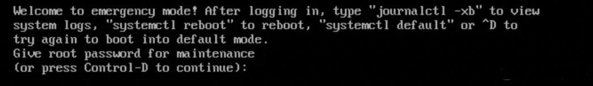
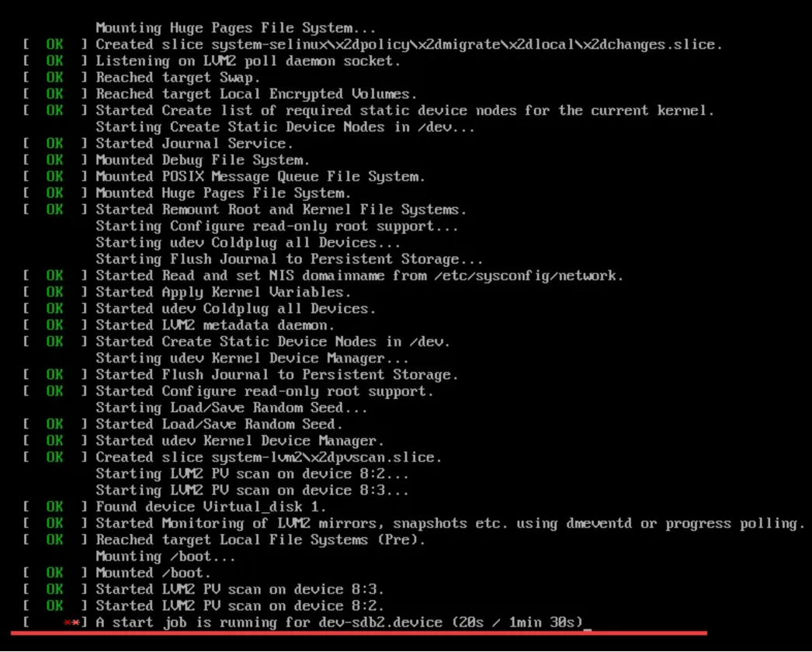
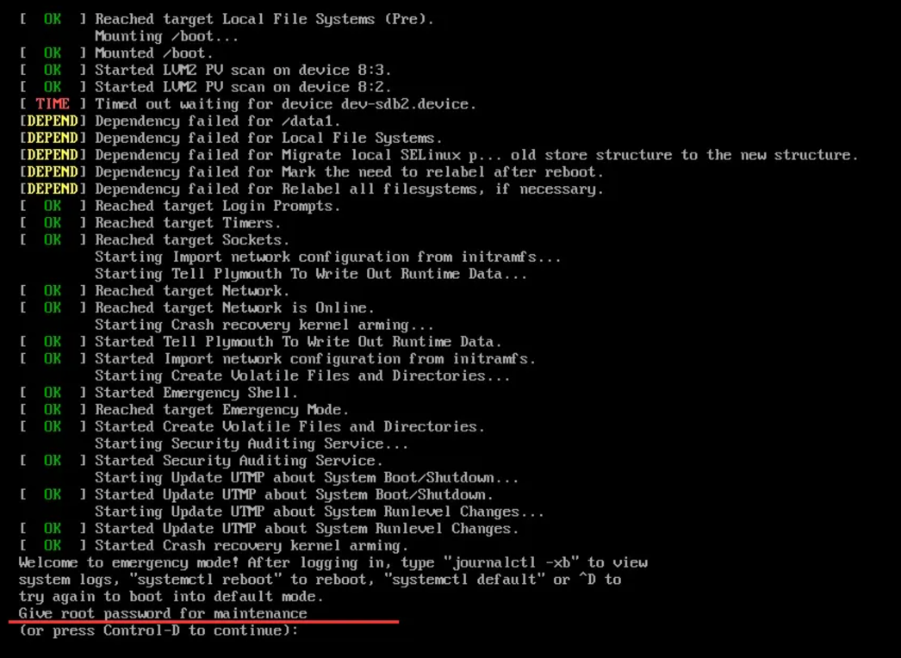
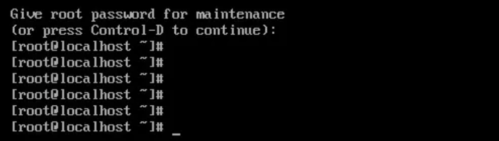
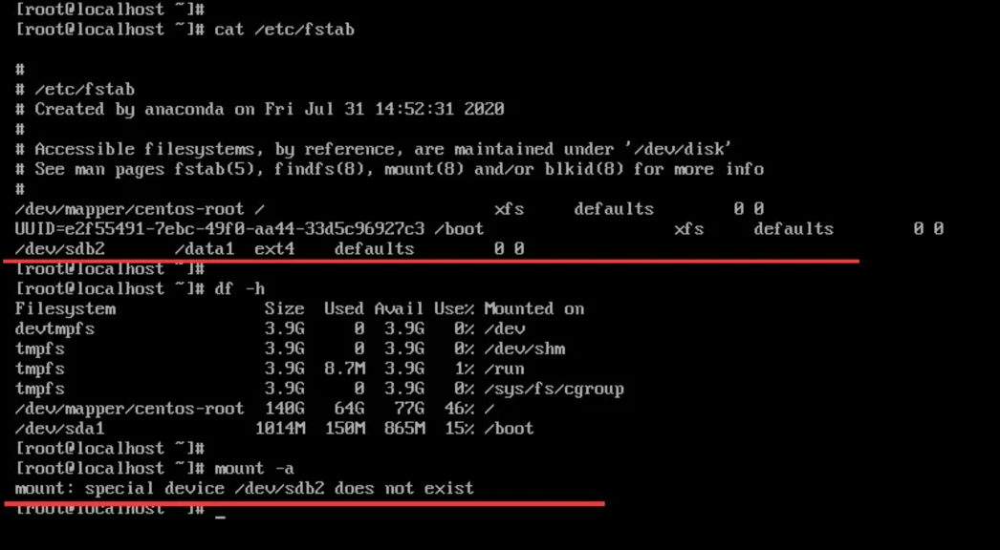

# An incorrect configuration in the /etc/fstab file on the Linux system is causing login issues

Encountering communication issues with the machine, I checked the system error messages through the VNC window in the background but couldn't access the system properly.

 

The following error messages were found:

 

(1) Disk corruption: There is usually a prompt indicating which disk or partition has an issue. You can use the fsck command to repair it and then restart the system.

 

(2) There might be a problem with a disk or incorrect formatting in the /etc/fstab file, causing the mounting to fail.

 

1.To determine the specific issue, we can follow these steps:

Press Ctrl+Alt+Delete to initiate a system restart. Monitor the terminal for the startup logs.  If there are issues, the log will likely remain paused at a particular step, as shown in the provided image. Based on the information, it appears that there is a problem with the /dev/sdb2 device.  This suggests that there may be an issue with the mounting of /dev/sdb2. Since disk mounts are typically configured in the /etc/fstab file during system startup, we should continue waiting and proceed to access the system to examine the /etc/fstab file.

2.After waiting for a while, the login screen reappeared with terminal prompts. The message prompts you to enter the root password. Please enter the root password and press Enter.

 

3.After entering the password and pressing Enter, you will have successfully logged into the system.  Now you can proceed to view the /etc/fstab file. 

 

4.After examining the /etc/fstab file, it was discovered that the mount configuration for /dev/sdb2 exists. Checking the mount status reveals that it is not mounted. Attempting to manually mount it using the command "mount -a" resulted in an error message stating that /dev/sdb2 does not exist.

 

5.Upon checking the disk partition information, it was noticed that only /dev/sdb1 is present, and there is no /dev/sdb2.

 

6.Indeed, you can resolve this issue by editing the /etc/fstab file and commenting out the configuration for /dev/sdb2.  Once you make this change, restart the system to apply the modifications.  This should solve the problem.

 

If you encounter difficulties accessing the system normally, you can try entering rescue mode to modify the /etc/fstab file.
