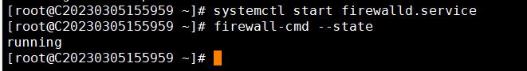
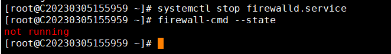
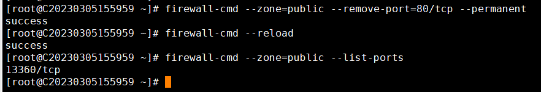

# CentOS 7.x Firewall: Enable/Disable and Add Ports

In CentOS 7.x, the default firewall is firewalld. Here is an example using CentOS 7.6

1.To check the firewall status, run the command: `sudo firewall-cmd --state`

If the firewall status shows "not running," it means that the firewall is not enabled.

2.To enable the firewall, you can use the following command: `systemctl start firewalld`.

"Running" indicates that the firewall is currently active and running.

3.disable the firewall, you can run the command: `systemctl stop firewalld.service`.

3. 4.restart the firewall, you can run the command: `systemctl restart firewalld.service`.

5.To view all open ports in the firewall, you can use the command: `firewall-cmd --zone=public --list-ports `.

As shown in the above image, only port 13360 is open, which is the remote port number.

5. 6.Open port

firewall-cmd --zone=public --add-port=80/tcp --permanent # Open port 80

The return value "success" indicates that the port has been successfully opened.

7.firewall-cmd --reload # Make the configuration take effect immediately.

As shown in the above figure, please check all the open ports of the firewall. Port 80 is currently open.

8.firewall-cmd --zone=public --remove-port=80/tcp --permanent  #Close port 80.

9.After closing port 80, check that port 80 is closed once the configuration takes effect.
