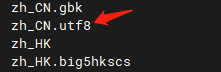
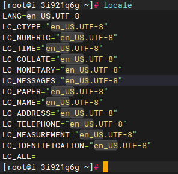
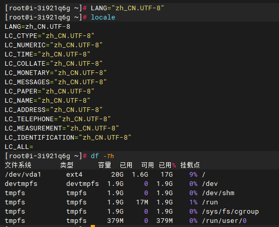
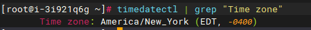
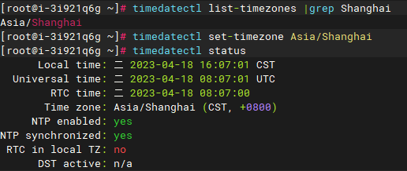
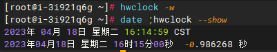

# Changing Language and Timezone in CentOS 6/7

**CentOS6**

**Change the default system language from English to Simplified Chinese：**

1.Query all language packs installed for the current day： locale -a

2 .Modify the configuration file: vi /etc/sysconfig/i18n, comment out the default option in the first line. After making the changes, save and exit by typing :wq. Restart the system for the changes to take effect.

3.We can use yum to download wget and test it. Upon testing, we can confirm that the system language has successfully switched to Simplified Chinese.

Modify the time.：

1.Displaying the time range and hardware time: `date -R; date; time`

+0800 represents Beijing time in mainland China. If it is explicitly stated as +0800 (UTC+8) or (China Standard Time), it refers to China Standard Time. Beijing and Shanghai are in the same time zone, so only one of them can be retained. As Shanghai already serves as a representative of the time zone, its maintainers may not have sufficient motivation to make changes.

2.Set the time zone to Shanghai.：cp /usr/share/zoneinfo/Asia/Shanghai / etc /localtime

The time zone information is stored in `/usr/share/zoneinfo/`, while the local time information for the current machine is stored in `/etc/localtime`.

3.Display system time and hardware time： date;hwclock -r

**CentOS7.x**

Change the default system language from English to Simplified Chinese：

1. View the current language configuration：locale

Display support for English language.

2. In CentOS 7, there are two ways to set the system language:

Installing language packages and fonts (if needed) Execute: `yum groupinstall "fonts" -y` to check if the `zh\_CN.utf8` language package is available. If not, you need to download and install the fonts. If it is already installed, you can skip this step.

Temporary language setting:

Execute: `LANG="zh\_CN.UTF-8"`. After setting the language, execute `df -Th` to verify that the system language has been changed to Simplified Chinese.

Drawback: After restarting the server, the system language will be reverted back to the default language.

Permanent setting:

Execute: `localectl set-locale LANG=zh\_CN.UTF-8`, then restart the server: `reboot`. After the server shuts down or restarts, the system language environment will still be set to Simplified Chinese when it boots up again.

To view the current time zone information, execute: `timedatectl | grep "Time zone"`.

To set the time zone to China Mainland (UTC+8), use the `timedatectl` command as follows:

timedatectl list-timezones |grep Shanghai  #To display the currently configured time zone of the system

timedatectl set-timezone Asia/Shanghai #Set time zone.

timedatectl status #View system time.

Execute: hwclock -w (equivalent to hwclock --systohc, requires root privileges), synchronize BIOS hardware time.

