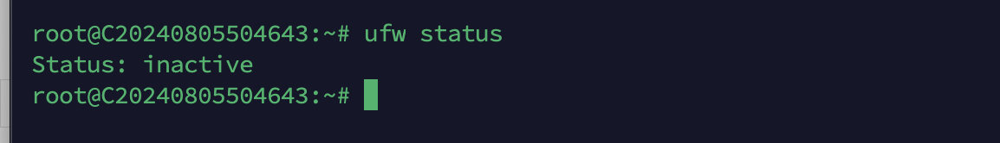
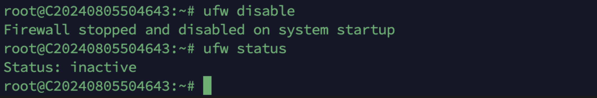

# Enable/Disable Firewall and Modify Remote Port in Ubuntu 18.04-22.04

In Ubuntu 18.04-22.04, the default firewall system is **ufw (Uncomplicated Firewall)**. Taking Ubuntu 18.04 as an example, it can be configured as shown in the following picture:

1. Check the Firewall Status (Default is Disabled)
#ufw status 

2. Enable the Firewall

#ufw enable

3.Disable the Firewall

#Ufw disable 

4.If the firewall is enabled, the commands to allow a specific port are as follows:

ufw allow 80/tcp                         ##Allow port 80 
ufw allow 22/tcp                         ##Allow port 22 
ufw allow 8112/tcp                     ##Allow port 8112 
ufw allow 1000:2000/tcp            ##Allow the port range 1000 to 2000.

5.The commands to delete an allowed port are as follows:

ufw delete allow 80/tcp               ##Delete the rule allowing port 80
ufw delete allow 22/tcp               ##Delete the rule allowing port 22 
ufw delete allow 1000:2000/tcp   ##Delete the rule allowing the port range 1000:2000

6.Modify the remote SSH port, restart the SSH service, and allow the new remote port.

For example, if the current remote port is 22 and you need to change it to 2882, the commands are as follows:
sed -i 's/^Port 22/Port 2882/' /etc/ssh/sshd\_config     ##Modify the remote port 
systemctl restart sshd                 ##restart the SSH service 
ufw allow 2882/tcp                     ##allow the new remote port

7.Use the new port for remote login.

ssh root@ specific IP -p 2882 

(The above operations are also applicable to Debian 10-12 systems.)
