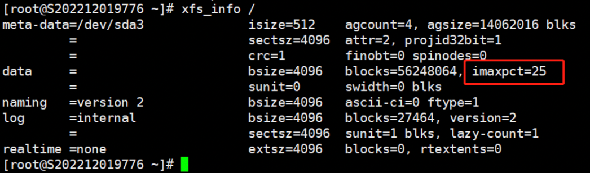
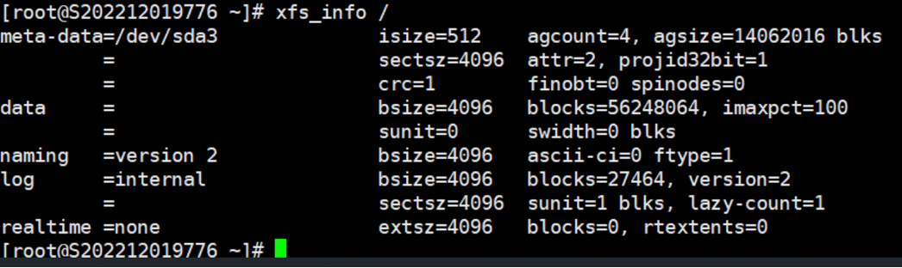

# Expand inode available space in a Linux system

1．Check if the file system that needs to be expanded is of XFS format：`df -hT`

``

2．The command *`df -i`* is used to view inode information

File system, inode available space, inode used space, free space, inode used%, mount point

3．The command *`xfs_info <mount_point>`* is used to view detailed information about an XFS volume.

The term *imaxpct* represents the percentage of space available for inode allocation, with 25% of space reserved by default for inode allocation.

Note: For file systems under 1TB, the default value is 25%; for file systems under 50TB, it is 5%; and for file systems over 50TB, it is 1%.

4．Use the command: *`xfs_growfs -m % <mount_point>`* to change the inode space percentage.

Note: *`-m [maxpct]`*: Specifies the new value for the maximum percentage of space in the file system that can be allocated for inodes.

5．Finally, check the expanded Inode space by using the command *`df -i`*.

Additionally, if the partition is in ext4 format, for non-system partitions, the size can be manually specified during formatting.

The partition needs to be unmounted before executing the following command.

`mkfs.ext4 -i 8192 /dev/sda5`

Note: 8192 represents 8K per inode, the default is 16K per inode.
