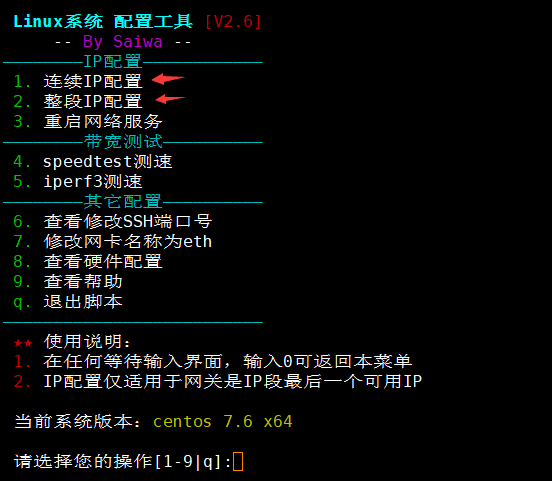
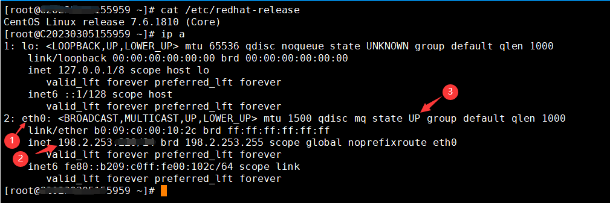
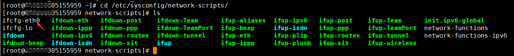
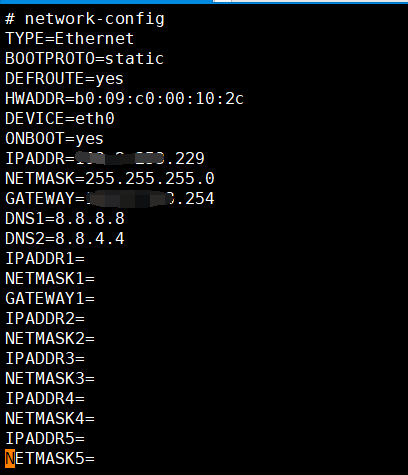
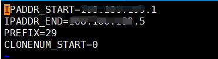

# How to configure multiple IP addresses in CentOS operating system

一.You can use the "Linux\_tools.sh" script to automatically add multiple IP addresses.

- Download and install the script using the following link：[system tools](https://billing.raksmart.com/whmcs/index.php?rp=/knowledgebase/189/system-tools.html)

Usage Instructions:

- At any prompt, enter 0 to return to the menu. By default, the script will be automatically deleted upon exit. However, in some cases, manual deletion may be required if the script fails.

IP Configuration Function:

- The IP configuration function supports CentOS 6-8, Ubuntu 14-22, and Debian systems. Both block IP configuration and sequential IP configuration must strictly follow the example provided.
- If there is only one network interface in the system that is in an UP state, the IP will be configured on that interface by default. If there are multiple network interfaces in an UP state, you can select the interface to configure the IP.
- When configuring IP on CentOS, simply press Enter to configure the IP in the main network configuration file. If you choose to configure it in range format, it may take longer to take effect, and there may be a timeout when executing the network service restart command. In reality, the configuration is already taking effect gradually, so please avoid repeating the network service restart command.
- In Ubuntu systems, there may be errors when restarting the network service. If you have checked the configuration file and found no issues (usually alignment issues in the configuration file), you can simply reboot the system to apply the changes.
- If you have any questions, enter 9 to view the help menu.

二、Manual Configuration:

1.First, you need to confirm the network interface name.

You can use the command "ip a" to check the status of the network interfaces and see the existing IP configurations on your machine. This will help you determine which network interface you want to configure with the multiple IPs.

- Check the network interface name: eth0

- Check the previous IP configurations on eth0
- Ensure that the network interface is in the UP state, indicating that it is open and connected to the network.

 

2.Primary Network Interface IP Configuration

Execute: `cd /etc/sysconfig/network-scripts/` to enter the directory of network interface configuration files.

To list the files in the directory, execute the command: `ls`

To edit the network interface configuration file for eth0, you can use either of the following commands:

1. Absolute path command: `vi ifcfg-eth0` This command will open the network interface configuration file for editing.
2. Relative path command: `vi /etc/sysconfig/network-scripts/ifcfg-eth0` This command will also open the network interface configuration file for editing.

To configure a range of /29 IP addresses (5 addresses in total), with the numbers 1, 2, 3, 4, and 5 representing the order of the IP addresses, and a single gateway entry, you can follow these steps:

After entering the network interface configuration file, press `a` to enter insert mode. Use the arrow keys to move to the last line and add the desired configuration. Press `ESC` to exit the insert mode and return to command mode. Finally, press `:wq` to save the changes and exit the editor.

Press `Shift+:` to enter the command mode. Then type `wq` to save the changes and exit the editor. Press Enter to confirm.

- IPADDR=Please write the assigned IP addresses.

- NETMASK=Subnet mask for IP allocation.

- GATEWAY=Gateway for IP allocation.

3.Restart the network interface for the configuration to take effect.

Execute the command：systemctl restart network

4.Additional network interface IP configuration

For additional network interface IP configuration, you need to create a new subinterface configuration file in the /etc/sysconfig/network-scripts/ directory. The file should be named "range", and if you are configuring a range of 4 IPs (4\*/26) or 8 IPs (8\*/27), each segment of IPs can have its own "range" file.

The files should be named as range0, range1, range2, range3, and so on, in sequential order.

You can use either of the following commands to create a configuration file for adding a /29 segment:

1. Absolute path command: `vi /etc/sysconfig/network-scripts/ifcfg-eth0-range0`
2. Relative path command: `ifcfg-eth0-range0`

The configuration commands are as follows:

- IPADDR\_START= Start IP address
- IPADDR\_END= End IP address
- PREFIX=29 Subnet mask
- CLONENUM\_START=0 Subnet start address

After entering the network card configuration file, press "a" to enter the insert mode and add the desired configuration. Then press "ESC" to exit the insert mode. Finally, type ":" followed by "wq" to save and exit the file. Press Enter to confirm.

5.Restart the network card to apply the configuration changes.

Execute the command：systemctl restart network

If neither of the above methods work and the configuration changes do not take effect, please contact technical support by submitting a ticket for assistance.
