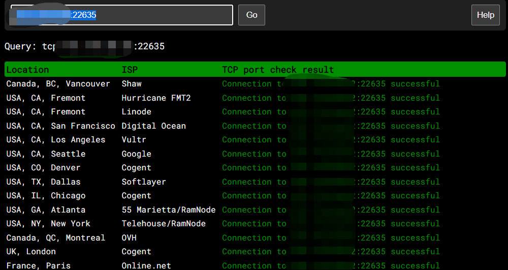

# How to enable/disable ping on Linux system

To prevent others from discovering and potentially attacking your machine through network ping scans, you can configure your system to disable or block the ping command.

Linux systems allow ping responses by default. The ability to ping is determined by two factors:

- Kernel parameters
- Firewall

To allow ping, both factors need to be enabled. If either of the two factors prohibits ping, it will not be possible to ping the system.

一.The method to disable ping at the kernel level is as follows:

First, let's check if the IP is responding properly by using the ping.pe website. Input the IP and test the connectivity. This will show if the target IP allows ping requests.

Temporarily disabling ping. ：

#   echo 1 >/proc/sys/net/ipv4/ icmp\_echo\_ignore\_all

At this point, if we check the IP, we can see that ping is disabled. If we still want to test the IP connectivity, we can perform a ping test on a specific port. Here, we can see that the connection is successful. Since ping is temporarily disabled, the ping functionality will be restored after a machine reboot.

Permanent disabling of ping

#vi  /etc/sysctl.conf   #Enter the configuration file.

Add a line inside：net.ipv4.icmp \_echo\_ignore\_all= 1

If you already have "net.ipv4.icmp\_echo\_ignore\_all" in the file, you can directly modify the value after the "=" sign. (0 means allow, 1 means deny)

#  sysctl -p    #Apply the new configuration.

Check if ping is disabled.

# cat /proc/sys/net/ipv4/icmp\_echo\_ignore\_all

The value "1" indicates that ping is disabled, while the value "0" indicates that ping is enabled.
