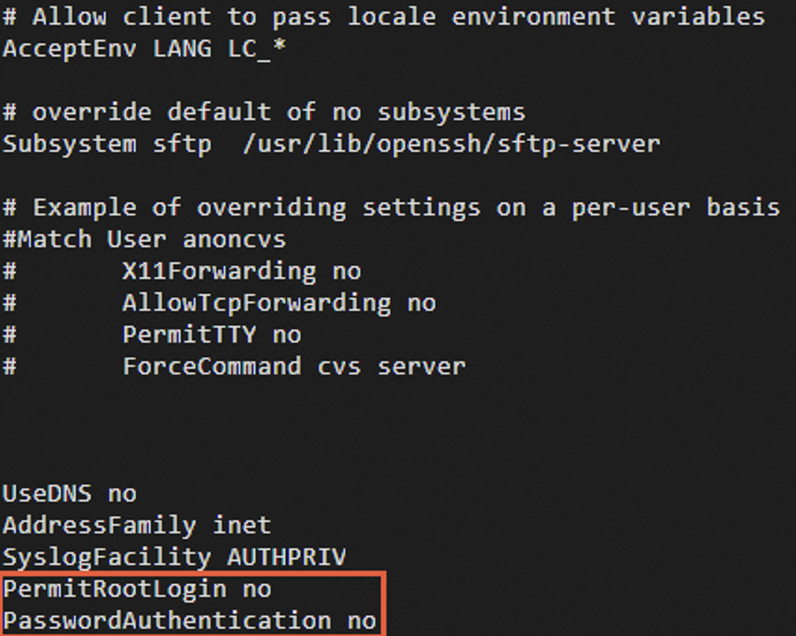
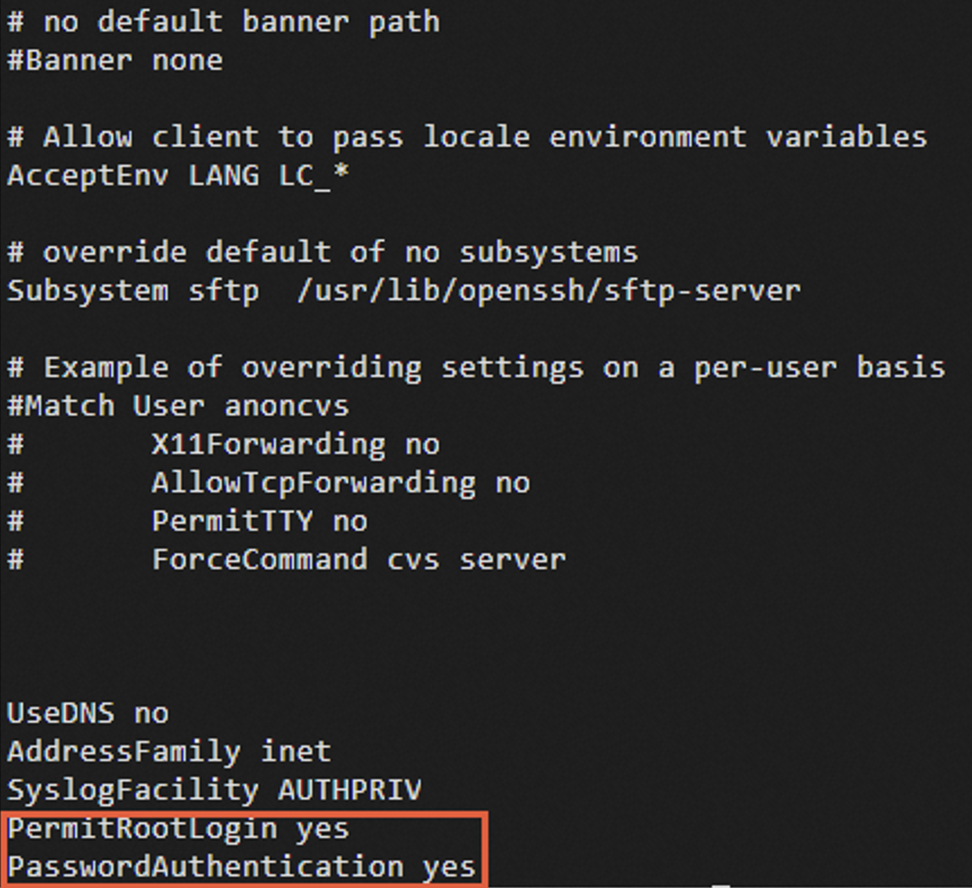

# How to handle the "Permission denied, please try again" error when SSH logging into Linux

Problem:

 

When trying to SSH into a Linux system on an ECS instance using a local SSH client, even after entering the correct password, an error message similar to the following appears:

 

- Permission denied, please try again
- SSH server denied password, please try again.

Reasons:

 

1. Root user login disabled within the ECS instance: The SSH service configuration file `/etc/ssh/sshd\_config` has the `PermitRootLogin` or `PasswordAuthentication` parameter set to "no".

You can refer to the following solution for the issue caused by disabling root user login:

 

2. SELinux service enabled on the Linux system, preventing both root and regular users from logging in.

Execute `cat /var/log/secure` to view the `secure` log.    If the log contains `error: Could not get shadow information for root.   `, it indicates that SELinux service is enabled.

You can refer to the following solution for the issue caused by SELinux service:

Solution:

一．Solution for the issue caused by disabling root user login:

 

1. Log in using VNC.

 

2. Check the configuration of the `PermitRootLogin` or `PasswordAuthentication` parameter in `/etc/ssh/sshd\_config`.

- #cat /etc/ssh/sshd\_config

As shown in the following figure, when the `PermitRootLogin` and `PasswordAuthentication` parameters are set to "no", it means that root user login is disabled, and password authentication is also disabled.

3.Modify the configuration of `PermitRootLogin` and `PasswordAuthentication` according to your business requirements.

Open the SSH configuration file:

- vi /etc/ssh/sshd\_config

4.Modify the values of the `PermitRootLogin` and `PasswordAuthentication` parameters:

- If you want to allow root user login, set the value of `PermitRootLogin` to "yes".
- If you want to allow password authentication, set the value of `PasswordAuthentication` to "yes".

5.Press the Esc key, then type ":wq" to save the changes and exit.

6.Execute the following command to restart the SSH service:

- systemctl restart sshd.service

二．Solution for SELinux service causing the issue

You can choose to temporarily or permanently disable the SELinux service based on your specific situation to resolve the SSH connection issue.

To check the SELinux service status:

1. Log in to the ECS instance using VNC.

2. Execute the following command to view the current SELinux service status:

- /usr/sbin/sestatus -v

The system displays something like the following:

SELinux status:       enabled

SELinux status  The parameter values are explained as follows:

enabled: SELinux service is enabled

disabled: SELinux service is disabled

3.Disable SELinux service.

 

Disabling SELinux temporarily will be effective until the system is rebooted.

Temporarily disable SELinux by executing the following command.

- setenforce 0

To permanently disable SELinux, execute the following command:

- sed -i 's/SELINUX=enforcing/SELINUX=disabled/' /etc/selinux/config

Please note that this command is applicable only when the current SELinux status is set to "enforcing".

4.Restart the instance for the changes to take effect.
