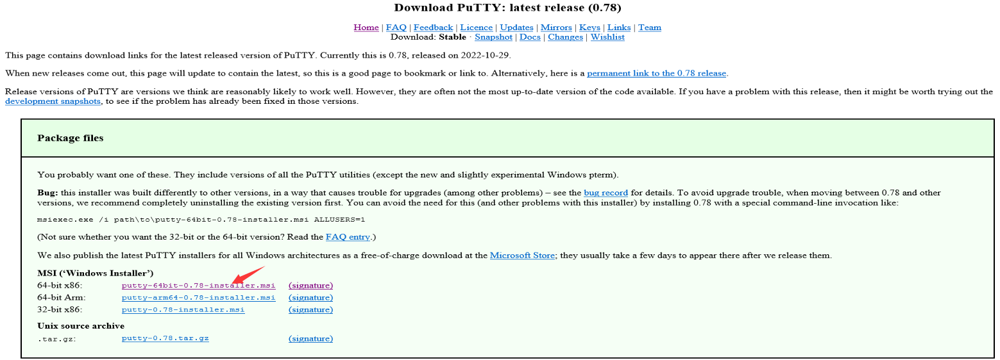
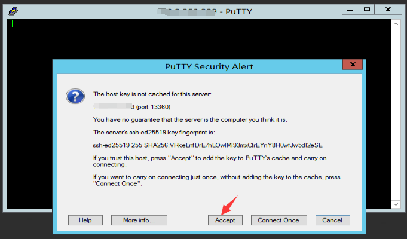
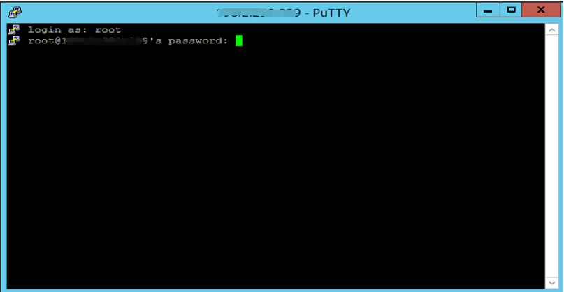
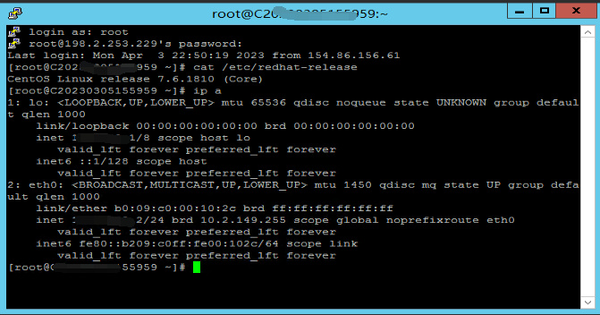

# How to remotely access a Linux system using Putty tool

Introduction to Putty software

PuTTY is a Telnet, SSH, rlogin, raw TCP, and serial interface connection software. Earlier versions of PuTTY were only available for the Windows platform, but recent versions have started to support various Unix platforms and are planned to be ported to Mac OS X. In addition to the official version, there are many third-party groups or individuals who have ported PuTTY to other platforms, such as Symbian-based mobile phones. PuTTY is an open-source software primarily maintained by Simon Tatham and is licensed under the MIT license. With the increasing popularity of Linux in server-side applications, remote management of Linux systems heavily relies on remote login tools. Among various remote login tools, PuTTY stands out as an excellent option. PuTTY is a free Telnet, SSH, and rlogin client for Windows x86 platform, offering features comparable to commercial Telnet clients.

Download link：[PuTTY：一个免费的SSH和Telnet客户端 (greenend.org.uk)](https://www.chiark.greenend.org.uk/~sgtatham/putty/)

Click on the red arrow in the image above to initiate the download. You will be redirected to the following interface. Choose the appropriate link for your system and click on it to start the download.

Click on the red arrow in the image above to initiate the download. After the download and installation are completed, the icon will appear as shown in the image below：

1.The connection steps are as follows:

- Enter the instance IP address.

- Enter the remote port number for the instance. The default port number for Linux is 22, but the image below shows a randomly set port number.

- Select the connection type as SSH.

- Click "Open" to initiate the connection.

- Click "Accept".

2.Enter your username and password. The password will not be displayed, but you can copy and paste it.

3.Successfully connected to the instance as shown in the following image.

