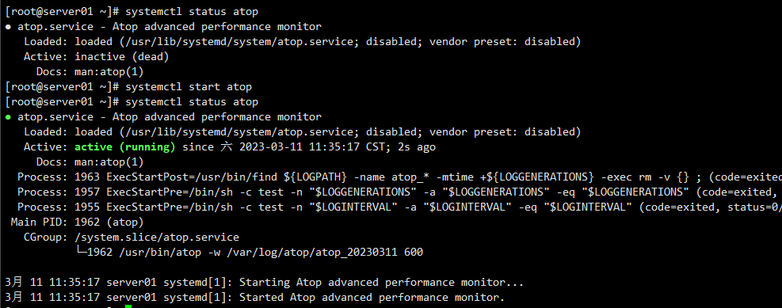
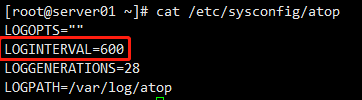

# How to use the atop monitoring tool in Linux

**Atop is a monitoring tool used to monitor resources and processes in Linux systems. It records the system's running state at regular intervals, collecting data on CPU, memory, disk, and network resource usage, as well as process information. The collected data can be saved as log files on disk. In case of server issues, you can analyze the corresponding atop log files for troubleshooting purposes.**

- To install atop on CentOS, execute the following command:

- yum -y install epel-release

- yum install atop –y

- To install atop on Ubuntu, execute the following command:

- apt-get install atop –y

To start atop, execute the following command:

- service atop start 或 systemctl start atop

After starting the atop service, execute the following command to see that atop is running in the background and writing data to the specified directory.

- ps -ef | grep atop

**Configure atop**

/etc/sysconfig/atop：The atop configuration file is used to adjust the monitoring interval of atop. By default, atop collects data every 600 seconds. Please refer to the following image for details.

/var/log/atop：The directory used to store atop monitoring log files is "/var/log/atop". After starting atop, it will store the collected records in this directory. To view the log files, execute the following command.

- atop -r /var/log/atop/atop\_20230311

**analyze atop log files**

The commonly used commands in atop are as follows: c: Sort processes in descending order based on CPU usage. m: Sort processes in descending order based on memory usage. d: Sort processes in descending order based on disk usage. a: Sort processes in descending order based on comprehensive resource usage. n: Sort processes in descending order based on network usage. This requires additional kernel modules to be installed and is not supported by default. t: Jump to the next monitoring sample. T: Jump to the previous monitoring sample. B: Specify a specific timestamp in the format YYYYMMDDhhmm.

**The meanings of system resource monitoring**

The above figure lists some fields and their values, and the meanings of each field are relative to the sampling period. The meanings of each field are as follows:

ATOP column: Displays the hostname, information sampling date, and time point. PRC column: Displays overall process running information. sys, user fields: Represents the time spent by processes in kernel mode and user mode. #proc field: Represents the total number of processes. #zombie field: Represents the number of zombie processes. #exit field: Represents the number of processes that exited during the atop sampling period. CPU column: Displays the overall CPU usage, which represents the usage of the CPU as a whole for multi-core CPUs. The CPU can be used for executing processes, handling interrupts, or be in an idle state. Idle state can be divided into two types: when active processes are waiting for disk IO, and when the CPU is completely idle. sys, user fields: Represents the proportion of CPU time spent by processes in kernel mode and user mode. irq field: Represents the proportion of CPU time spent on handling interrupts. idle field: Represents the proportion of time the CPU is completely idle. wait field: Represents the proportion of time the CPU is in the "process waiting for disk IO" state. cpu column: Displays the usage of a specific CPU core. The meanings of the fields are the same as the CPU column, and the sum of the field values is 100%. CPL column: Displays CPU load information. avg1, avg5, and avg15 fields: Represents the average number of processes in the run queue over the past 1 minute, 5 minutes, and 15 minutes. csw field: Context switch count. intr field: Interrupt count. MEM column: Represents memory usage. tot field: Total physical memory. free field: Size of free memory. cache field: Size of memory used for page cache. buff field: Size of memory used for file buffers. slab field: Size of memory occupied by the kernel. SWP column: Displays swap space usage. tot field: Total swap space. free field: Size of free swap space. PAG column: Displays virtual memory paging information. swin, swout fields: Represents the number of memory pages swapped in and out. DSK column: Displays disk usage information. Each disk device corresponds to a column. If there is a device named vdb, an additional DSK column will be added. vda field: Disk device identifier. busy field: Proportion of disk busy time. read, write fields: Represents the number of read and write requests. NET column: Multiple NET columns display network status, including transport layer TCP and UDP, IP layer, and information for each active network interface. XXXi fields: Receive packet count at various layers or active network interfaces. XXXo fields: Transmit packet count at various layers or active network interfaces.
