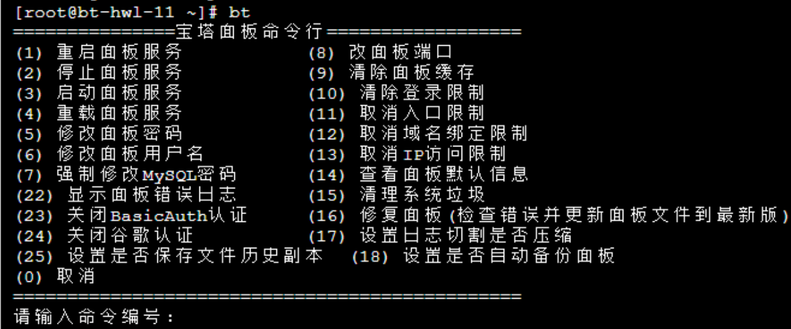

# Linux System BT Panel Installation Tutorial

一、 Installation Requirements:

1.Memory: 512MB or more, recommended 768MB or more (the panel itself occupies approximately 60MB of memory).

2.Disk Space: 300MB or more of available disk space (the panel itself occupies approximately 20MB of disk space).

3.Operating System: CentOS 7.1+ (Ubuntu 16.04+, Debian 9.0+). Make sure it is a clean operating system without any previously installed Apache/Nginx/php/MySQL/pgsql/gitlab/java environments (existing environments cannot be installed).

4.Architecture: x86\_64.

5.Baota Linux 7.0 is based on CentOS 7, so it is necessary to use CentOS 7.x system. Note: CentOS officially announced the end of support for CentOS 6 in 2020, and major software developers are gradually ceasing compatibility with CentOS

Note: CentOS officially announced the end of maintenance and updates for CentOS 6 in 2020. Major software developers are also gradually ceasing compatibility with CentOS 6. It is not recommended to use CentOS 6 for new servers.

二、Installation Method for Baota Linux Panel 7.9.0:

Official support for CentOS 8 has been discontinued. Please switch to CentOS 7 or CentOS 8 Stream to install Baota Linux Panel. Here are the detailed

instructions:https://www.bt.cn/bbs/thread-82931-1-1.html

1.CentOS Installation Command:

Yum install -y wget && wget -O install.sh https://download.bt.cn/install/install\_6.0.sh && sh install.sh 12f2c1d72

2.Ubuntu/Deepin Installation Command:

wget -O install.sh https://download.bt.cn/install/install-ubuntu\_6.0.sh && sudo bash install.sh 12f2c1d72

3.Debian Installation Command:

wget -O install.sh https://download.bt.cn/install/install-ubuntu\_6.0.sh && bash install.sh 12f2c1d72

4.Fedora Installation Command:

wget -O install.sh https://download.bt.cn/install/install\_6.0.sh && bash install.sh 12f2c1d72

5.Linux Panel 7.9.8 Upgrade:

curl https://download.bt.cn/install/update\_panel.sh|bash

三、If the above nodes are not accessible, please use the following alternate nodes for installation:

1.Alternate Node Guangdong:

yum install –y wget && wget –O install.sh <http://125.88.182.172:5880/install/install> 6.0.sh && sh install.sh

2.Alternate Node Hong Kong:

yum install –y wget && wget –O install.sh <http://103.224.251.67:5880/install/install> 6.0sh && sh install.sh

3.Alternate Node United States:

Yum install –y wget && wget –O install.sh <http://128.1.164.196:5880/install/install> 6.0.sh && sh install.sh

After connecting to your Linux server using SSH tools such as Xshell or PuTTY, execute the corresponding command based on your system to start the installation (it takes about 2 minutes to complete the panel installation). After the installation is complete, you will be prompted with login information. If you need to change the password, restart Baota, modify the port, uninstall Baota, or perform other operations, you can simply enter "bt" to display the corresponding operation options, as shown in the figure below. Follow the prompts to complete the operation.

四、Linux Panel 7.9.8 Update Features:

1.Added RSA encryption verification mechanism for login form data.

2. Added encryption storage mechanism for sensitive data such as usernames and passwords.

3. Optimized encryption mechanism for key data transmission and session binding to prevent replay attacks.

4. Synchronized bug fixes that have been verified in some test versions.
