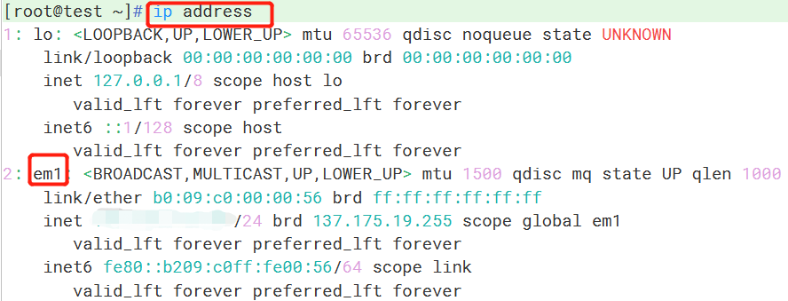
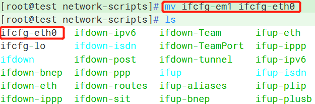
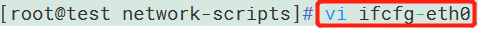
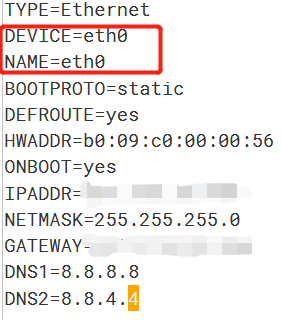
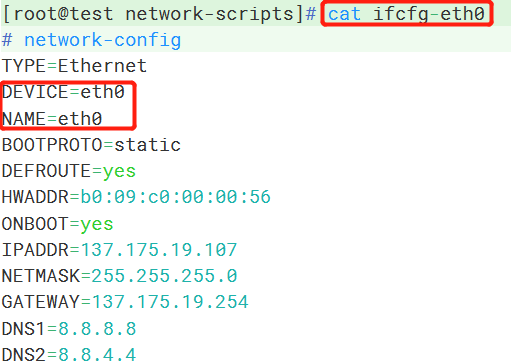
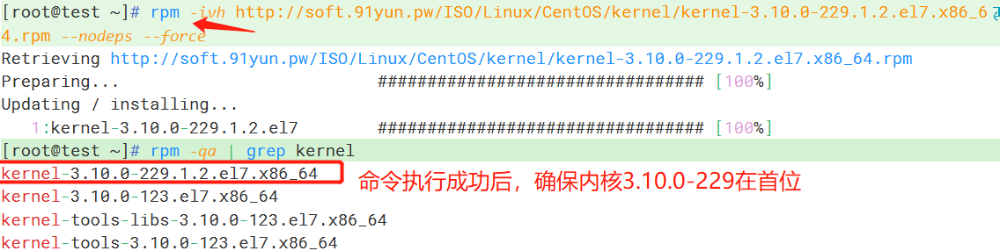
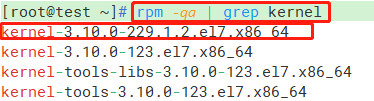
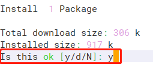

# Linux System RuiSu Installation Tutorial

Note: The prerequisite for installing RuiSu is to ensure that the network card is in the "eth" series.

Step 1: Install the recommended version of the kernel and reboot the machine after installation.

Step 2: After the reboot, verify that the kernel installation is correct. Then, download the 91YUN RuiSu installation script, which will be automatically executed.

一.Modify the network interface name.

1.Use the "ip address" command to check the network interface name.

2. Go to the network interface configuration file directory and use the "ls" command to view the names of the network interface configuration files.

- cd /etc/sysconfig/network-scripts/

3. Use the "mv" command to change the name of the network interface configuration file, and use the "ls" command to check if the modification was successful.

- mv "ifcfg-\*\*\*" (where "\*" represents the original network interface name) to "ifcfg-eth\*" (if you have multiple network interfaces, you can increment the number after "eth").

4. To change the network interface name within the file, you simply need to edit the file and remove or modify the network interface name. Make sure to remove any quotation marks if present.

- vi ifcfg-eth\*

Press the "i" key to enter text input mode and make changes to the network card name.

DEVICE=eth\*

NAME=eth\*

5.To exit the text input mode, press the ESC key. Then, to enter the command mode, press Shift+: (colon). In the command mode, type "wq" and press Enter to save the modifications and exit the file.

6.You can use the "cat" command to view the contents of the file and verify if the modifications were successful.

- cat ifcfg-eth0

7.If you have a network configuration file in the "Range" format, you can use the following commands to modify it. Make sure the "eth\*" name matches the name of the main network card.

- mv ifcfg-\*\*\*-range0  ifcfg-eth\*-range0

8. Restart the system   #reboot

9. Verify if the network card name has been successfully modified.

- ip address

 

二.Install the Speeder.

1.Modify the specified optimized kernel：

Replace the CentOS 7.x kernel with： 3.10.0-229.1.2.el7.x86\_64 ​​​​​​

- rpm -ivh <http://soft.91yun.org/ISO/Linux/CentOS/kernel/kernel-3.10.0-229.1.2.el7.x86_64.rpm> --force

2.Check if the kernel is installed successfully.

- rpm -qa | grep kernel

3.Restart the system  #reboot 

4.Check if the kernel replacement is successful

- uname -r

5.Download the installation script and execute it automatically：

Method of installing Rui Su (LsRuisu):

- wget -N --no-check-certificate https://github.com/91yun/serverspeeder/raw/master/serverspeeder.sh && yum install net-tools && bash serverspeeder.sh

Enter "y" and press Enter to continue.

这里输入y回车继续

6.After the installation is completed, check the running status of Rui Su (LsRuisu) by using the following command:

- /serverspeeder/bin/serverSpeeder.sh status

7.To enable Rui Su (LsRuisu) to start automatically on boot, follow these steps:

- echo "service serverSpeeder start" >> /etc/rc.d/rc.local && chmod +x /etc/rc.d/rc.local

Error Resolution:

serverspeeder.sh: line 141: ifconfig: command not found

The main reason for encountering this issue is that the system does not come with `ipconfig` installed in most cases.

Therefore, to resolve this, you simply need to install `ipconfig` using the following command:

yum install upgrade

yum install net-tools

Common Commands: 

Restarting Speed:

/serverspeeder/bin/serverSpeeder.sh restart

Checking Speed status:

/serverspeeder/bin/serverSpeeder.sh status

Uninstalling Speed:

chattr -i /serverspeeder/etc/apx\* && /serverspeeder/bin/serverSpeeder.sh uninstall -f
