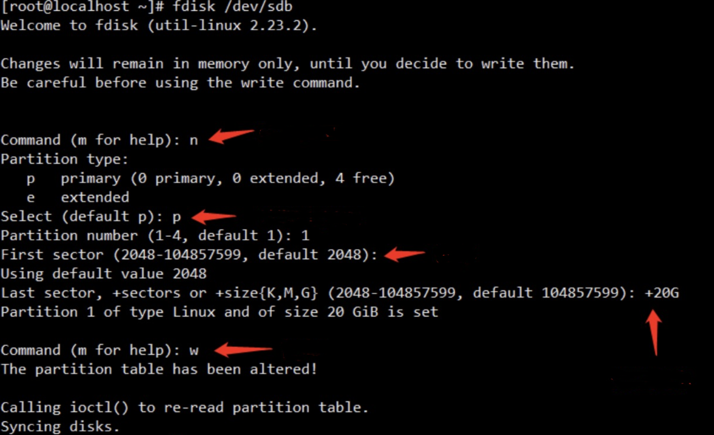
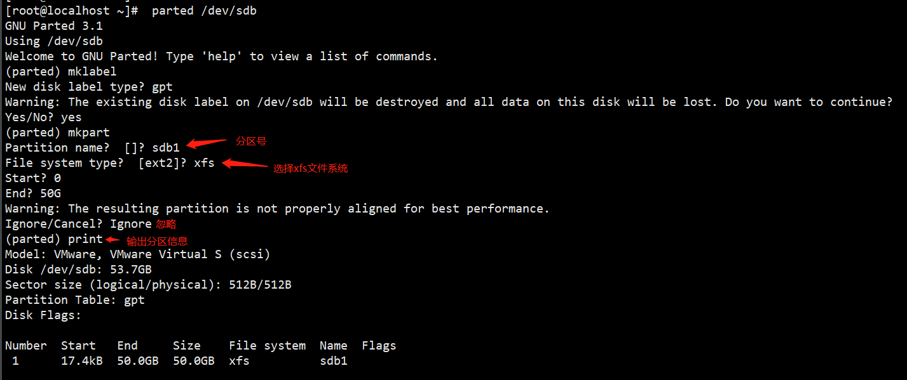
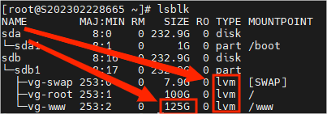
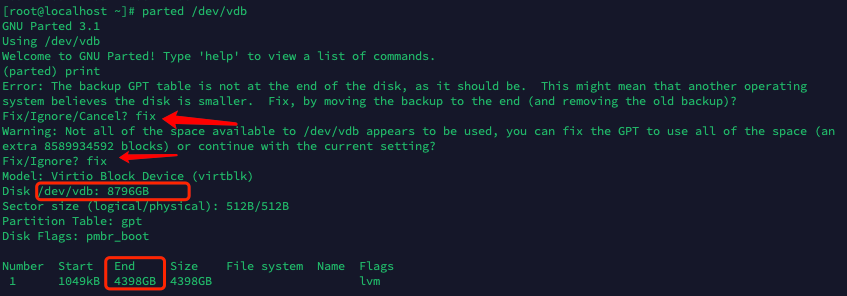
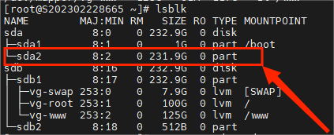
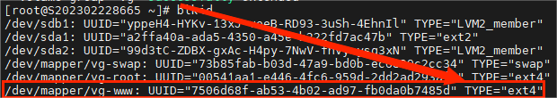
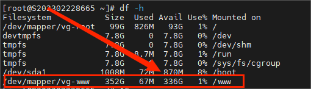

# Mounting and Expanding Linux System Disk

For scenarios where additional hard disks need to be added to a machine and manually mounted and expanded Data is invaluable, so ensure that data is backed up before performing any formatting operations.

**一、****Mounting a New Partition**

- #lsblk #View the currently recognized disks in the system and take note of the new disk's name.

- #fdisk    /dev/sdb    #Start partitioning.

n - Create a new partition - Partition type: Press Enter (default) - Partition number: Press Enter (default) - Start sector: Press Enter (default) - Last sector: + Partition size

p - View partition table

w - Save and exit

- # lsblk or fdisk -l - View partition results

 

- parted /dev/device\_file
- mklabel - Create a partition table
- gpt - We should use the gpt partition table format for disks larger than 2TB
- yes - Confirm that the existing data on the disk will be destroyed
- mkpart - Perform the partition operation, specifying the partition name, file system, and the start and end positions of the partition
- print - Print the partition information

- # mkfs.xfs   -f   /dev/sdb1    #Format the file system as XFS

- # blkid   /dev/sdb1      #View the file system type and UUID

- # mkdir  /mypart  #Create a mount point.

- # vim    /etc/fstab   #Set up automatic mounting at startup.

UUID=[File system UUID]   /mypart    xfs    defaults   0   0

- # mount   -a       # Refresh or reload the /etc/fstab file

Check if the /etc/fstab file has the correct format for automatic mounting during startup.

Check if the entries in /etc/fstab are written correctly,

- # df  -h

 

After executing the reboot command, if there are no issues with the mounted points, it indicates that automatic mounting during startup is effective.

**二****、****Expanding existing partitions.**

Here, we will take /www partition as an example for expanding:

First, verify if your hard disk is part of an LVM volume group. If your machine does not have an LVM volume group, then your hard disk does not support expansion.

- # lsblk  #Check the hard disks recognized by the current system and take note of their current capacities.

- # pvdisplay   #Check the volume group names.

- #parted /dev/sda    print   #Display the current disk partitions and check if the format is GPT. Remember the current parameters.

If you encounter the error shown in the screenshot, follow the system prompt and enter "Fix". The system will automatically set the capacity of the expanded disk partition to GPT.

 

mkpart primary 1075MB 250GB  #The first 1075MB represents the End capacity mentioned in the second step, and the second 250GB represents the capacity of Disk /dev/sdb.

After completing the process, you can exit by typing "quit".

- # df -h        #You can view the partition results, and here we can see that the partitioning has been successful.

Add the partition to the volume group

- # pvcreate   /dev/sda2  #Add the partition to the physical volume

- # vgextend   vg   /dev/sda2  #Extend the volume group (VG)

- # lvextend  -l  +100%free  /dev/vg/www  #Extend the logical volume (LV)

Format the file system

- # blkid  #Check the file system of the partition to be expanded.

The command "xfs\_growfs" is used to expand the XFS file system, while "resize2fs" is used to expand the ext4 file system.

- #resize2fs   /dev/vg/www  #Format as ext4

- # df -h  #Here we can see that the expansion has been successful.

# reboot  Finally, restart the system and confirm again
