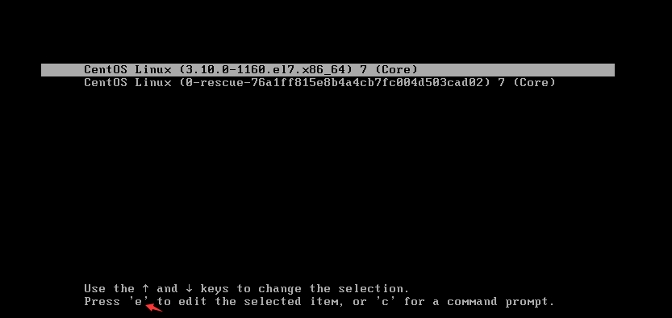
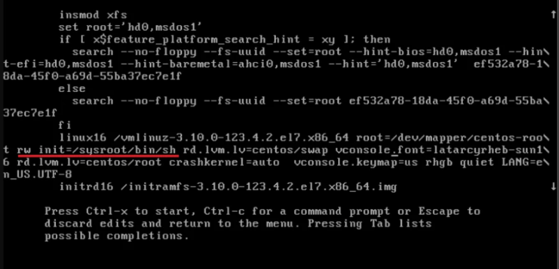
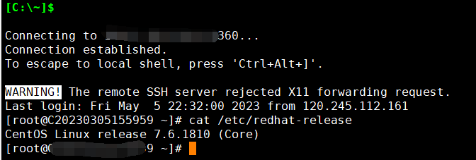

# Resetting the password in CentOS 7.x system

Resetting the password in the CentOS 7.x system can usually be done automatically by accessing the backend. However, in case of special circumstances where this method is not feasible, you can follow the manual steps to reset the password.

1.Firstly, restart the machine and access the boot menu. Press "e" to edit the currently selected kernel.

2.Scroll down the list until you find the line with an underscore (\_) below the "ro" parameter.

Change "ro" to "rw" and add "init=/sysroot/bin/sh" at the end of the line.

3.After making the changes, press Ctrl + X to boot into single-user mode with the specified bash shell. In this mode, we will change the root password.

- rw init=/sysroot/bin/sh

4.Once in single-user mode, run the following command to change the root password.

- chroot /sysroot

5.Lastly, run the following command to change the root password.

- passwd root

6.The system will prompt you to enter and confirm the new password. After creating the new password, run the following command to update SELinux parameters.

- Touch /.autorelabel

7.Finally, exit and reboot the system. You can now log in using the new password.

