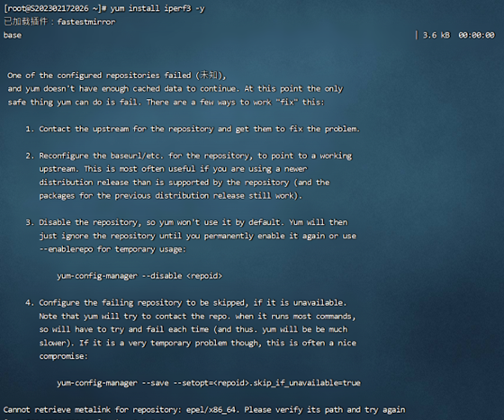

# The error message "Not enough cached data to install" typically occurs when using the yum package manager in a Linux system

The problem descriptionThe error message "Not enough cached data to install" typically occurs when using the yum package manager in a Linux system.

Solution: Replace the yum repository.

# Backup the original yum repository.

mv /etc/yum.repos.d /etc/yum.repos.d.bak

# Create a directory for the new yum repository.

mkdir /etc/yum.repos.d

# Download the yum repository configuration file (Choose either Huawei Cloud source or Alibaba Cloud source).

wget -O /etc/yum.repos.d/CentOS-Base.repo <https://repo.huaweicloud.com/repository/conf/CentOS-7-reg.repo>

wget -O /etc/yum.repos.d/CentOS-Base.repo http://mirrors.aliyun.com/repo/Centos-7.repo

# Rebuild the cache

yum clean all

yum makecache
