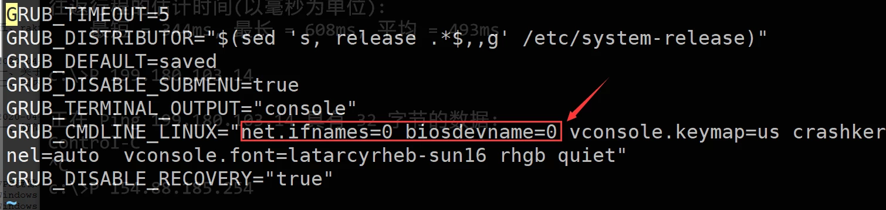
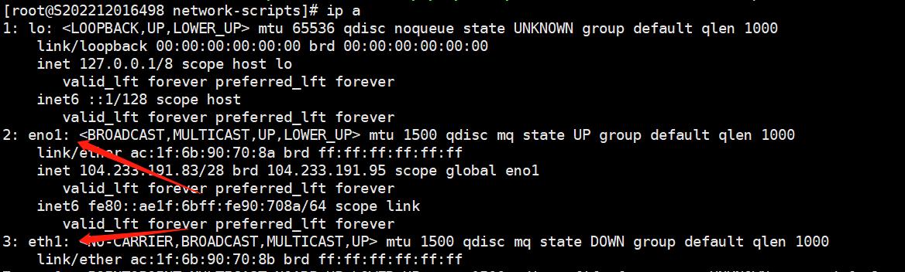
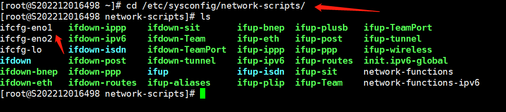

# To change the network interface name in CentOS 7.x

一.modify GRUB

1.Edit the GRUB configuration file by running the command: `vi /etc/default/grub`.

2.And add "net.ifnames=0 biosdevname=0"

3.After making the modifications, save and exit by typing ":wq!" or use "ZZ" to exit.

4.Run the command "grub2-mkconfig -o /boot/grub2/grub.cfg" to regenerate the GRUB configuration and update the kernel parameters.

二.Rename the current network interface configuration file.

1.First, use the command "ip a" to check the current network interface names. Make sure not to modify any names that are already in use.

 

2.cd /etc/sysconfig/network-scripts/  #Enter the network interface configuration file directory.

 

mv ifcfg-eno1 ifcfg-eth0                  #Rename the interface in "eth" format.

sed -i 's/eno1/eth0/g' ifcfg-eth0      #Modify "eno1" to "eth0" inside the file, and adjust the command according to the specific name.

 

三.Reboot the system to apply the above changes.
reboot
