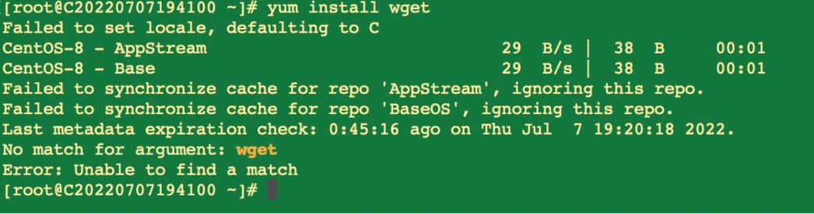

# Unable to use Yum and Dnf on CentOS 8

1.Root cause: CentOS 8 - End of updates by late 2021.

2.Error screenshot:

3.Error keywords:

Failed to synchronize cache for repo 'AppStream', ignoring this repo.

**Note: Unable to synchronize the cache for 'AppStream' repo, ignoring this repo.**
Failed to synchronize cache for repo 'BaseOS', ignoring this repo.

**Note: Unable to synchronize the cache for 'BaseOS' repo, ignoring this repo.**

Last metadata expiration check: 0:45:16 ago on Thu Jul 7 19:20:18 2022.

**Note: Last metadata expiration check: 0:45:16 before Thursday, July 7, 2022, 19:20:18**.
No match for argument: wget

**Note: Parameter mismatch: wget.**
Error: Unable to find a match

**Note: Error: No match found.**

4.Solution:

sed -i 's/mirrorlist/#mirrorlist/g' /etc/yum.repos.d/CentOS-\*

sed -i 's|#baseurl=http://mirror.centos.org|baseurl=http://vault.centos.org|g' /etc/yum.repos.d/CentOS-\*

Execute the adjustments one by one, and then you should be able to use Dnf or Yum.

 Note: To fix the above error, we need to use the following command to change the repo URL pointing to the CentOS official URL to [vault.centos.org](https://vault.centos.org/ "https://vault.centos.org/")

If the above is not working, you can use the following command (Aliyun mirror):

curl -o /etc/yum.repos.d/CentOS-Base.repo https://mirrors.aliyun.com/repo/Centos-vault-8.5.2111.repo

yum makecache
