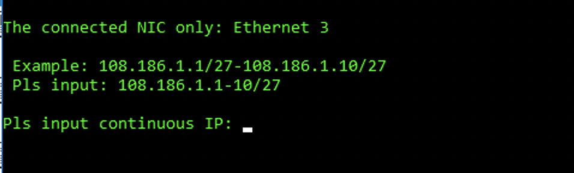
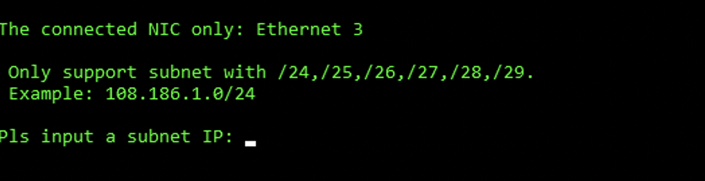
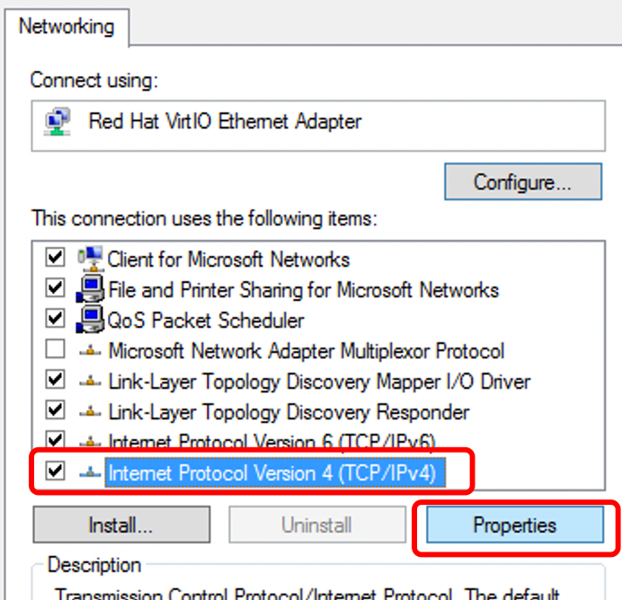
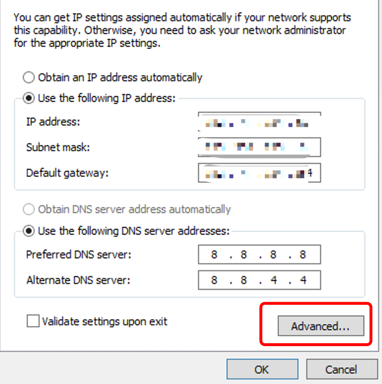
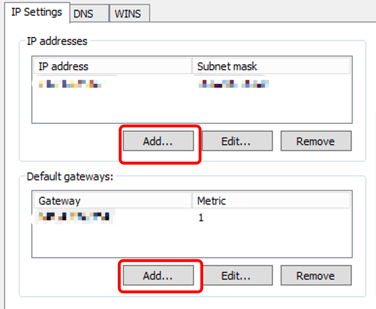

# Add an IP address in Windows System

Method 1: You can use the scripts provided in the [system tools](https://billing.raksmart.com/whmcs/index.php?rp=/knowledgebase/189/system-tools.html) document to configure the commands directly.

Adding IP addresses consecutively.

Adding a block of IP addresses.

 

Method 2:

 

If the number of IP addresses to be added is small, you can also add them in the Advanced settings of IPv4 in Network Connections.

 

 

Method 3:

 

To batch add IP addresses using the command prompt:

 

Enter the command: `for /l %i in (starting\_number,1,ending\_number) do netsh interface ip add address "Local Connection" IP\_prefix.%i subnet\_mask` 

(Where starting\_number and ending\_number are the last digits of the IP address provided by the supplier, "Local Connection" is the network interface name, which may vary for each server and can be found in the Properties of Network Neighborhood.)

Open the command prompt by going to Start -> Run -> type "cmd" -> Enter.

For example, available IP addresses: 174.139.111.82-174.139.111.86 (total of 5 available IPs)

Subnet mask: 255.255.255.248

Current network interface name: Local Connection 1

Then enter the command: `for /l %i in (82,1,86) do netsh interface ip add address "Local Connection" 174.139.111.%i 255.255.255.248`

(You can copy the above command by right-clicking on your local computer, and then paste it directly into the command prompt window. This will help avoid typing errors and save time.)

 

Press Enter to execute the command. The IP addresses will be automatically added one by one.
