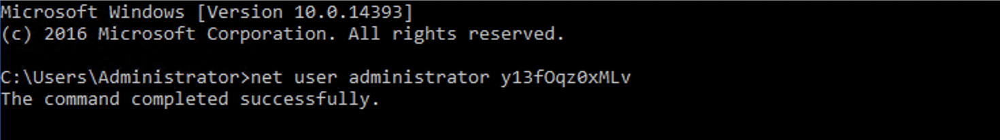
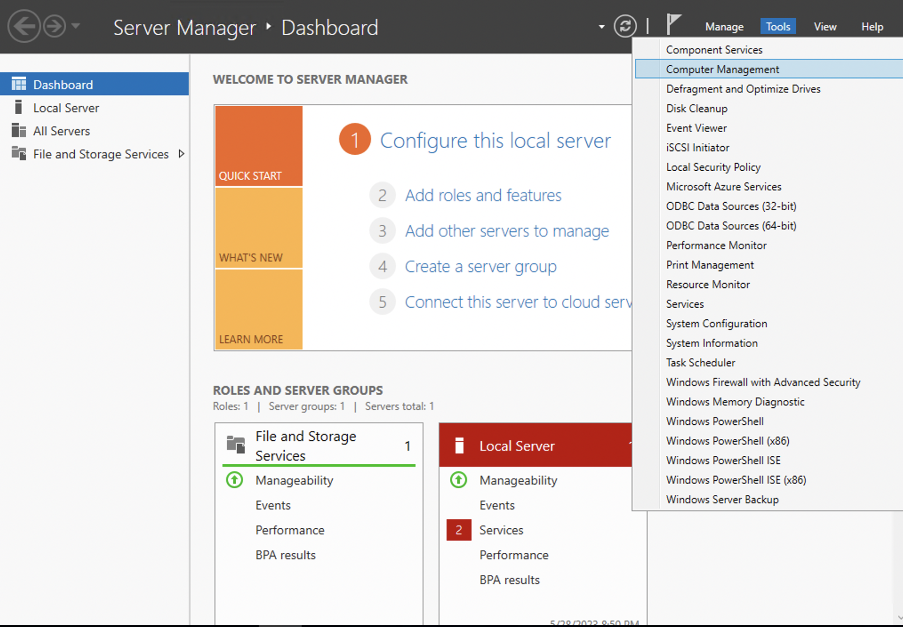
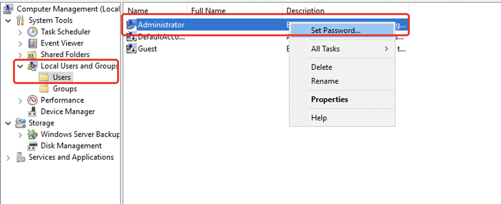
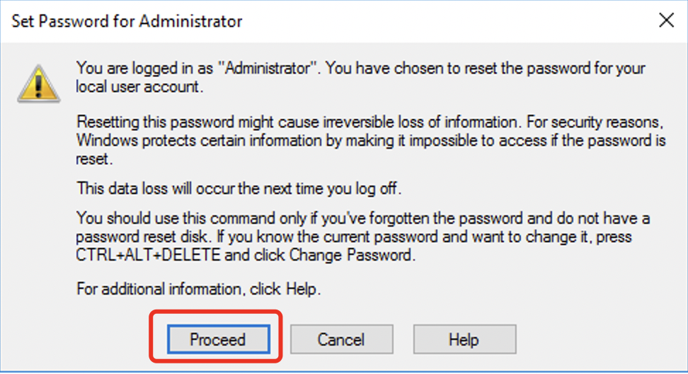
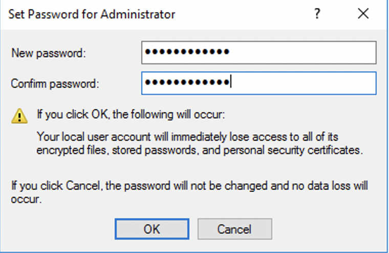

# Change Administrator Password in Windows

There are two ways to manually change the Windows Administrator password：

一.Changing the password via command line

1.Open PowerShell and use the following command to change the password: - Type "net user administrator xxxxx" (replace "xxxxx" with the new password)

二.Graphical Interface Modification

1.Open Server Manager Dashboard，Navigate to Tools -> Computer Management.

2.Go to Local Users and Groups -> Users，Right-click on Administrator and select "Set Password".

3.Click "Continue."

4.Click "OK" after setting the new password. (The password should meet complexity requirements, including a combination of numbers, letters, and special characters.)

