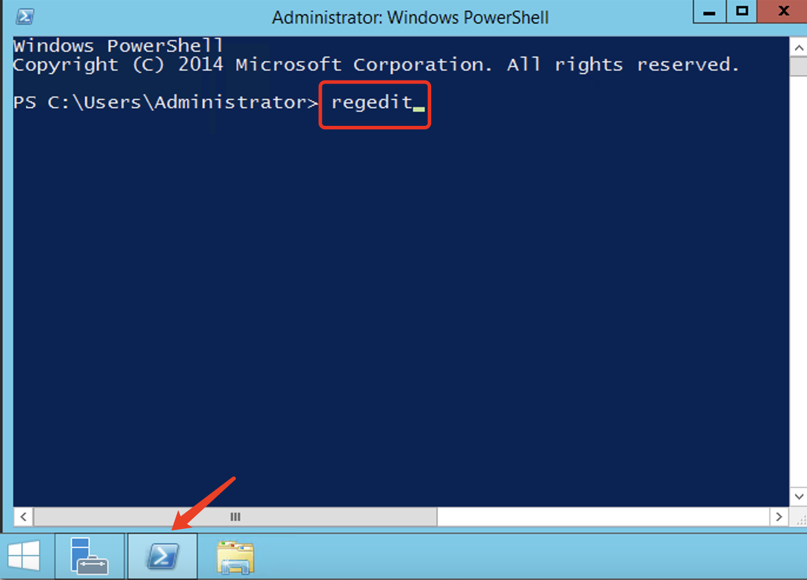
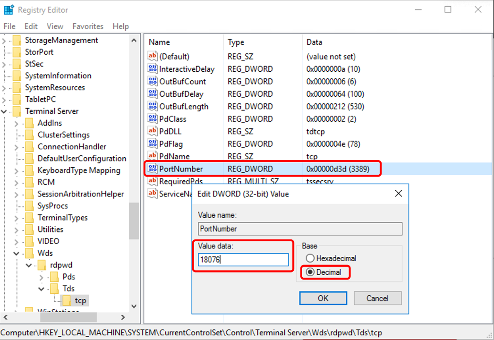
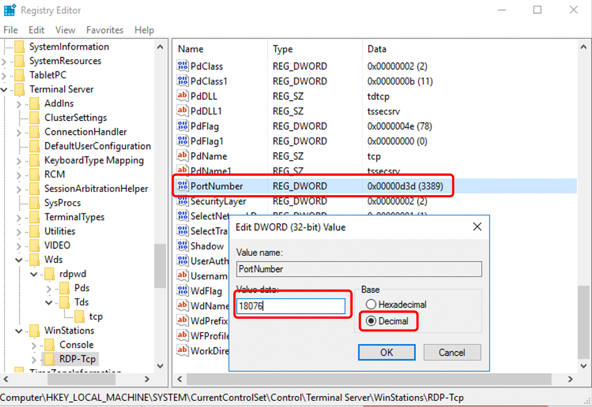
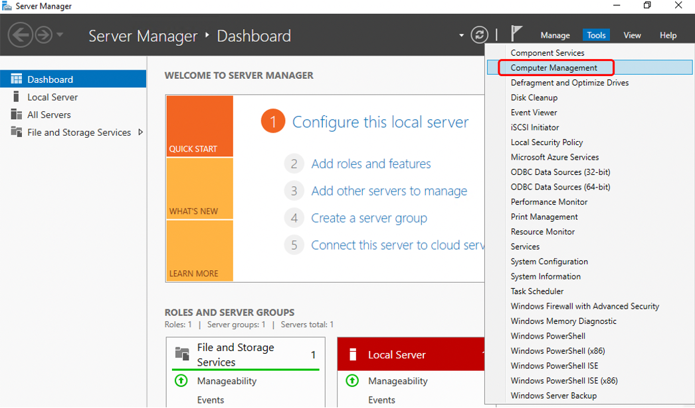
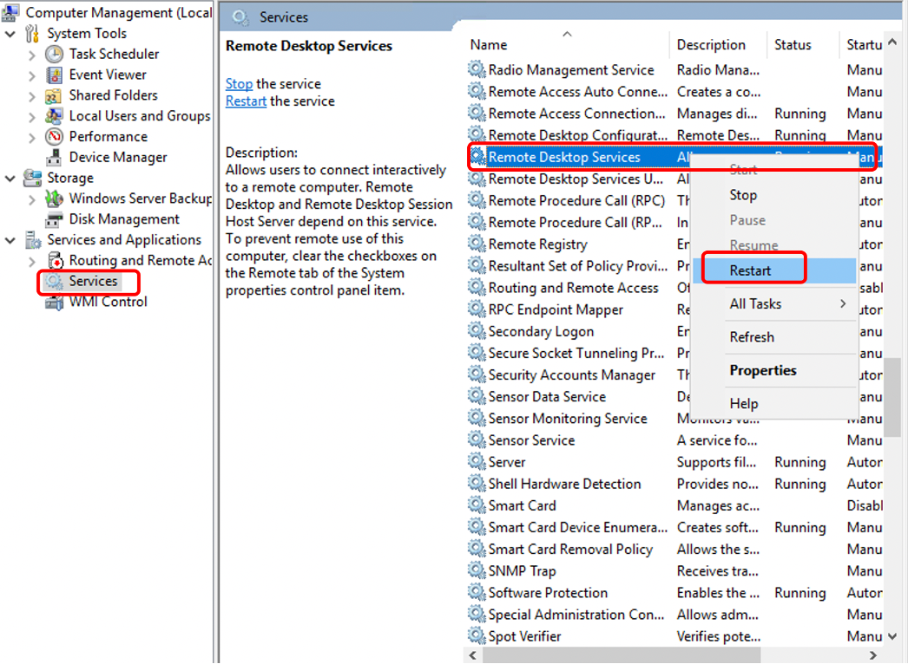
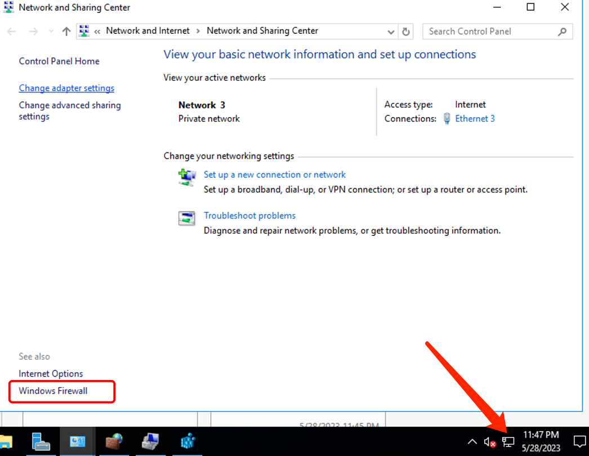
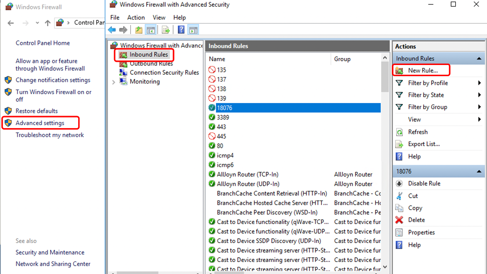
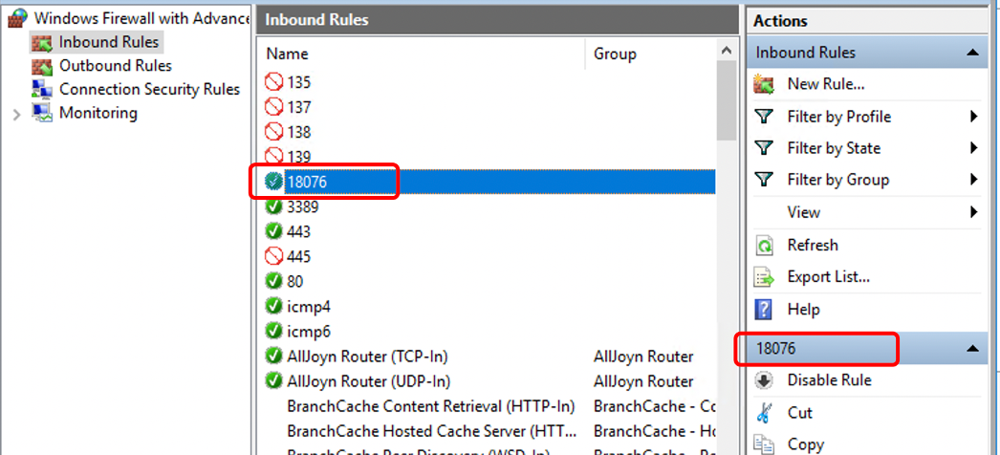
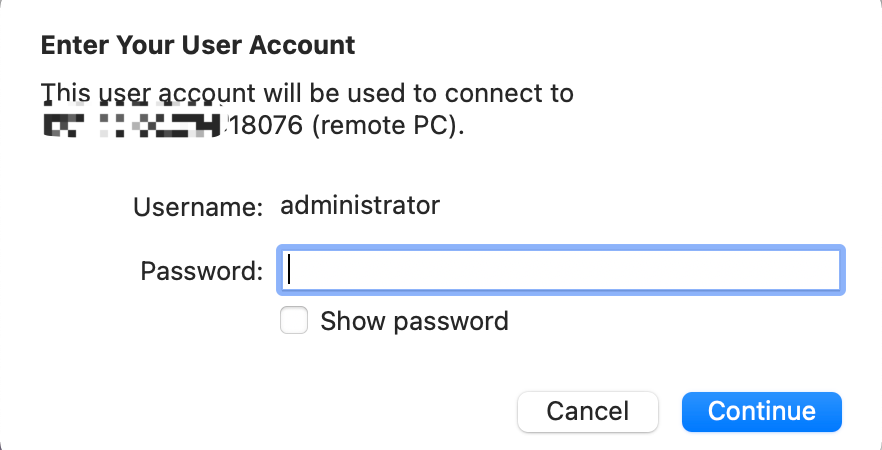

# Change the remote port number in Windows

**The remote port number for Windows systems is between 1024 and 65535, and you can choose any port within this range.**

1.To access the Registry Editor, please follow these steps after logging into the system: Press the Win key (Windows logo key) + R to open the Run dialog box. Type "regedit" and press Enter, or open Windows PowerShell and enter the "regedit" command

2.Open the following path：HKEY\_LOCAL\_MACHINE\SYSTEM\CurrentControlSet\Control\Terminal Server\Wds\rdpwd\Tds\tcp

Double-click or right-click on "PortNumber" to modify it. Change the default value of 3389 to the desired port of your choice (within the range of 1023-65535, preferably avoiding commonly used ports). Click OK to save the changes.

3.Next, open the following path: HKEY\_LOCAL\_MACHINE\SYSTEM\CurrentControlSet\Control\Terminal Server\WinStations\RDP-Tcp

Double-click or right-click on "PortNumber" and modify to the same port as mentioned above (the one you want to change to). Click OK to confirm the changes.

4.Click on "Server Manager" and then click on "Computer Management". In the pop-up window, select "Services and Applications" on the left-hand side, then choose "Services". Find "Remote Desktop Service" in the list, right-click on it, and select "Restart". The port number change will take effect after restart.

(Alternatively, you can choose to restart the system for the port changes to take effect.)

- If the user's computer firewall is disabled, they can now connect via Remote Desktop from another computer.

- Usually, for security reasons, it is recommended to keep the firewall enabled. Therefore, it is necessary to modify the inbound rules of the firewall as well.

5.Right-click on the network icon in the lower-right corner - Open Network and Sharing Center - Windows Firewall - Advanced Settings - Inbound Rules - New Rule - Select Port - Enter the port to be allowed - Allow the connection - Check all three network profiles by default - Enter a description - Finish.

6.The port forwarding is successful, and you can now connect with the new remote port number.

7.To test remote access, simply add the new remote port number after the remote address to establish a connection.

