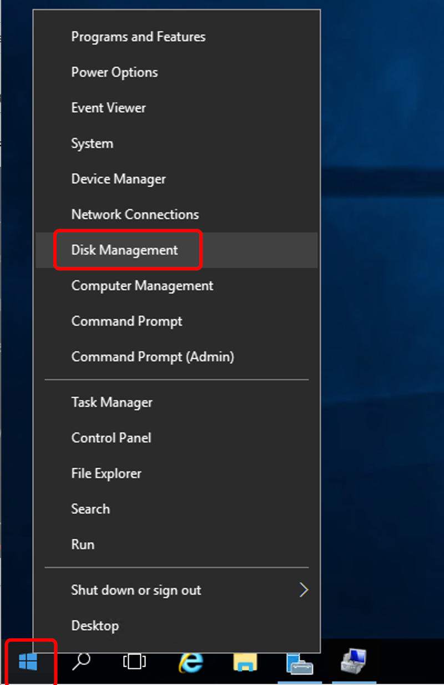
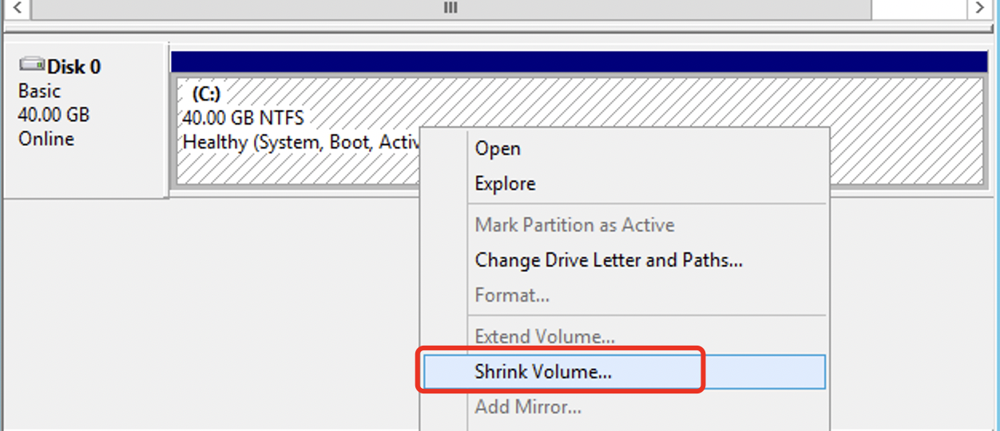
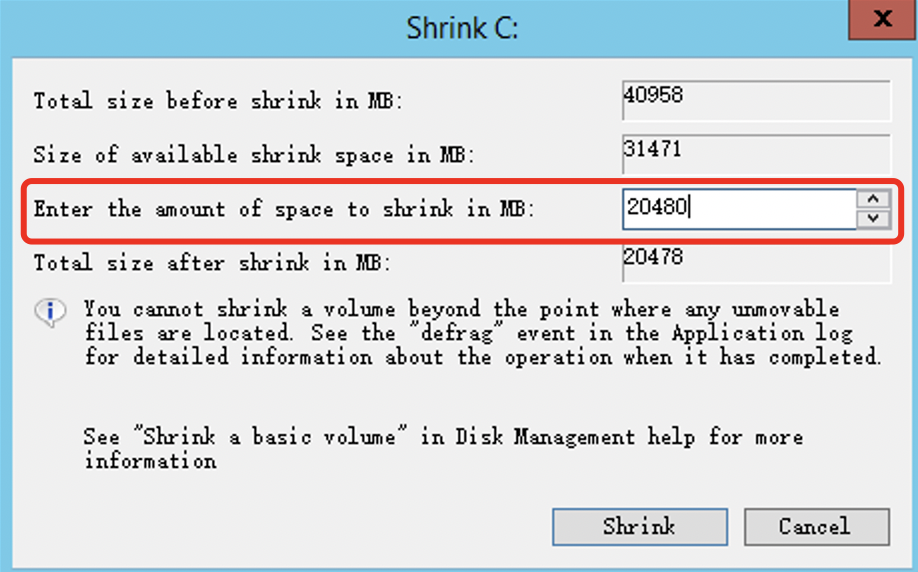
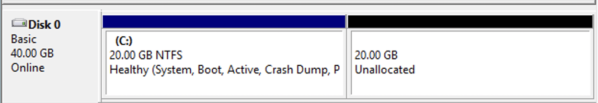
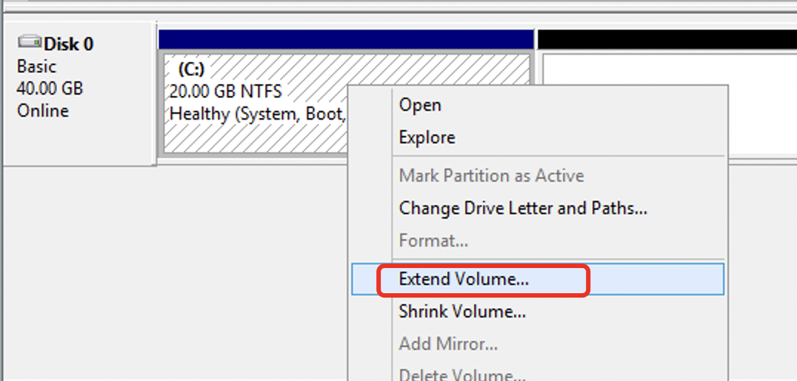
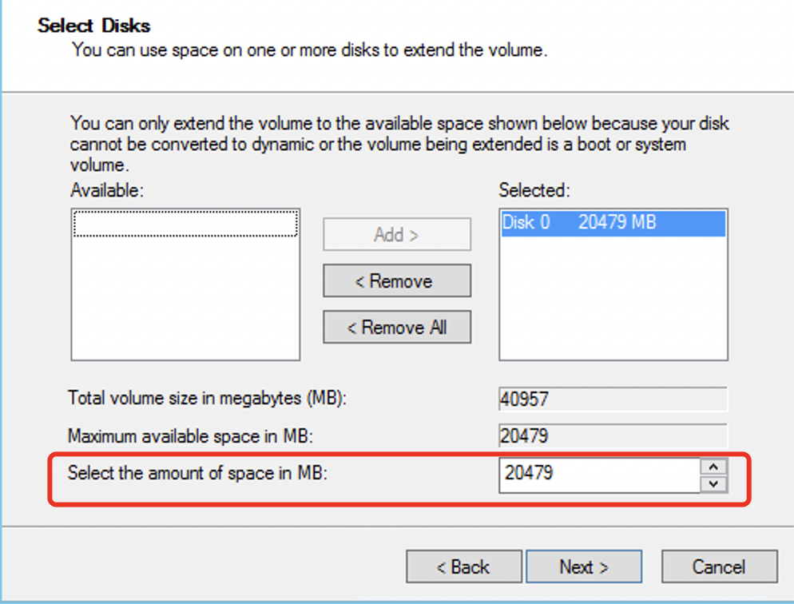
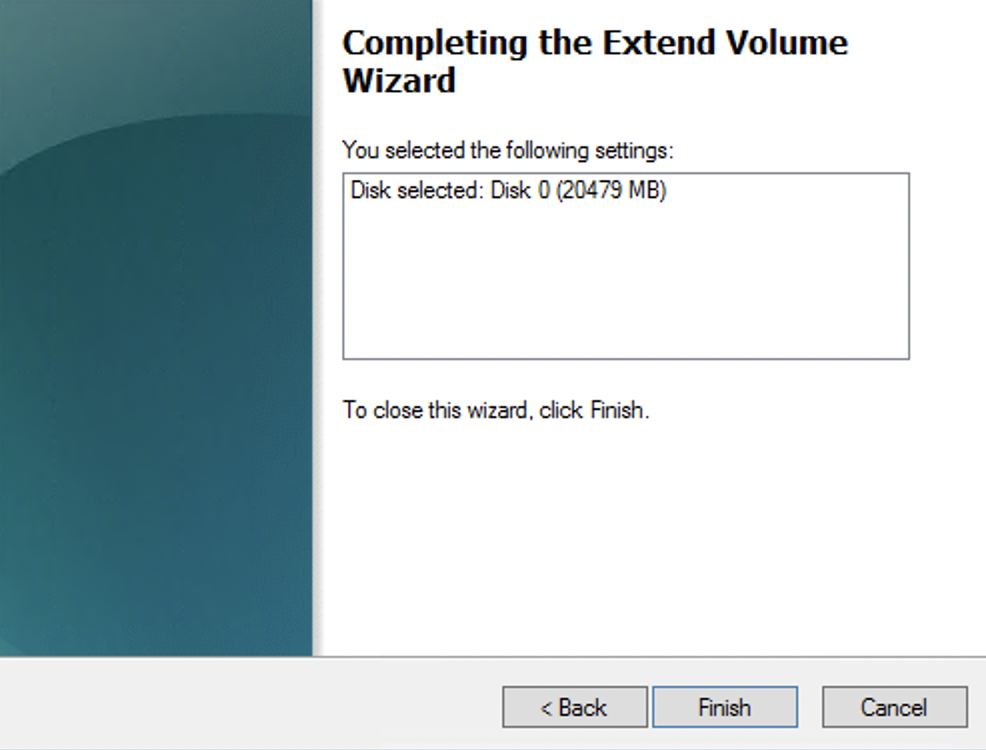
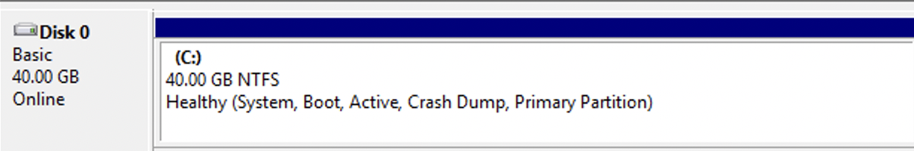

# Compress/Expand Disk Space in Windows System

When compressing a partitioned disk in Windows, it is important to backup your data beforehand to avoid data loss.

Compress volume

 

1.Right-click on the Start menu located at the bottom left corner and select "Disk Management".

2.Select the disk you want to work with, right-click on it, and choose "Shrink Volume".

 

3.Adjust the size of the compression according to your needs, and then click on "Shrink" to proceed.

 

4.After compression, you will be able to see the compressed space created.

 

 

Extend Volume

 

1.Right-click on the target disk space that needs to be extended and select "Extend Volume."

2.After clicking "Next," adjust the desired capacity for the volume to be extended. Once done, click "Next."

3.Done. You can now see the increased size of the disk space after extension.

