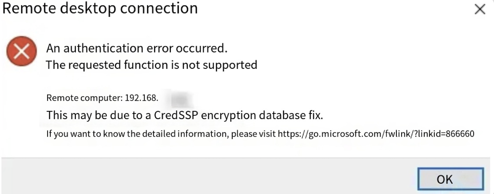
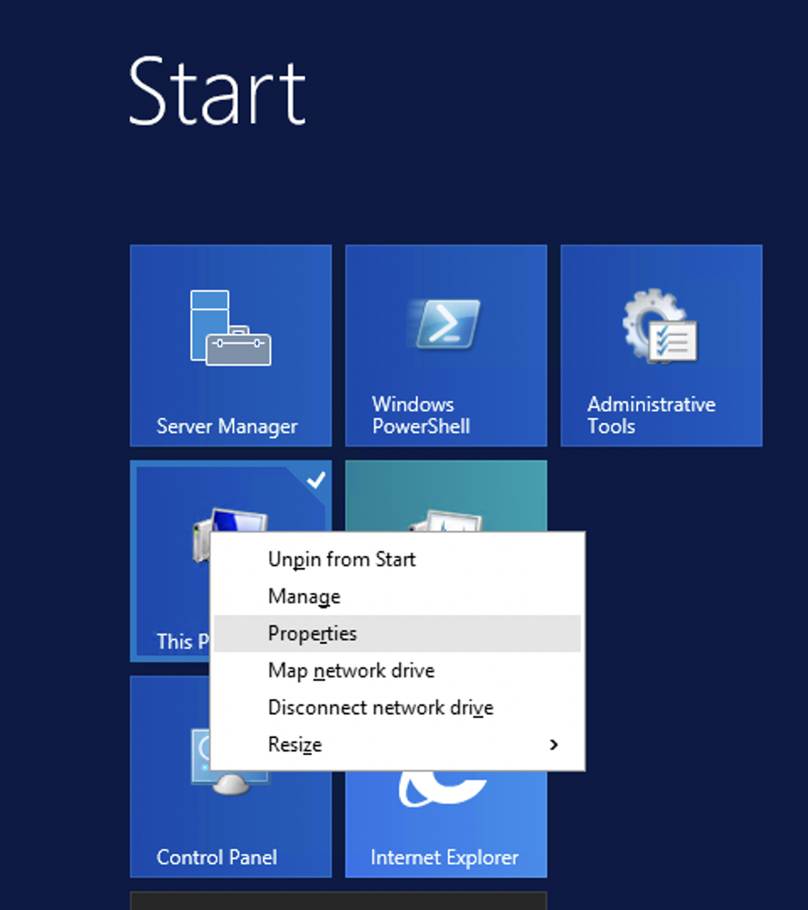
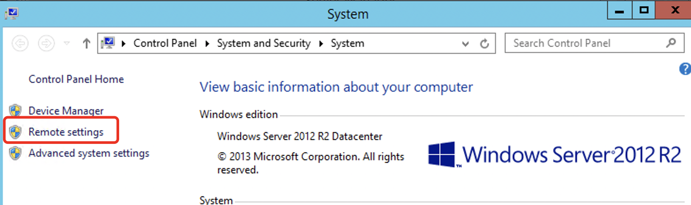
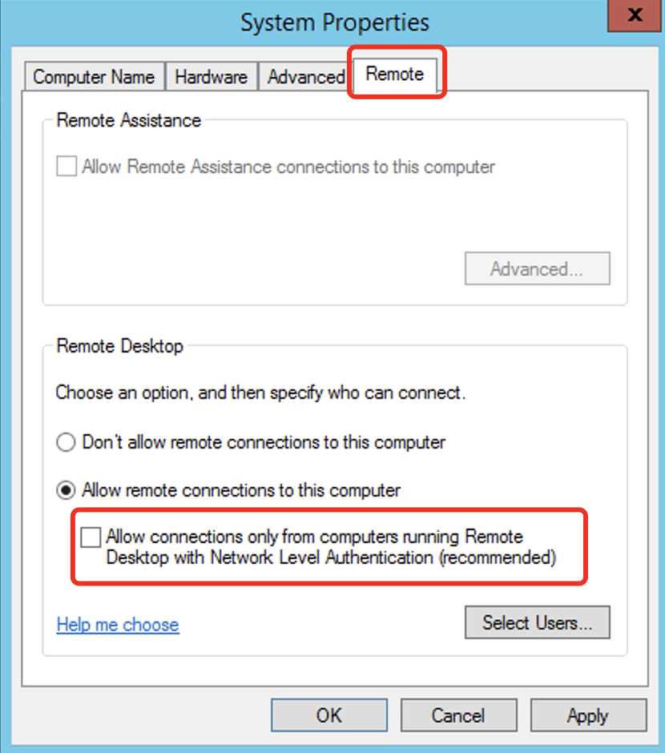
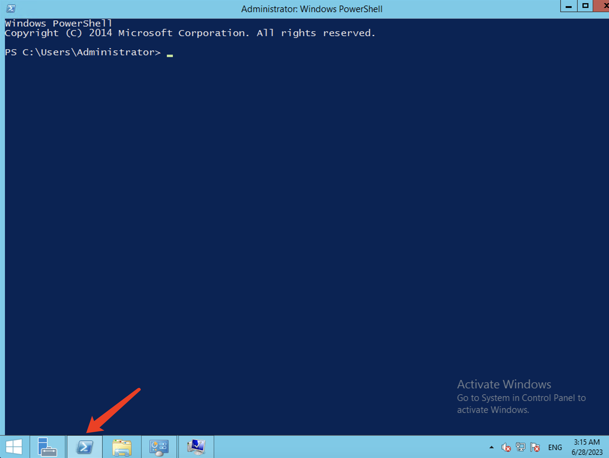

# CredSSP encryption oracle remediation error in Windows Remote Desktop

**Issue description: When attempting to connect to a Windows instance using Remote Desktop, "An authentication error has occurred. The requested function is not supported."** **error message appears**

Root cause:

The issue is caused by a security update released by Microsoft in May 2018 that affects the Credential Security Support Provider protocol (CredSSP) and authentication request methods.

By default, after installing this update, patched local computers are unable to communicate with unpatched instances.

Solution:

Depending on the specific scenario, you can consider the following three solutions:

Solution 1 : Run the following command on the local PC

1.Open a CMD window with administrator privileges on the local PC. Run the following command:

reg add "HKLM\SOFTWARE\Microsoft\Windows\CurrentVersion\Policies\System\CredSSP\Parameters" /v AllowEncryptionOracle /t REG\_DWORD /d 2 /f

Solution 2: Allow Remote Desktop Connections on the instance

1.Use VNC to connect to the Windows system，Click on the Start menu and right-click on "This PC" (or "My Computer") and select "Properties".

3. 2.On the Control Panel main page, click on "Remote Settings".

4. 3.Under the "Remote" tab, uncheck the option "Allow connections only from computers running Remote Desktop with Network Level Authentication (recommended)", and then click on "OK".

Solution Three: Modifying the Registry

1.Connect to the Windows system using VNC.

2. Click on the "Windows PowerShell" in the lower-right corner to open it, and execute the following command to run the Windows PowerShell script as an administrator:

- New-Item -Path HKLM:\Software\Microsoft\Windows\CurrentVersion\Policies\System -Name CredSSP -Force

- New-Item -Path HKLM:\Software\Microsoft\Windows\CurrentVersion\Policies\System\CredSSP -Name Parameters -Force

- Get-Item -Path HKLM:\Software\Microsoft\Windows\CurrentVersion\Policies\System\CredSSP\Parameters | New-ItemProperty -Name AllowEncryptionOracle -Value 2 -PropertyType DWORD -Force

3.The changes will take effect after rebooting the machine.
