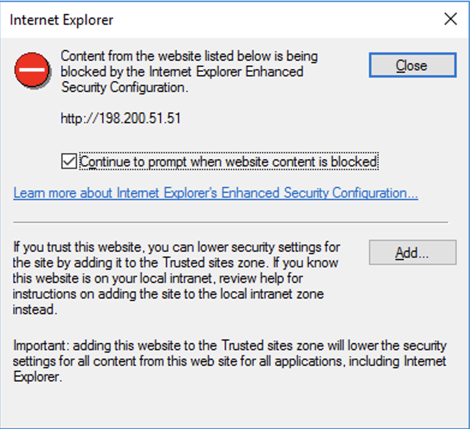
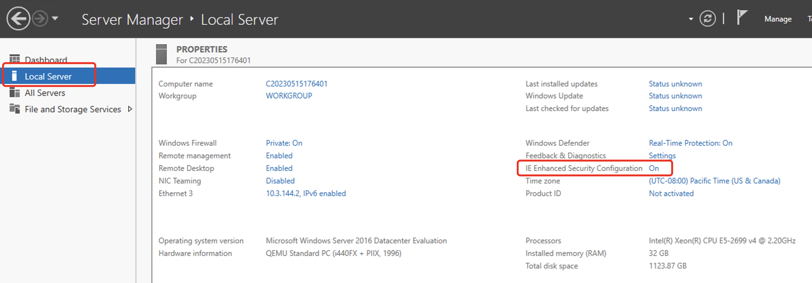
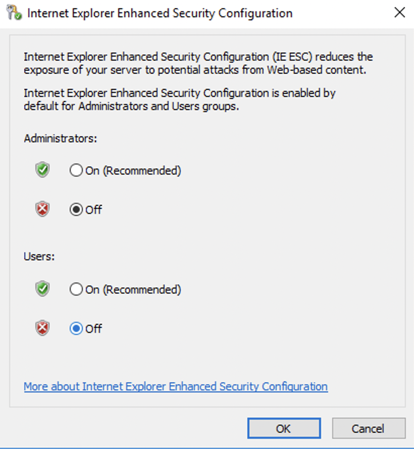

# Encounter the message "Enhanced Security Configuration is preventing the content from being displayed" while using Internet Explorer, you can resolve it by following these steps

In Windows operating systems, when using the Internet Explorer and encountering a message that the website content is blocked, you may need to add the site to the trusted sites list.

To ensure the security of Windows Server, Internet Explorer (IE) browser is configured with enhanced security settings by default. If you do not want to receive the error message mentioned above when opening the browser, you can disable the enhanced security configuration for IE.

1.Click the Start button in the lower-left corner of the screen > Server Manager > Local Server, then click on the right side of "IE Enhanced Security Configuration" to enable it.

2.On the "Internet Explorer Enhanced Security Configuration" page, select "Off" for both administrators and users, then click "OK" to save the configuration.

3.After configuring the Internet Explorer Enhanced Security settings as mentioned, you should no longer receive the prompt blocking the content on that website after you reopen IE Browser.
