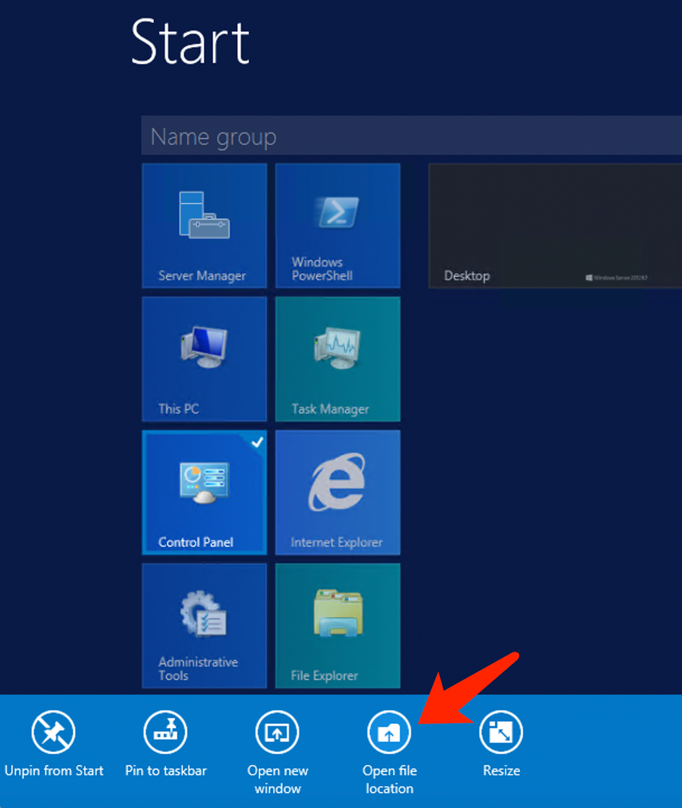
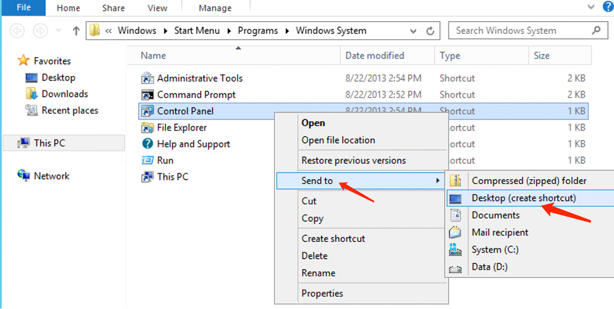
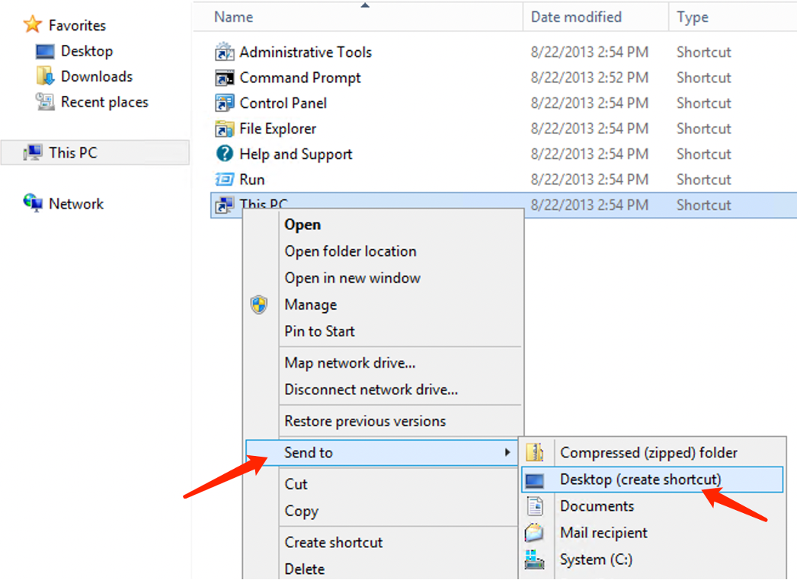

# How to Create Shortcut Icons in Windows

In some partially installed Windows systems, after remote login, the desktop only contains a Recycle Bin icon. Many users requested that it would be nice to have icons like 'This PC,' 'Control Panel,' and 'Search' as shortcuts on the desktop.

Create Desktop Shortcuts with the following steps:

1.Click the icon in the lower-left corner to open the Start menu.

 

2.Right-click 'Control Panel' and select 'Open file location.'

3.Right-click ‘Control Panel,' select 'Send to,' and then click 'Desktop (create shortcut)’.

4.The steps for creating a shortcut for 'This PC' are the same.

