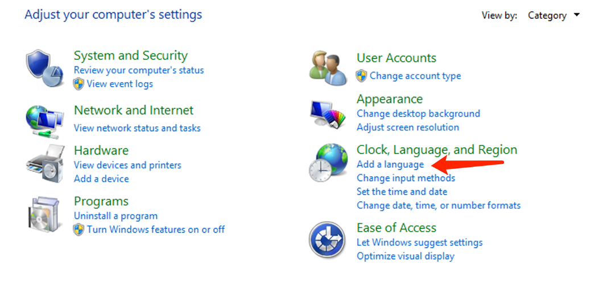
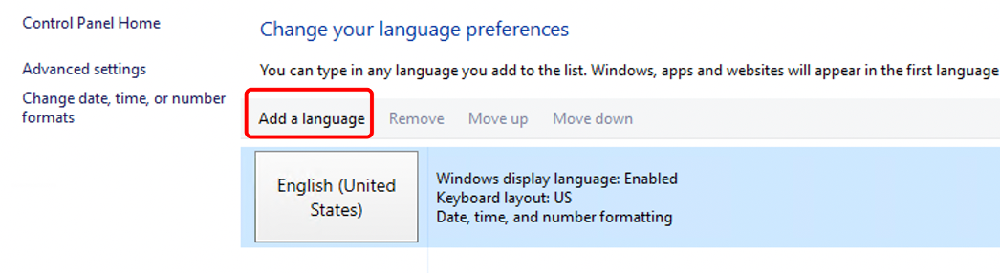
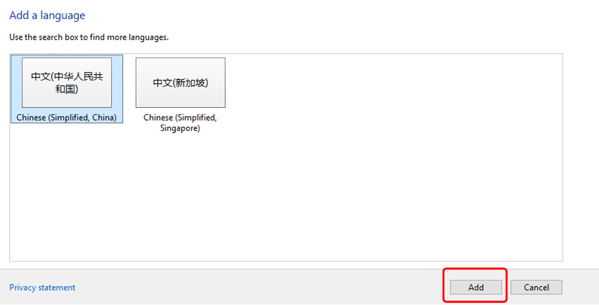
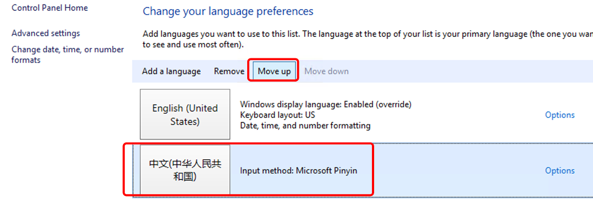
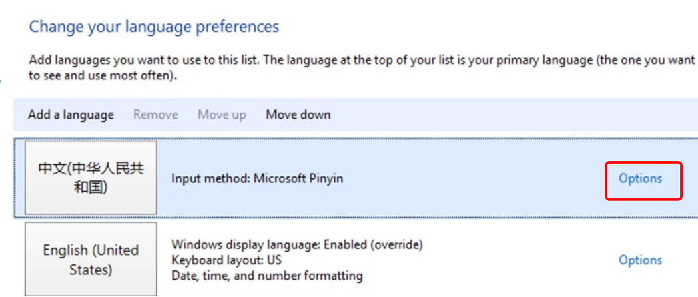
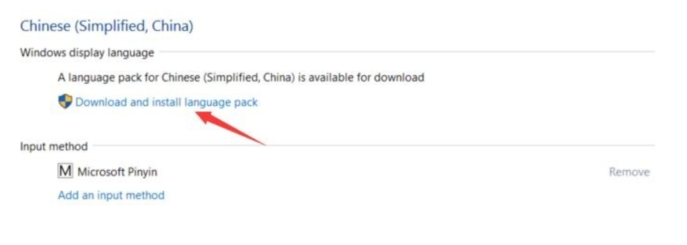
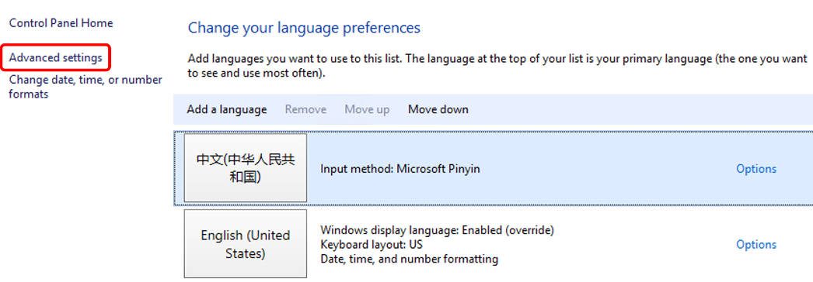
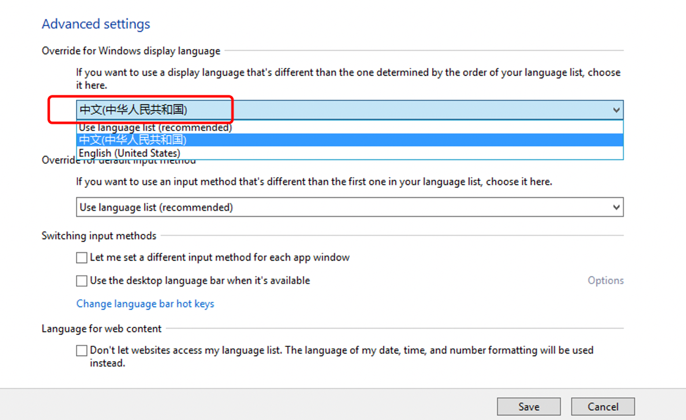

# How to change the language in Windows

1.Go to Control Panel -  Select "Clock, Language, and Region." - Click "Add" to add the language.

2.add the language.

3.Select the language you want to add - Open - Add.

4.Move the added language to the top of the language list.

5.In that case, you need to download and install the language pack. Click on the option on the right.

6.Download and install the language pack.

7.Select Advanced settings after the download is complete.

8.Switch to the language we just downloaded, and select it from the dropdown menu in the first option. Then save the changes.

9.After completing the steps, log out and then remotely connect again, and you will see that the server has successfully switched to the new language.
