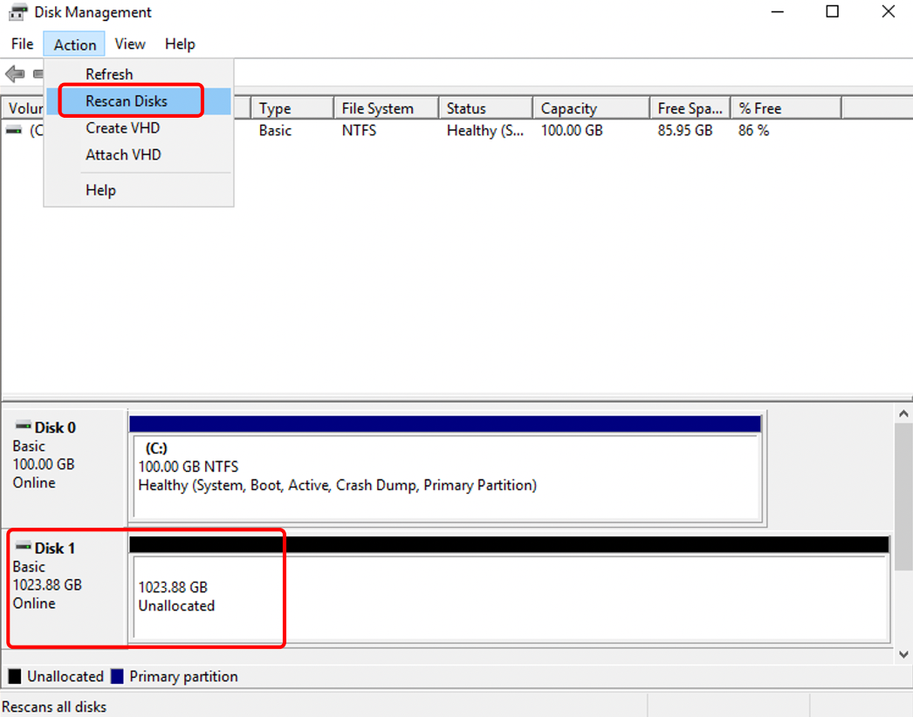
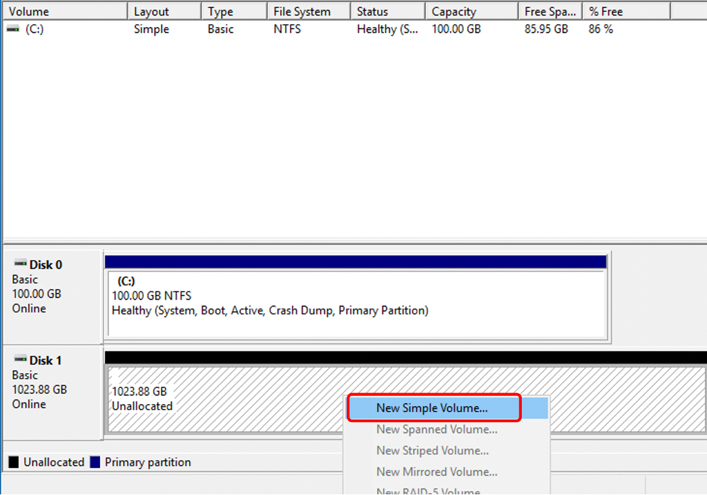
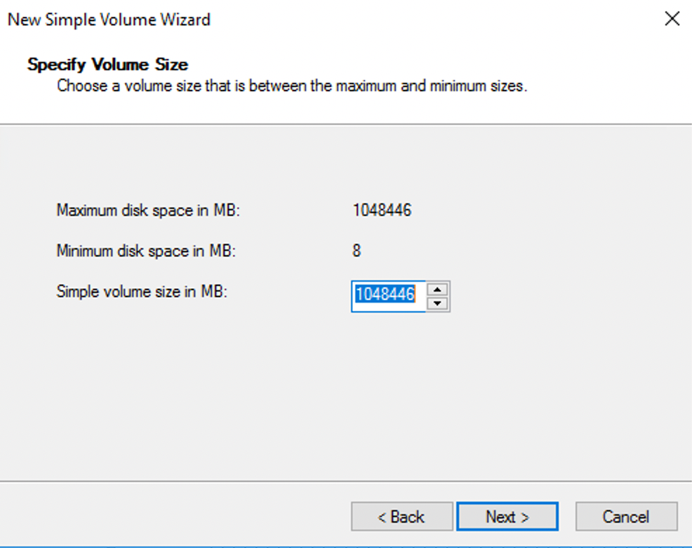
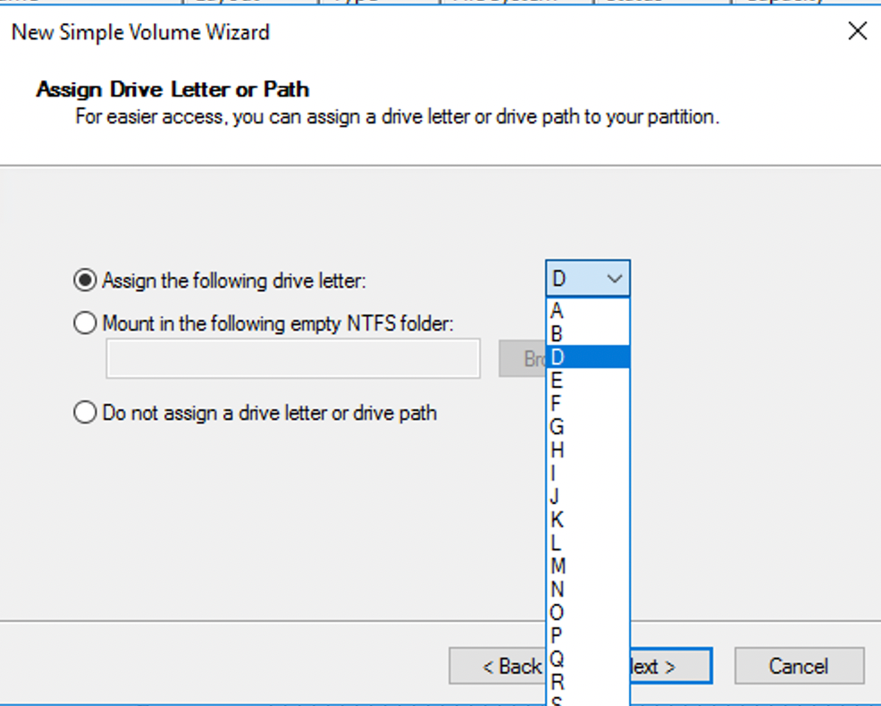
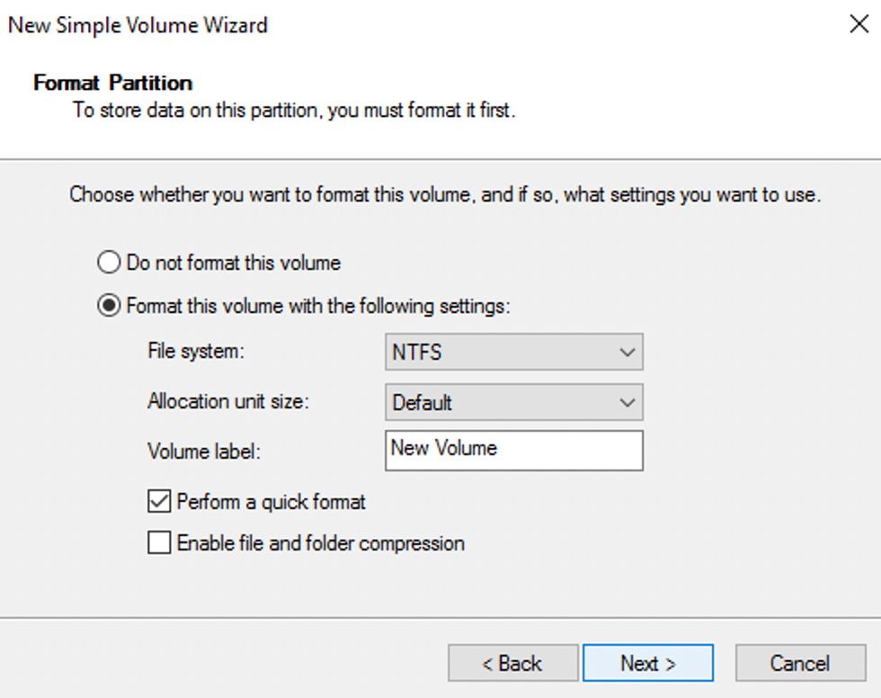

# How to create a partition in Windows system

1.Right-click on the Start menu in the Windows Server desktop and select "Disk Management."

2.In the Disk Management dialog box, select "Action" > "Rescan Disks" to view the unallocated disk space.

Disk 0 (C drive) is the system disk, and Disk 1 (D drive) is the data disk.

3.Right-click on the unallocated space of Disk 1 and select "New Simple Volume."

4.Allocate the desired capacity for the disk, which is set to the entire available space by default.

5.Choose the drive letter for the new partition.

6.Click Next to proceed and then click Finish to complete the process.

7.After the creation is completed, you can see the newly added D drive.
