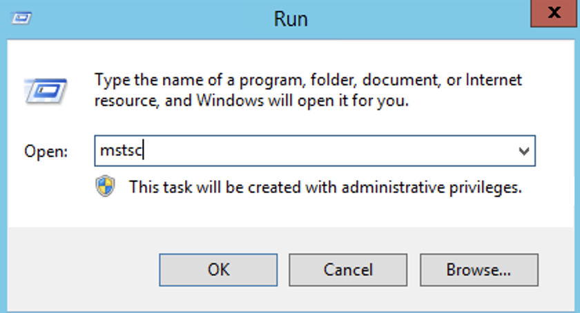
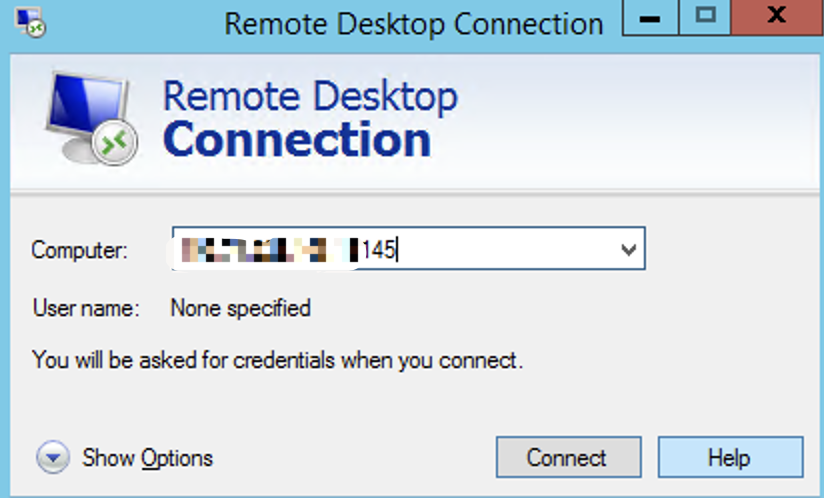

# How to remotely log in to a Windows system

To remotely log in to a Windows system, you can use the Remote Desktop Protocol (RDP) feature. Here are the steps to remotely log in to a Windows system:

1. Ensure that the remote system has the Remote Desktop feature enabled and is connected to the network.

2.On your local computer, press the shortcut keys "Win+R" to open the Run window, then enter the command "mstsc" and click OK to open the Remote Desktop Connection window.

3.In the Remote Desktop Connection window, enter the IP address of the remote system you want to connect to. If there is a port number, make sure to include it as well.

4. Click the "Connect" button to initiate the connection.

5. If prompted, enter the username and password for the remote system. Make sure you have the necessary credentials with appropriate permissions to log in.

6. Once authenticated, you will be connected to the remote Windows system, and you can interact with it as if you were physically present.
