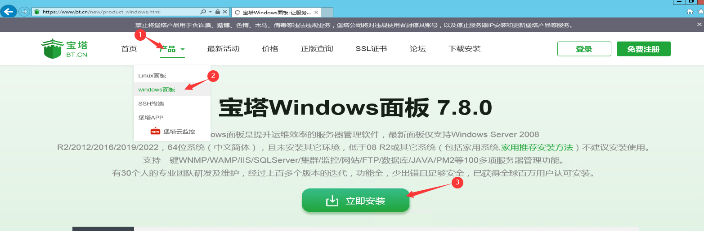
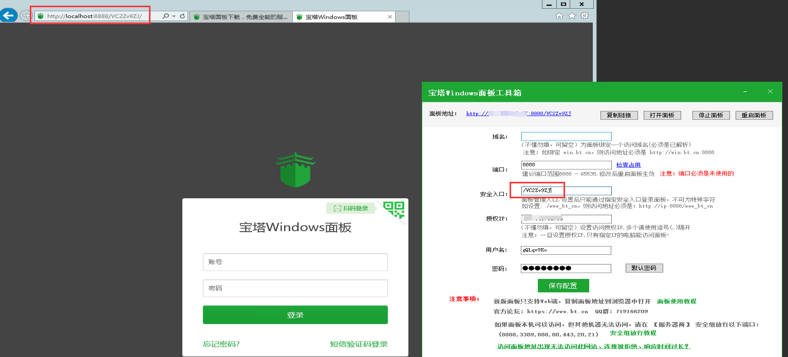

# Installing and Using Baota Panel on Windows System

Direct download link for Baota panel.：<https://www.bt.cn/new/download.html>

Windows Instance:

- Choose any of the following methods to open the Baota panel:
- Method 1: Double-click the Baota icon on the Windows desktop.
- Method 2: On the Windows desktop, click the Start menu > Baota panel.

On the Baota Windows panel toolbox page, you can view the running information of Baota services.

You can check and record relevant information about the Baota panel, such as the ports used by Baota services, security access, etc., as shown in the following figure.

Choose any of the following methods to check if you can access the Baota panel using localhost:

- On the Baota Windows panel toolbox page, click "Open Panel".
- Open a web browser and enter "localhost:<Port Used by Baota Service>[Security Access]" in the address bar, then press Enter to access the Baota panel.
- <Port Used by Baota Service>: Refers to the port displayed on the Baota Windows panel toolbox page, for example, 8888.
- [Security Access]: If the Baota panel has enabled security access, the browser's access address must include the [Security Access] parameter, otherwise, you will get a "404" error when accessing the Baota panel. The value of this parameter is the security access displayed on the Baota Windows panel toolbox page, for example, /VC2Zv9ZJ.

