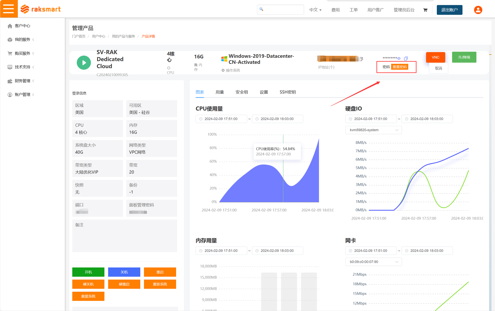
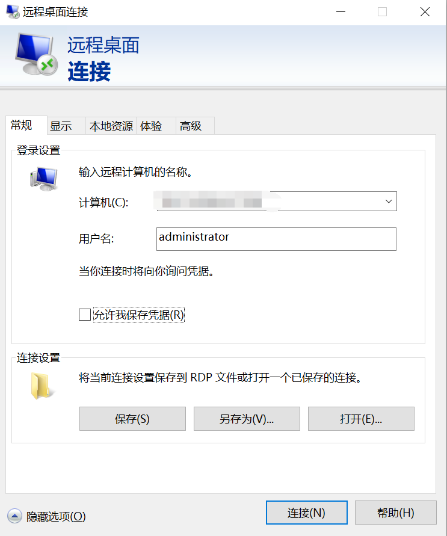
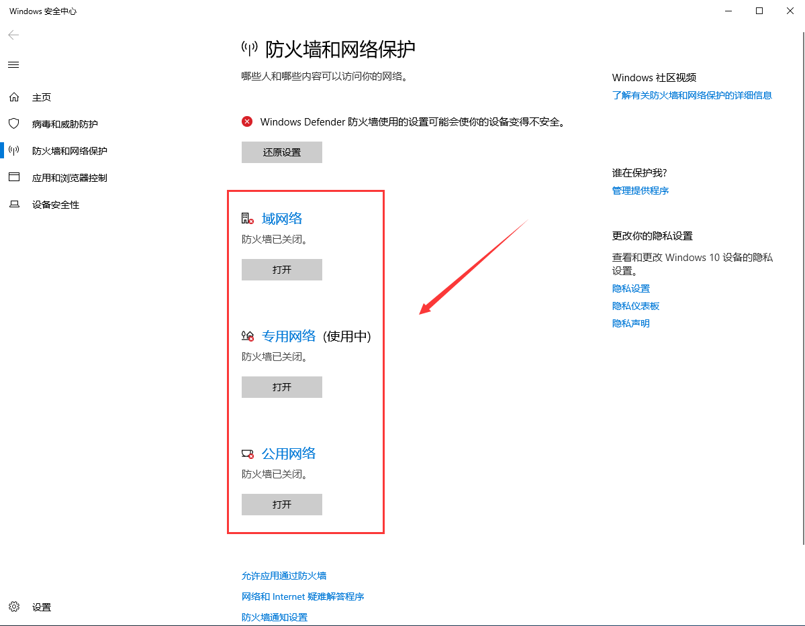
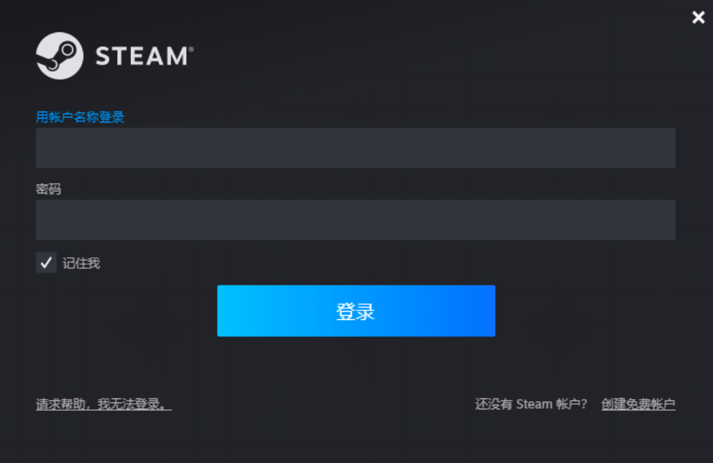
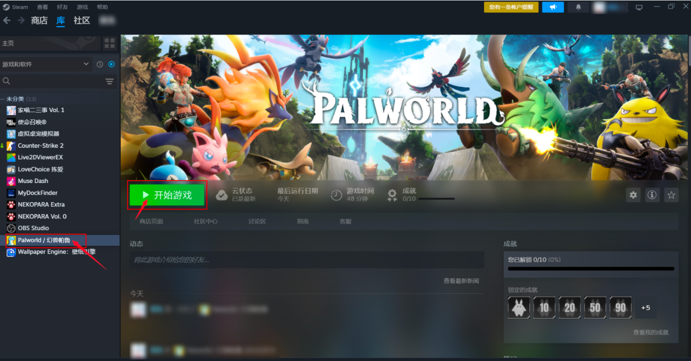
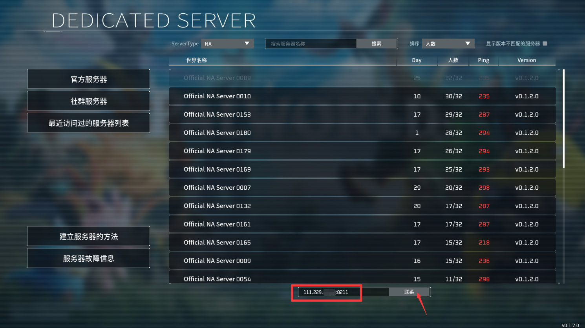
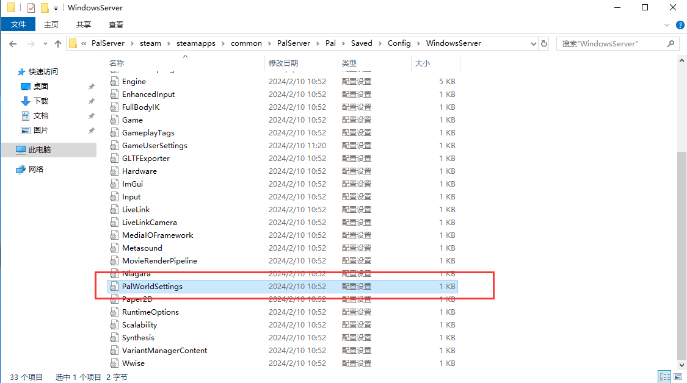

# One-click deployment of Palworld on Windows server

Deployment Environment

- Server configuration: Take CPU 4 cores and memory 16GB as an example (usually can meet 6-8 people online at the same time)
- Operating System:Windows Server 2019

Log in to Windows

1、Log in to the raksmart console and obtain the server‘s login password. If you forget your password, you can reset it in the console:

2、Use the *Remote Desktop Connection* on your computer, enter the IP address, port, account, and password to remotely connect to the server.

Deployment

Prerequisites: PowerShell

One-click deployment on Windows requires PowerShell. PowerShell is a task automation and configuration management framework that provides a command-line shell and scripting language for managing and controlling Windows operating systems and related applications. So how do you find PowerShell? Here are somen methods:

|  |  |
| --- | --- |
| Methods | Descriptions |
| Using the Start Menu | Click the Windows Start button and type *PowerShell* in the search box. You should see a search result for *Windows PowerShell* or *PowerShell*. Click that result to open PowerShell. |
| Using the Run Dialog Box | Press the *Win + R* key combination to open the Run dialog box. Enter *powershell* in the box and click *OK* to open PowerShell. |
| Using File Explorer | Open File Explorer (Windows Explorer), navigate to the desired directory, then type *powershell* in the address bar and press *Enter*. This will open PowerShell in the current directory. |

Step 1: Download the C++ runtime library (click the link to download), which needs to be installed manually. [https://aka.ms/vs/17/release/vc\_redist.x64.exe](https://cloud.tencent.com/developer/tools/blog-entry?target=https%3A%2F%2Faka.ms%2Fvs%2F17%2Frelease%2Fvc_redist.x64.exe&source=article&objectId=2383611 "https://cloud.tencent.com/developer/tools/blog-entry?target=https%3A%2F%2Faka.ms%2Fvs%2F17%2Frelease%2Fvc_redist.x64.exe&source=article&objectId=2383611")

Step 2: Download the DirectX support library (click the link to download), which needs to be installed manually. [https://www.microsoft.com/en-us/download/details.aspx?id=35](https://cloud.tencent.com/developer/tools/blog-entry?target=https%3A%2F%2Fwww.microsoft.com%2Fen-us%2Fdownload%2Fdetails.aspx%3Fid%3D35&source=article&objectId=2383611 "https://cloud.tencent.com/developer/tools/blog-entry?target=https%3A%2F%2Fwww.microsoft.com%2Fen-us%2Fdownload%2Fdetails.aspx%3Fid%3D35&source=article&objectId=2383611")

Step 3: Run the one-click deployment command

The one-click deployment method is suitable for developers who want to quickly get started with the Palworld. The deployment can be completed by running only one line of command.

With reference to the official tutorial, we have packaged a script for one-click deployment of the Palworld for you and uploaded it to the cloud. You only need to log in to the server, copy and run the following command in PowerShell. Usually, after waiting for 3-5 minutes, the deployment can be completed.

iex (irm 'https://pal.pet/pal-server/Windows/install.ps1')

⚠️Note: If you use a server in mainland China to run the one-click deployment script, the script may fail to run due to network problems. It is recommended that you retry multiple times or deploy again at a different time. The main reason here is that the installation process requires requesting Steam's server, and the network connection may be unstable.

Step 4: Turn off the firewall

⚠️Note: Be sure to turn off the firewall in the machine, otherwise the server may not be able to be connected.

**Server-side Startup and Restart**

After the server-side deployment is complete, it will start automatically. No additional startup is required.

After the server restarts, the Palworld server-side will start automatically.

If you need to restart the server-side, simply restart the server.

Log in to the game

Prerequisites

- First you need to download the Steam client-side on your local computer.
- Secondly, you need to [buy Palworld](https://cloud.tencent.com/developer/tools/blog-entry?target=https%3A%2F%2Fstore.steampowered.com%2Fapp%2F1623730%2FPalworld%2F%3Fl%3Dschinese&source=article&objectId=2382000 "https://cloud.tencent.com/developer/tools/blog-entry?target=https%3A%2F%2Fstore.steampowered.com%2Fapp%2F1623730%2FPalworld%2F%3Fl%3Dschinese&source=article&objectId=2382000")on Steam.

Login steps

Step 1: Open the Steam client and log in to your Steam account.

Step 2: Find the Palworld in the *Library* and click *Start Game*.

Step 3: Select [Join Multiplayer (Dedicated Server)] in the game menu.

Step 4: At this point, you have successfully built a dedicated server for Palworld. Players can enter the public IP address and port number of the server you have deployed (such as 11.11.11.11:8211). After successfully connecting to the server, they can play online.

⚠️Note: Remember to use an English colon between the public IP and the port, otherwise you will be prompted`Format Error. Example: 127.0.0.1:7777`！！！

Tip: You can check the public IP of the server in the user backend. When entering the server connection address, if your server public IP is displayed as: 175.xxx.xx.138, you need to fill in the following when entering the link:175.xxx.xx.138:8211

Renew

Open PowerShell

Enter the following command

iex (irm 'https://pal.pet/update\_windows.ps1')

Wait for a while and the task will be successfully executed to complete the update.

Manually configure game parameters

After the deployment of the Palworld is completed, if you want to DIY the game world according to your own preferences, you need to take the following steps:

Step 1: Go to the following path to find the configuration file of the game world parameters:`PalWorldSettings.ini`

C:\Program Files\PalServer\steam\steamapps\common\PalServer\Pal\Saved\Config\WindowsServer\PalWorldSettings.ini

Step 2: Select the file, right-click, and choose Notepad as the opening method.

Step 3: Write the specific world configuration according to your needs. The following content is only an example. For detailed parameters, please refer to the [official description](https://cloud.tencent.com/developer/tools/blog-entry?target=https%3A%2F%2Ftech.palworldgame.com%2Foptimize-game-balance&source=article&objectId=2383611 "https://cloud.tencent.com/developer/tools/blog-entry?target=https%3A%2F%2Ftech.palworldgame.com%2Foptimize-game-balance&source=article&objectId=2383611")。

Difficulty=None ServerName=Lighthouse ServerDescription=Lighthouse AdminPassword=ABC ServerPassword=TEST DeathPenalty=All bEnablePlayerToPlayerDamage=False

Step 4: Restart the server to make it effective (Palworld you deployed will start automatically).
