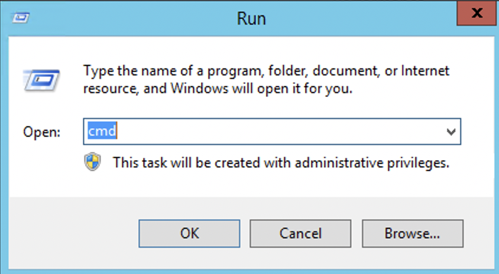
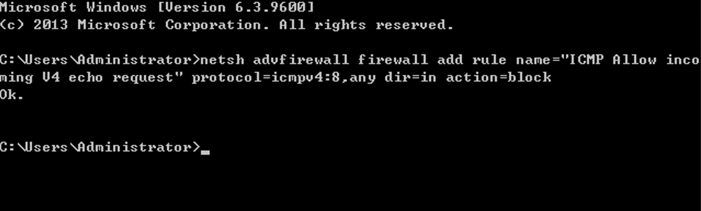

# Setting up Ping Block on Windows System

To prevent hackers from discovering and attacking the machine through network ping scanning, you can disable the ping command on the local machine.

1.Press the Win+R shortcut key on your computer desktop to open the Run window. Type "cmd" in the search box and click OK.

2.Enter the following command in the command prompt window.：

- netsh advfirewall firewall add rule name="ICMP Allow incoming V4 echo request" protocol=icmpv4:8,any dir=in action=block

This command adds a new rule on top of the existing rules. If you want to restore the ability to ping, you can simply delete this rule

- netsh advfirewall firewall del rule name="ICMP Allow incoming V4 echo request"

3.At this point, if we check the IP, we can see that ping is blocked. However, if we want to test the IP connectivity, we can perform a ping test on a specific port, and we can see that it is reachable. If we want to restore the ping block, we can simply enable the aforementioned rule again.

