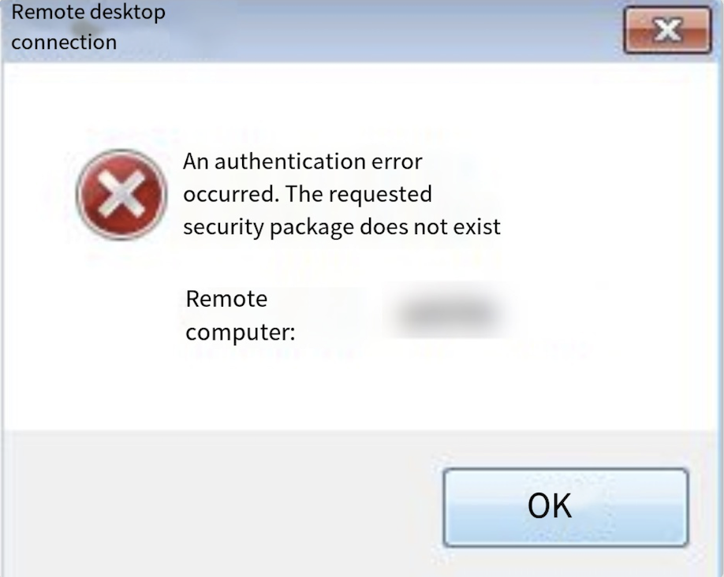
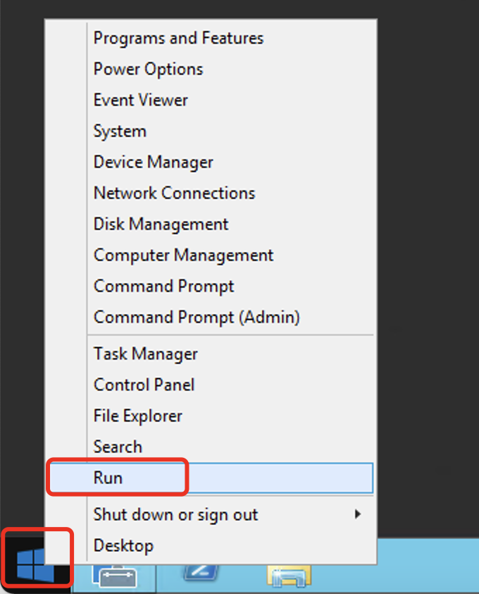
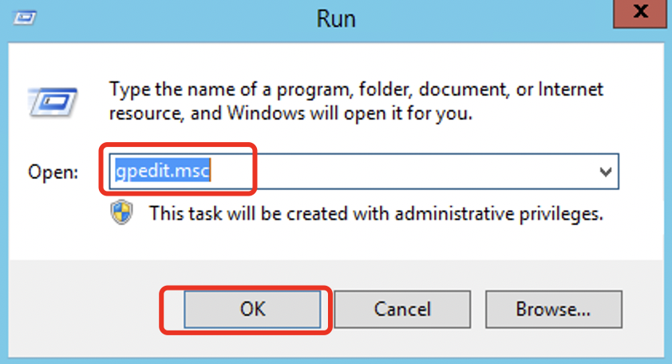
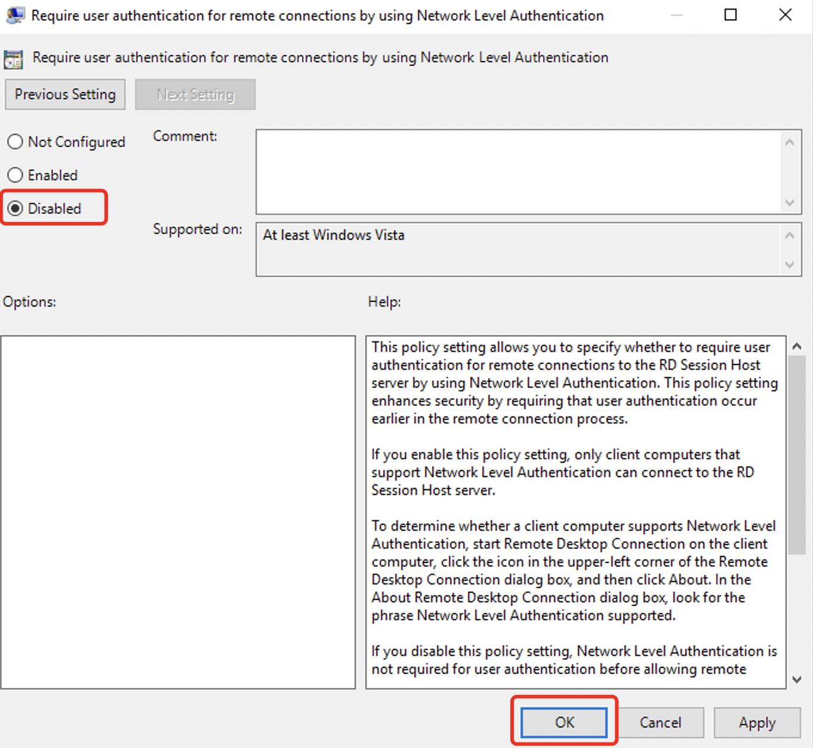

# The error message "An authentication error has occurred. The requested security package does not exist" can be resolved by following the steps below

The error you are experiencing is caused by a missing security package related to authentication during remote desktop connection to the instance on the Windows system.

 

**The solution is as follows:**

1.Access the system through the backend VNC.

2. Right-click on the Windows icon and click on "Run".

3. Enter "gpedit.msc" in the Run dialog to open the Local Group Policy Editor. Navigate to: Computer Configuration > Administrative Templates > Windows Components > Remote Desktop Services > Remote Desktop Session Host > Security. In the right pane, find and double-click on "Require user authentication for remote connections by using Network Level Authentication."

4. In the "Require user authentication for remote connections by using Network Level Authentication" window, select "Disabled" and click on "OK."

