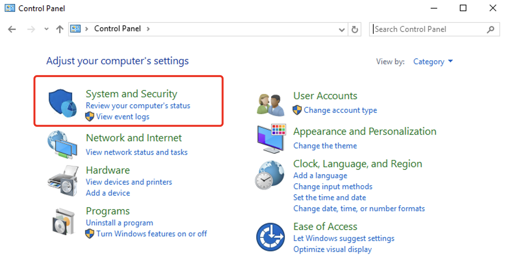
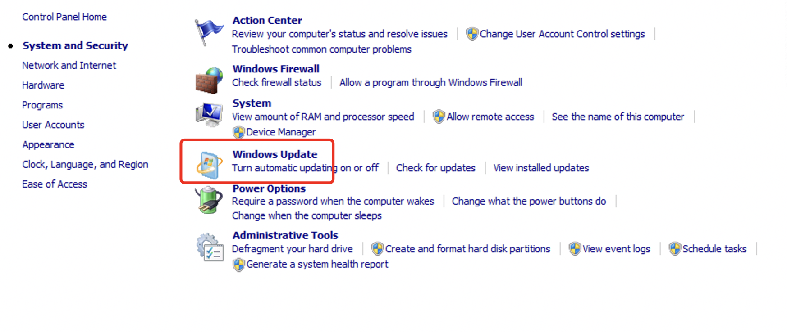
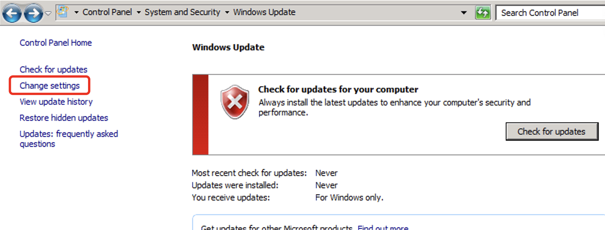
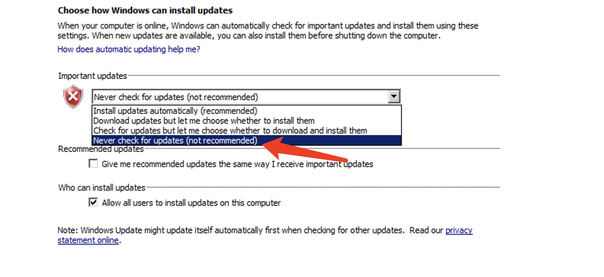
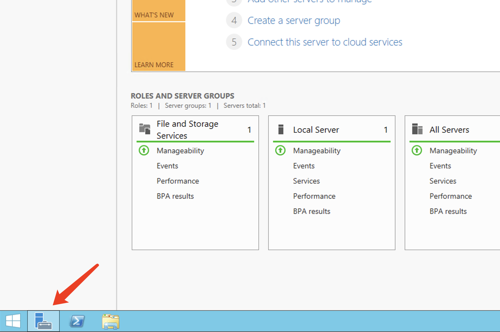
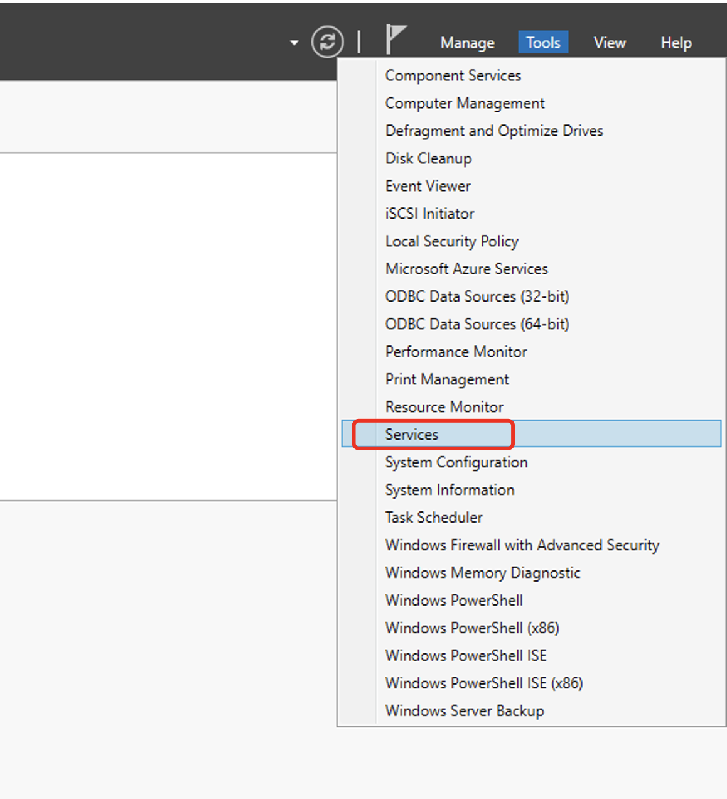
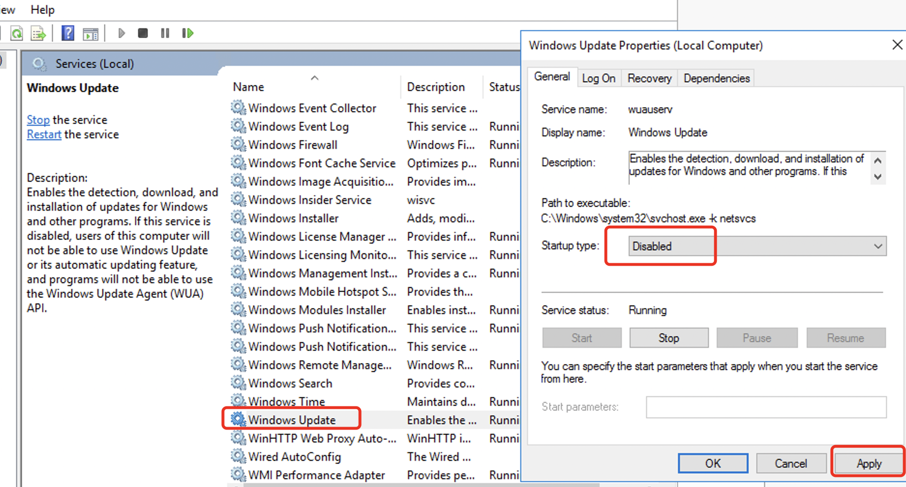

# To disable automatic system updates on Windows

1.Remotely access the Windows instance using Remote Desktop.

2. Click on the Start button located in the bottom-left corner and open the Control Panel. Then, click on "System and Security".

3. Click on "Windows Update".

4. Click on "Change settings" in the left column.

5. Once in the "Change settings" window, select the option "Never check for updates".

6. By doing this, we have successfully disabled the update checking for the Windows system. However, the Windows Update service is still set to start automatically at system startup. Therefore, we also need to open the "Server Manager" application.

7. After opening the "Server Manager" window, click on "Tools" at the top and select "Services" from the drop-down menu.

8. Locate "Windows Update" in the list, right-click on it, and select "Properties". In the Properties window, set the "Startup type" to "Disabled", and then click "OK".

