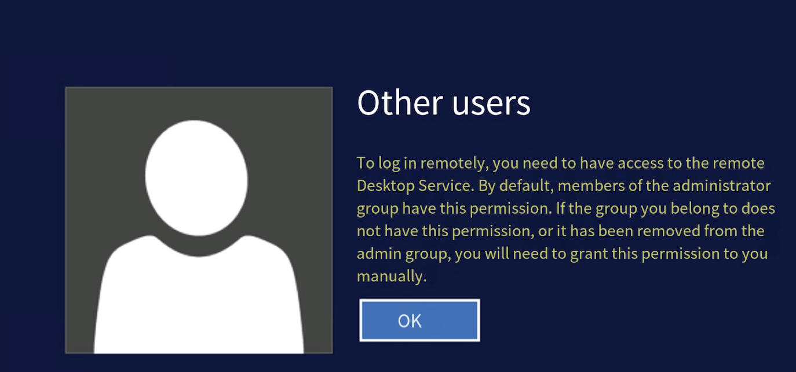
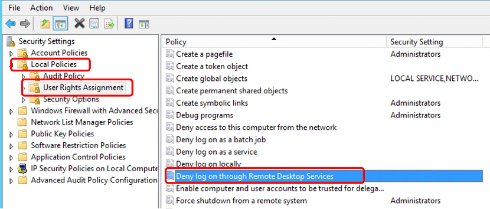
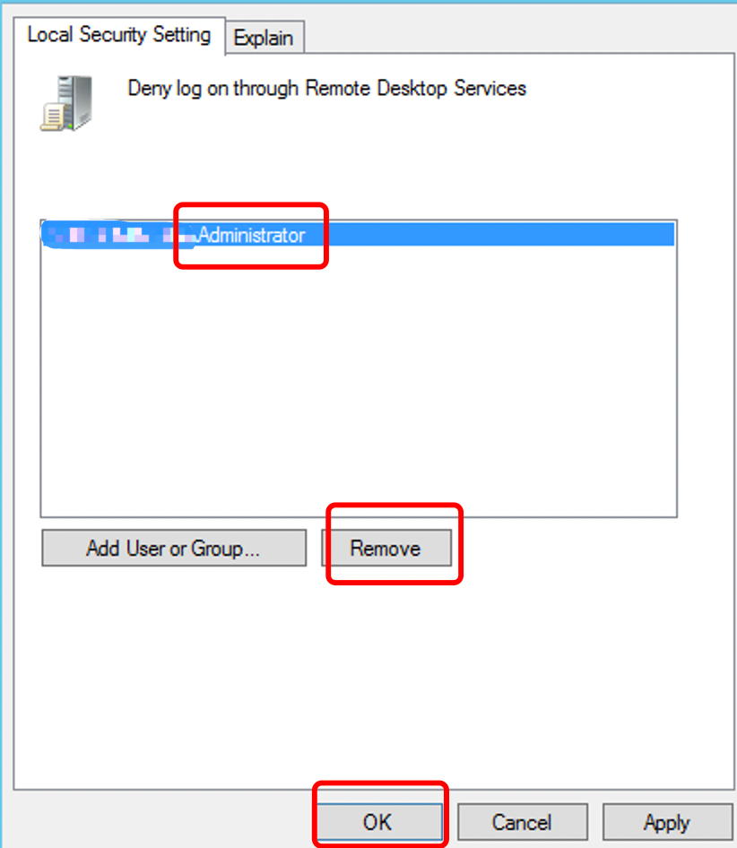

# To resolve the error message "To log on remotely, you need the right to log on through Remote Desktop Services,"

## 一.Symptom of the problem.

When using the Administrator user to log in to the instance via Remote Desktop, the following message is displayed.

## 二.Root Cause

The local security policy on the Windows instance has been configured to disallow the Administrator user from logging in as a Remote Desktop Services client.

## 三.Solution

Please refer to the following steps for the operation:

 

1.  Connect to the Windows instance via VNC.

2.  Click on the Start icon, open the Control Panel, and navigate to System and Security.

3.  On the Control Panel page, click on System and Security > Administrative Tools, and double-click to open Local Security Policy.

4.  On the Local Security Policy page, click on Local Policies > User Rights Assignment, and double-click on "Deny log on through Remote Desktop Services" in the right-hand pane.

5.  In the "Deny log on through Remote Desktop Services" properties window, click on the "Add User or Group" button.

