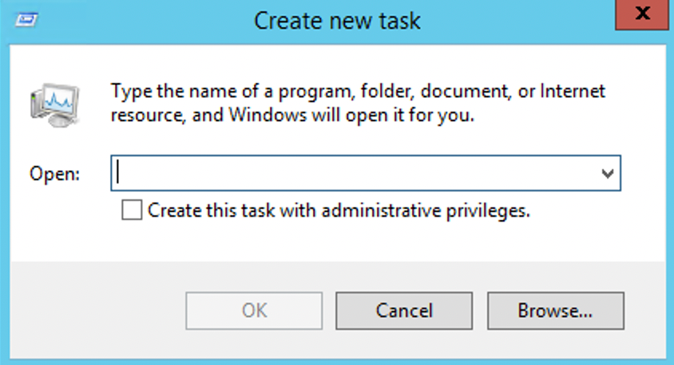

# What to do if you are unable to access the desktop of a Windows Server 2012 system after uninstalling certain software

#### 一.Issue description

For Windows Server 2012 operating system, when installing certain applications that require .NET Framework 3.5, the built-in .NET Framework 4.5 version needs to be uninstalled. However, after uninstalling it, there might be issues such as a black screen and inability to access the system desktop. Only the Task Manager can be accessed in such cases.

#### 二.Possible causes

After uninstalling .NET Framework 4.5, the system transitions from Full mode to Core mode, which does not enable the system desktop.

#### 三.solution

The recovery process involves transitioning from Core mode to Full mode.  Follow the steps below:

1.  Log in to the server.

 

2.  Open Task Manager.

 

3.  Select "File > Run new task."

 

The system opens the "Create new task" window.

4.  In the "Open" field, type "cmd" and press Enter.

5.  In the opened command prompt window, execute the following command to transition the system from Core mode to Full mode:

Dism /online /enable-feature /all /featurename:Server-Gui-Mgmt /featurename:Server-Gui-Shell /featurename:ServerCore-FullServer

6.  After approximately 10 minutes, the system will prompt for a restart.  Enter "Y" in the command prompt to restart the system.

After logging in again, the desktop should be displayed normally.
