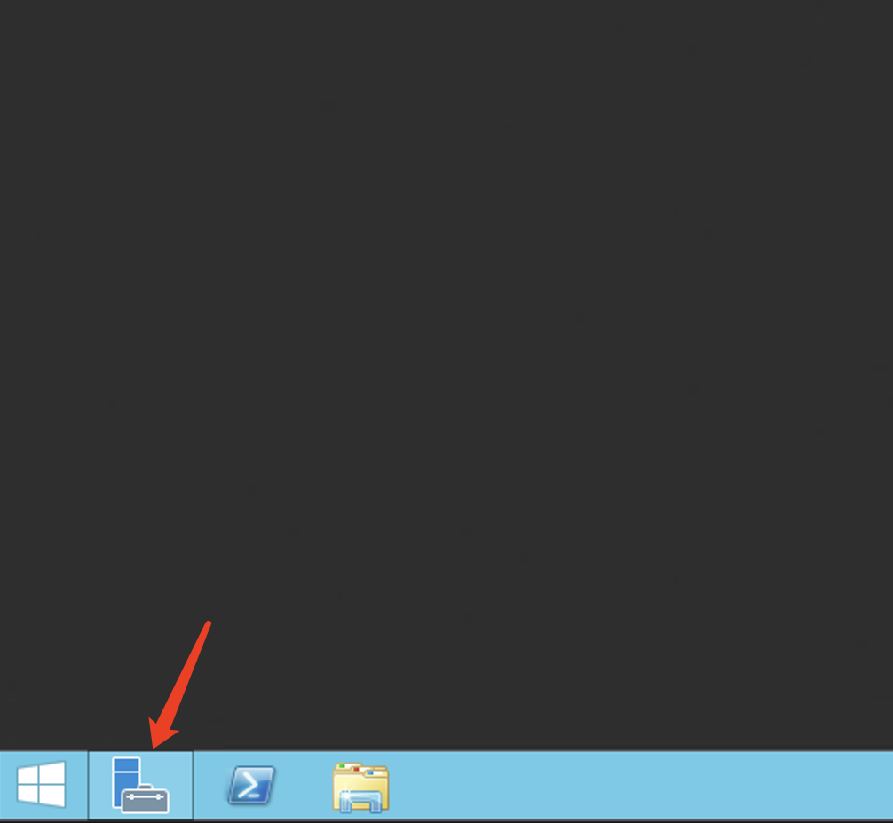
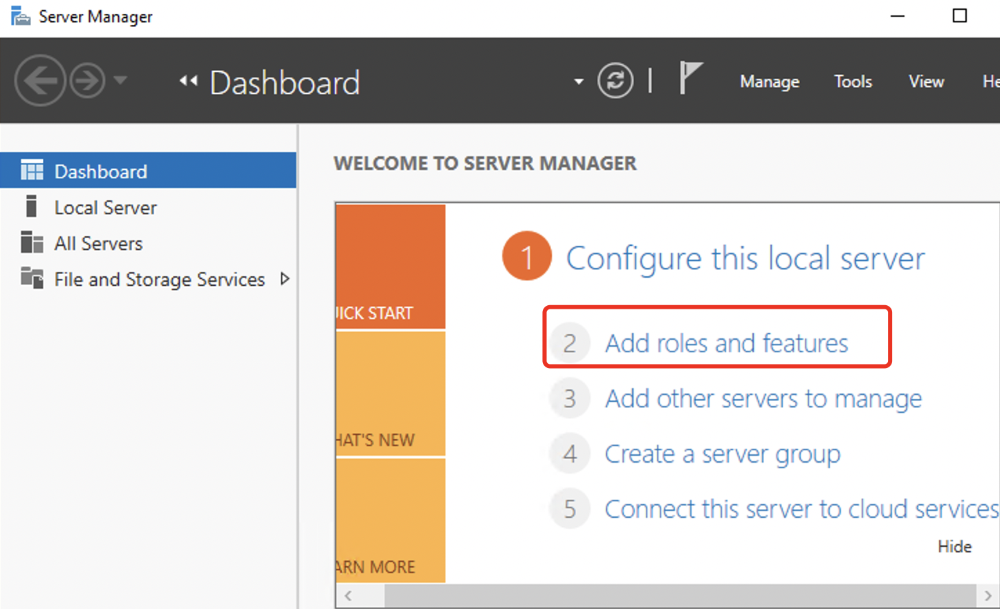
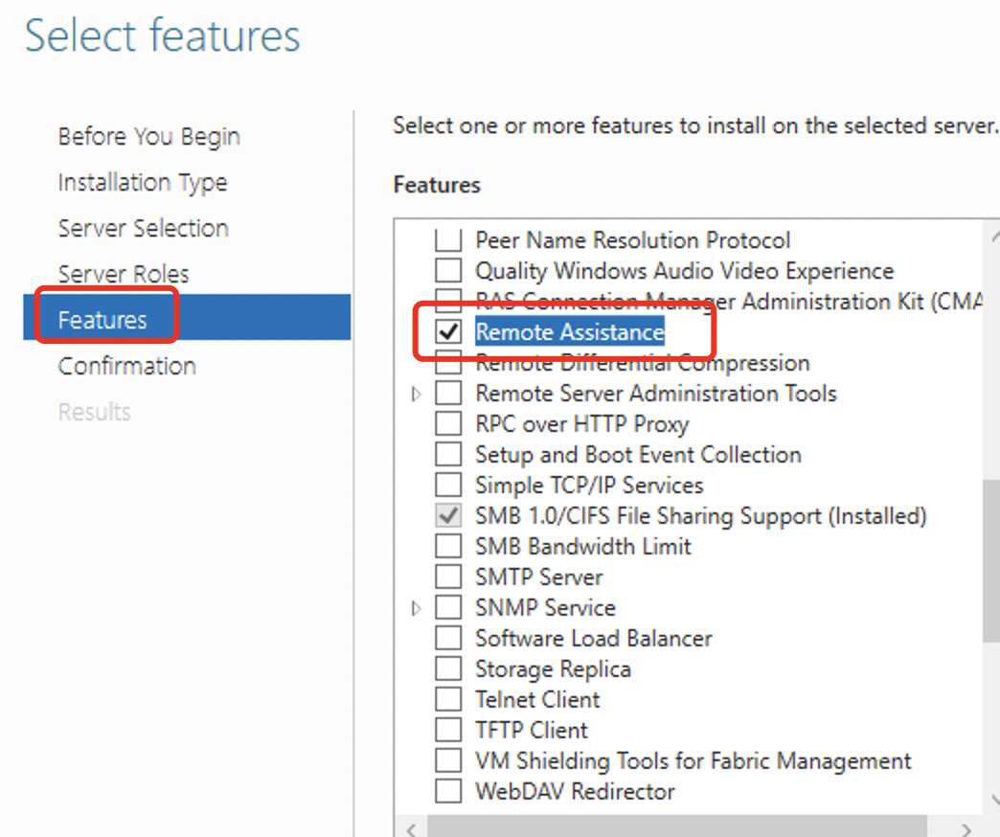

# Windows system cannot start Remote Assistance

In Windows Server systems, if Remote Assistance option is grayed out and cannot be selected for enabling.

1. 1.Click on the Server Manager icon on the Windows taskbar.

2. 2.In the pop-up Server Manager window that appears, click on "Add Roles and Features" on the right-hand side.

3. 3.In the "Add Roles and Features Wizard" window that appears, click "Next" until you reach the "Features" section. Find and select "Remote Assistance" and then click "Next" until the process is completed.

