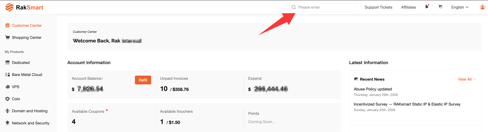
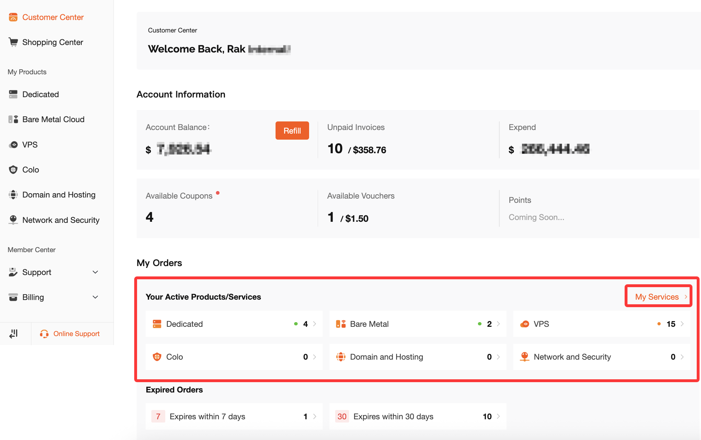
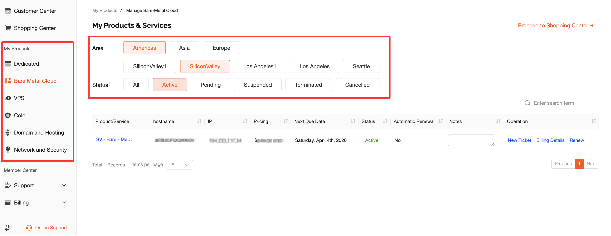

# How to Find Purchased Products

## 1. Overview

When you need to manage your purchased cloud services, such as Dedicated, Bare Metal Cloud, or VPS, or check product status and renewal information, you can quickly locate your products in the RakSmart Client Area using the following three methods:

- Quick Search - Search directly using the hostname or primary IP address
- Homepage Shortcut - View products through “My Orders” or “My Services”
- Product Navigation - Filter products by type, region, or status

Below are the detailed steps for each method.

---

## Method 1: Quick Search (Fastest)

If you remember the server hostname or primary IP address, you can use this method to quickly locate your machine.

### Steps

1. **Log in to the RakSmart Client Area.**
2. Locate the search bar in the top-right corner of the page (the input field labeled “Search”).

   
3. Enter the primary IP address or hostname of your server.

   - For example:

     - 192.168.1.100
     - sv-xxxxx
4. The system will automatically display matching product orders.
5. Click the corresponding order to enter the product page.

### Suitable For

- When you remember the IP address or hostname
- When you need quick access to a specific server

---

## Method 2: Find Products from the Client Area Homepage

If you have just logged in to the client area, you can quickly view active services through the homepage shortcuts.

### View via My Orders - Current Orders

1. Log in and go to the Customer Center.

   
2. Locate the “My Orders” section.
3. Check “Current Orders” to see a list of active orders.
4. From the list, you can：

   - Click the product type (e.g., Dedicated) to open the product details page
   - Or click “My Services” to view all active services

### Suitable For

- Quickly viewing all active products
- When you do not remember the IP address or hostname

---

## Method 3: Find Products via Product Navigation (Most Comprehensive)

If you need to filter products by type, region, or status, this method is recommended.

### 1. Enter Product Management

In the left navigation menu, find “My Products”, then choose the corresponding product type based on your purchase:

- Dedicated
- Bare Metal Cloud
- VPS

- 

### 2. Filter by Region

After entering the product page, you will see region filtering options.

| Region | Available Locations |
| --- | --- |
| Americas | Silicon Valley, Los Angeles, Seattle, etc. |
| Asia | Singapore, Hong Kong, Japan, Korea, etc. |
| Europe | Frankfurt, etc. |

Select the corresponding region to view all servers in that location.

### 3. Filter by Status

After selecting a region, you can further filter machines by status.

| Status | Description |
| --- | --- |
| All | Displays all machines regardless of status |
| Active | Servers currently running normally |
| Pending | New orders or changes awaiting approval |
| Suspended | Suspended due to unpaid invoices or other reasons |
| Terminated | Deleted or expired services |
| Cancelled | Orders that have been cancelled |

### 4. View Product List

After applying filters, the page will display a list of matching products, including:

- **Product/Service** - Product configuration details
- **Hostname** - Server hostname
- **IP Address** - Server IP address (for some products)
- **Pricing** - Product price
- **Next Due Date** - Renewal date
- **Status** - Current service status
- **Automatic Renewal** - Whether automatic renewal is enabled

Click a product to enter the management panel, where you can perform operations such as:

- Reinstalling the operating system
- Restarting the server
- Viewing monitoring information

---

## Product Search Path Summary

| Product Type | Navigation Path |
| --- | --- |
| Dedicated | My Products → Dedicated → Filter by region/status |
| Bare Metal Cloud | My Products → Bare Metal Cloud → Filter by region/status |
| VPS | My Products → VPS → Filter by region/status |
| All Active Products | Client Area Homepage → My Services |
| Current Orders | Customer Center → My Orders → Current Orders |

---

## Frequently Asked Questions

**Q: Why can’t I see any machines in Product Management?**
**A:** Please check the following:

1. Make sure you selected the correct product type.
2. Confirm that the region filter includes the location of your server.
3. Check whether the status filter is set to “All” or “Active”.
4. Ensure that the logged-in account is the owner of the product.

**Q: Why does nothing appear after entering an IP address in the search bar?**
**A:** Please confirm:

1. The IP address is entered correctly.
2. The IP belongs to a product under the currently logged-in account.

**Q: What does “Pending” status mean for my server?**
**A:** It means your newly purchased server is currently being prepared or installed. Once the setup is complete and approved, the status will change to “Active”.

**Q: What is the difference between Dedicated and Bare Metal Cloud?**
**A:**
**Dedicated** refers to a traditional physical server.
**Bare Metal Cloud** refers to a physical server with cloud-style features and management capabilities.

These two product types are listed under separate menus in “My Products”, so please choose the appropriate section based on the product you purchased.
