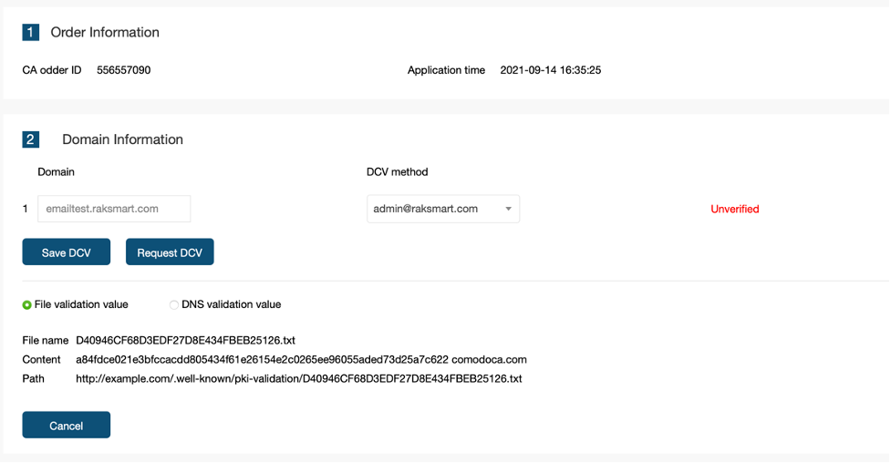
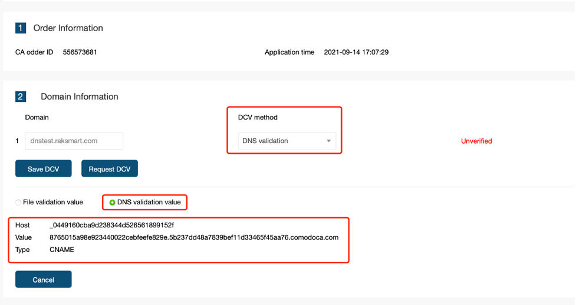
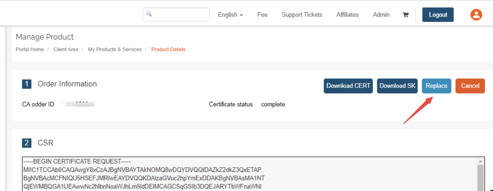

# SSL Certificate Validation Methods Guide

## 1. Overview

During the SSL certificate application process, **Domain Control Validation (DCV)** is required to verify your ownership or control of the domain. After the DCV is successfully completed, the SSL certificate is typically issued within about 30 minutes.

| Validation Method | Applicable Scenario | Estimated Time |
| --- | --- | --- |
| Email Validation | The domain email account can receive emails | Within minutes |
| DNS Validation | You can manage the domain DNS records | After DNS propagation takes effect |
| HTTP/HTTPS Validation | You can access the website root directory | After the file is uploaded |

⚠️ **Important:** For email validation, the receiving email address must be either a domain-based email address or the domain registrant email address shown in the WHOIS record. All validation steps must be completed by the customer.

## 2. General Input Rules

### 2.1 Domain Format Requirements

When applying for an SSL certificate, the Domain information cannot be an IP address. It must be entered in domain format, such as `xxx.xxx.xxx`.

| Certificate Type | Domain Format | Example |
| --- | --- | --- |
| Single Domain Certificate | Enter the domain that needs to be bound directly | [yourdomain.com](http://yourdomain.com/ "http://yourdomain.com") / [sub.yourdomain.com](http://sub.yourdomain.com/ "http://sub.yourdomain.com") |
| Wildcard Certificate | `*.yourdomain.com` | \*.example.com |
| Multi-Domain SAN Certificate | Enter one primary domain only. Other domains can be entered when submitting the certificate | [Example Domain](http://example.com/) |

### 2.2 Common Input Errors

**Error 1: Entering an IP address**
**Issue:** An error appears when clicking **“Submit”** after **“Save”**
**Cause:** SSL certificates can only be bound to domain names, not IP addresses
**Solution:** Change it to the correct domain format

**Error 2: Entering a specific domain for a wildcard certificate**
**Issue:** A format error is shown during submission
**Cause:** A wildcard certificate must use the `*.domain.com` format
**Solution:** Change it to the wildcard format

## 3. Email Validation

### 3.1 Steps

**Step 1: Select the validation method**

- Enter the Domain information on the certificate application page
- Select the **“DCV method”** as the email validation address
- Click **“Save”**
- Click **“Submit”**

**Step 2: Confirm submission**

After the submission is successful, the page will jump to the confirmation page.

**Step 3: Check the email and complete validation**

- Log in to your mailbox and check the validation email sent by the certificate authority
- The email will contain a verification code and a verification link
- Click the **“here”** link in the email to open the verification page
- Enter the verification code from the email on the verification page
- Click **“Next”** to complete the validation

### 3.2 Validation Completed

- The page will display that the validation was successful
- The certificate status will be updated to validated

---

## 4. DNS Validation

### 4.1 Steps

**Step 1: Select the validation method**

- Enter the Domain information
- Select the **“DCV method”** as **“DNS validation”**
- Click **“Save”**
- Click **“Submit”**

**Step 2: Obtain the validation information**
After submission, the system will generate a DNS validation record, including:

| Field | Description | Example |
| --- | --- | --- |
| Host | Host record | `_dnsauth.yourdomain.com` |
| Type | Record type | `CNAME` |
| Value | Record value | `_dnsauth.yourdomain.com.xxx.xxx.com` |

**Step 3: Add the record in DNS management**

- Log in to your domain DNS management panel
- Find the domain that needs to be validated, and enter the validation value in the subdomain record section
- Fill in the record according to the information provided by the system

**Step 3.1: Verify that the DNS record has taken effect**

After adding the DNS record, you can use a DNS lookup tool to check whether the record has taken effect.

Visit [DNS Lookup / DNS Record Query](https://www.racent.com/dns-check) , enter your domain and host record, and check the resolution status. If it shows that the record has taken effect, the system will automatically complete the certificate validation.

---

## 5. HTTP/HTTPS Validation

### 5.1 Steps

**Step 1: Select the validation method**

- Enter the Domain information
- Select the **“DCV method”** as **“HTTP validation”**
- Click **“Save”**
- Click **“Submit”**

**Step 2: Obtain the validation file information**

The system will generate a validation file that needs to be created in the website root directory:

| Item | Example |
| --- | --- |
| File Path | `/.well-known/pki-validation/文件名.txt` |
| File Content | verification code + CA domain |
| Validation URL | `<http://yourdomain.com/.well-known/pki-validation/文件名.txt`> |

**Step 3: Create the validation file in the website root directory**

**Example for Linux / Apache / Nginx environments:**

# Enter the website root directory (adjust the path according to your actual environment)

“cd /var/www/html”

# Create the required directory

“mkdir -p .well-known/pki-validation”

# Enter the directory

“cd .well-known/pki-validation”

# Create the validation file and write the content echo "205acf83f2718baa25ead1cd95bb2891b8e2c4818586a5bea3046f16b37b080f comodoca.com" > 007BDDFAC9157321D1071420BE72FEA8.txt

# Set file permissions (make sure it is accessible)

“chmod 644 007BDDFAC9157321D1071420BE72FEA8.txt”

# Restart the web service (optional, to make the configuration take effect)

" /etc/init.d/apache2 restart”

# Or  “systemctl restart nginx”

**Windows / IIS environment:**

- Create a folder named `.well-known` in the website root directory
- Create a folder named `pki-validation` inside `.well-known`
- Create a text file in the `pki-validation` folder, for example: `007BDDFAC9157321D1071420BE72FEA8.txt`
- Open the file with Notepad and paste the content provided by the system
- Save the file

**Step 4: Test whether the file can be accessed**

Open the validation URL in a browser:

- ✅ Normal: the browser displays the file content
- ❌ Abnormal: `404 Not Found` or the file cannot be accessed

### 5.2 Validation Completed

After the file becomes accessible, the system will automatically detect it and complete the validation.

**Certificate issuance time:** After any of the above validation methods is completed, the SSL certificate is usually issued within about 30 minutes.

## 6. Frequently Asked Questions

### 6.1 What should I do if the certificate is still not issued after application?

If the certificate remains in **“Pending”** status for a long time, you can try the following:

- Visit the certificate status check tool: **Sectigo Order Status Checker**
- Select the purchased certificate order
- On the DCV validation information page, locate the two validation configuration options
- First change it to another option, then click **“Save your changes”**
- Then change it back to the original option and click **“Save your changes”** again
- If the configuration is correct, it will usually take effect immediately

### 6.2 What should I do if I entered incorrect information during the certificate application process?

**Pending status:**
The domain cannot be changed. You must wait until the certificate is issued, or cancel it and apply again.

**Issued status:**
You can click **“Replace”** in the backend to change the domain.

### 6.3 What should I do if I accidentally clicked the Cancel button?

**Cancelled status explanation:**

- A cancelled status cannot be restored
- No further operations can be performed
- You need to purchase the certificate again

---

## 7. Technical Support

If you encounter any validation issues, you can contact us in the following way:

Submit a ticket: Click **“Submit Ticket”** in the upper-right corner of the backend.
