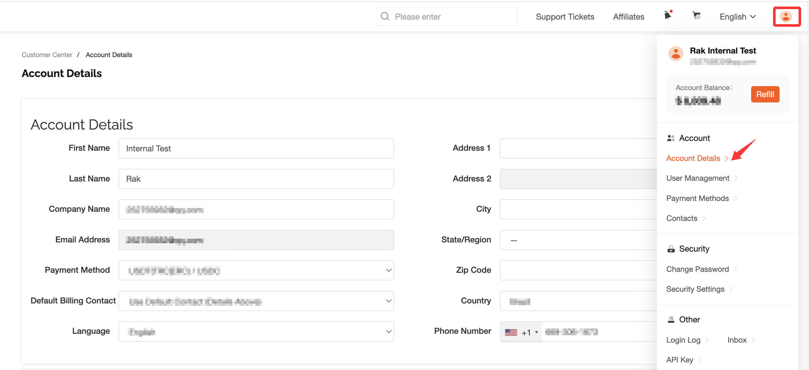
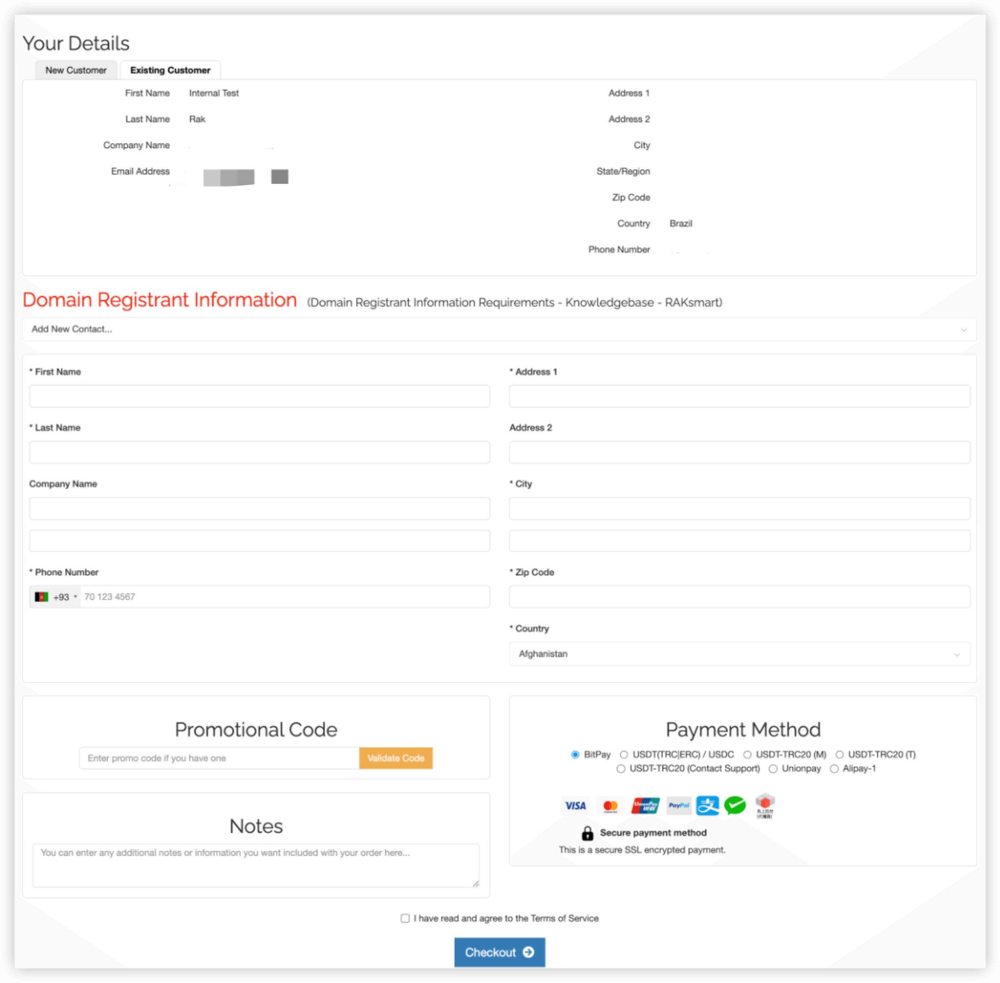

# Domain registration information requirements

1.Before registering a domain, please modify your account information to meet the requirements of domain name registration information as follows:

（1）Click on the avatar in the top right corner.

（2）Click on "Account Details".

（3）Name must not be empty, and can only use English or Pinyin.

（4）Surname must not be empty, and can only use English or Pinyin.

（5）Company name can be left blank. If filled in, it can only use English or Pinyin.

（6）Email address must be a valid and legal address. You need to receive a verification email to activate the domain name.

（7）The first line of the street address must not be empty, and can only use English, Pinyin, and numbers.

（8）The second line of the street address can be left blank. If filled in, it can only use English, Pinyin, and numbers.

（9）City must be filled in, and can only use English or Pinyin. It must correspond to Country>>Province>>City.

（10）Province must be filled in, and can only use English or Pinyin. It must correspond to Country>>Province.

（11）Country must be filled in.

（12）Postal code must be filled in, and can only use English or Pinyin. It must correspond to Country>>Province>>City>>Postal Code.

（13）Mobile phone number must be filled in, and make sure it matches the relevant code rules of the selected region.

2.When registering a domain, as shown in the figure below, you need to create or select contact information:

(1）Click on "Help Center" to view domain name information related requirements

(2）Create or select contact information. If you have not created contact information before, you must create a new one for the first time you register a domain name. If you have created one before, you can directly click to select.

(3）Name must not be empty, and can only use English or Pinyin

(4）Surname must not be empty, and can only use English or Pinyin

(5）Company name can be left blank. If filled in, it can only use English or Pinyin

(6）Email address must be a valid and legal address. You need to receive a verification email to activate the domain name

(7）The first line of the street address must not be empty, and can only use English, Pinyin, and numbers

(8）The second line of the street address can be left blank. If filled in, it can only use English, Pinyin, and numbers

(9）City must be filled in, and can only use English or Pinyin. It must correspond to Country>>Province>>City.

(10）Province must be filled in, and can only use English or Pinyin. It must correspond to Country>>Province.

(11）Country must be filled in.

(12）Postal code must be filled in, and can only use English or Pinyin. It must correspond to Country>>Province>>City>>Postal Code.

(13）Mobile phone number must be filled in, and make sure it matches the relevant code rules of the selected region.

3.Important reminder: The domain registration information must meet the above requirements, and Country>>Province>>City>>Postal Code must correspond, otherwise the registration will not be successful!
