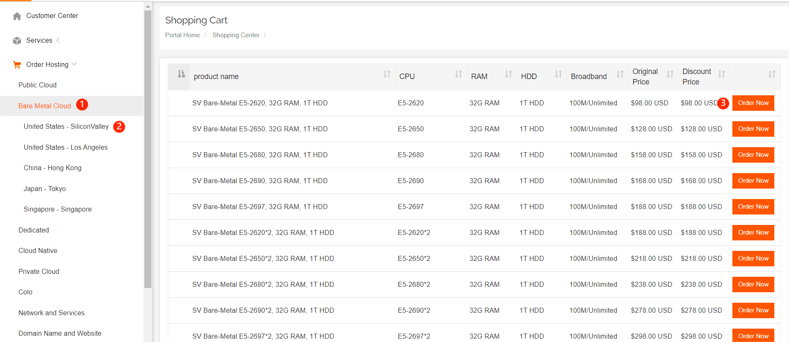
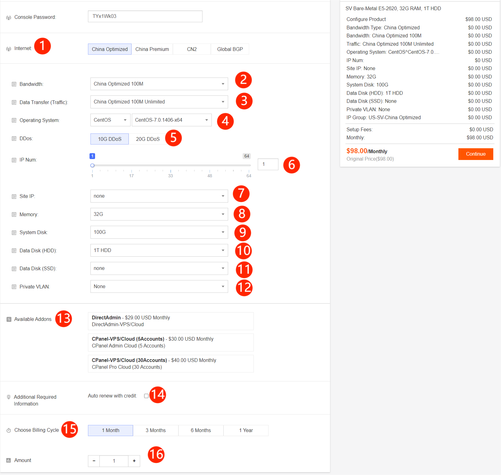

# How to buy a Bare-Metal Cloud

**1****.**How to Choose a Product

（1）Choose a bare-metal cloud product.

（2）Choose a country/region and select the bare-metal cloud product to display all countries/regions. Here, we use the example of the United States-Silicon Valley.

（3）Click "Buy Now."

**2****.**How to Choose Configuration Based on Requirements. Take the United States-Silicon Valley as an example

（1）Choose the required network. If you cannot distinguish between different networks, you can submit a ticket or view the documentation on network introductions.

（2）In different regions and  lines, the maximum bandwidth is different

（3）After selecting the bandwidth, you can select a traffic level.

（4）You can choose the Linux and Windows systems according to your needs.

（5）Choose defense, but not all regions have defense.

（6）You can have up to 64 ordinary IPs, with the default being one.

（7）Station IPs can be added based on ordinary IPs.

（8）You can choose the size.

（9）The system disk size cannot be changed.

（10）The size of the HDD data disk can be selected.

（11）The size of the SSD data disk can be selected, and both HDD and SSD can be used simultaneously.

（12）Intranet: you can set up an intranet in the same region.

（13）Panel services.

（14）Automatic renewal requires that your account has sufficient balance, otherwise it will not take effect.

（15）You can enjoy a 5% discount for quarterly payment, pay for 5 months and use for 6 months for semi-annual payment, and pay for 10 months and use for 12 months for annual payment.

（16）You can place an order for multiple machines with the same configuration.

