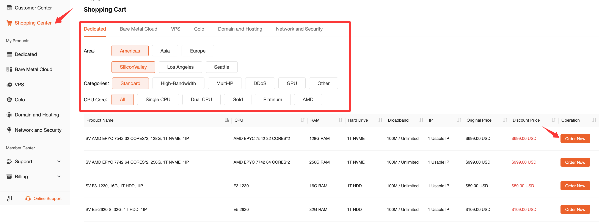
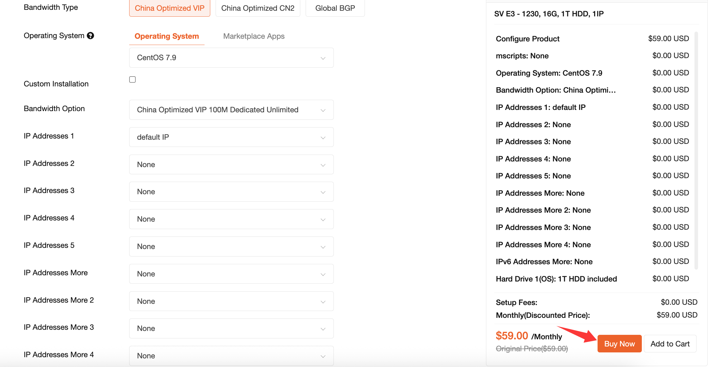
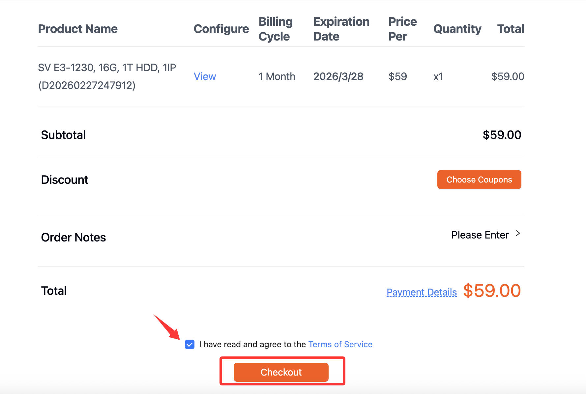
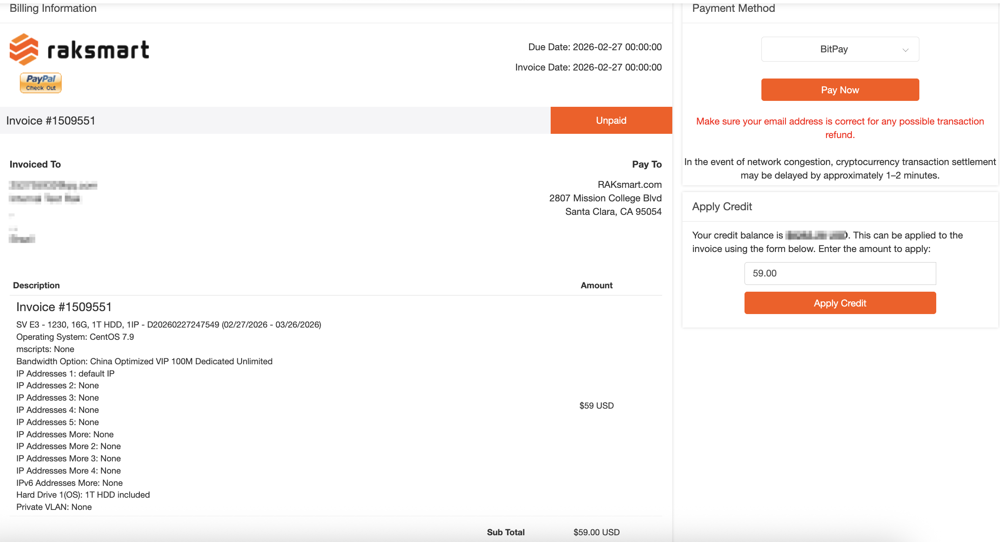

# How to place an order

1.Log in to the RAKsmart customer backend and click on "Shopping Center" to select the product type you need.

2.Click on "Order Now" to go to the configuration selection page.

3.After completing the configuration selection, click on "Continue" to make the payment.

4.Choose the settlement method, click on "Check Out", pay the bill, and after the bill is paid, the service will be launched. Please pay attention to the delivery email.

(1) Enter the verification code and click to validate.

(2) You can fill in special requirements, such as system partition, that you need to specify.

(3) Select the payment method.

(4) You need to agree to the terms of service to make the payment.

(5) Click on "Checkout" to go to the payment page.

5.Choose a payment method, you can choose between balance and non-balance payment.

(1) You can select the payment method.

(2) If you have money in your account, you can use the balance to make the payment.

