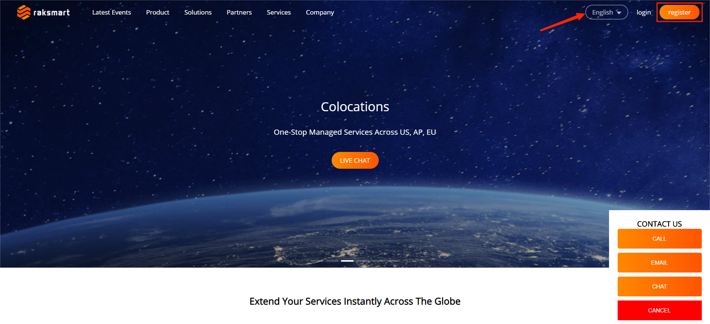
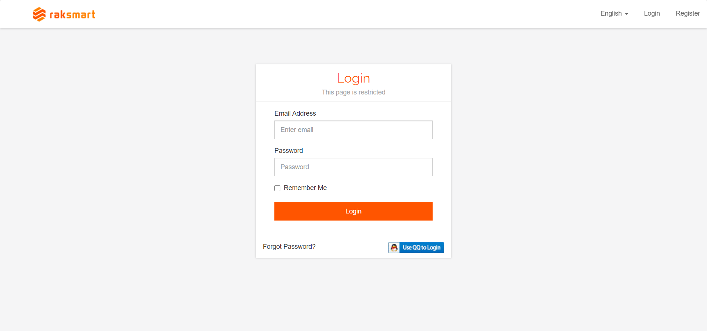

# How to register an account

1.Type the website address http://www.raksmart.com/ into your browser, click on "Register" to enter the registration page (the webpage supports both Chinese and English, and you can switch between them by clicking on the left side of "Login").

2.After completing the registration of your RAKsmart account, enter your account and password , log in to the backend system interface.

3.Backend system interface.

