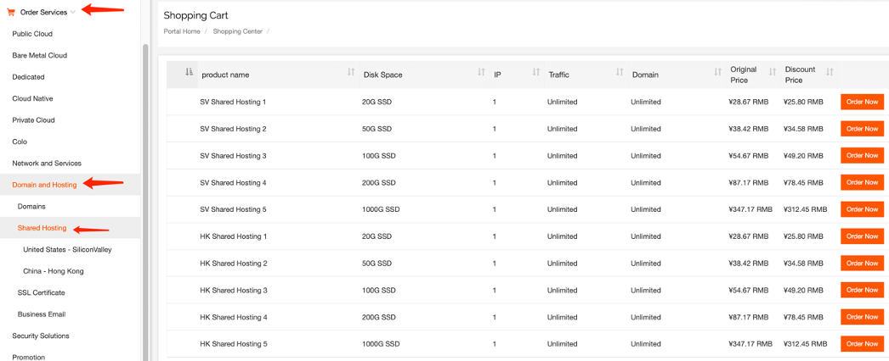
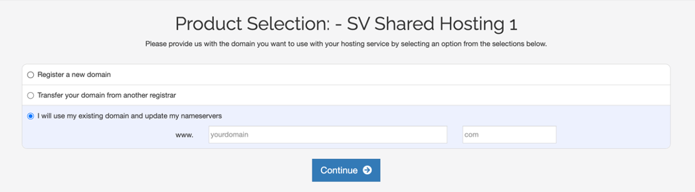
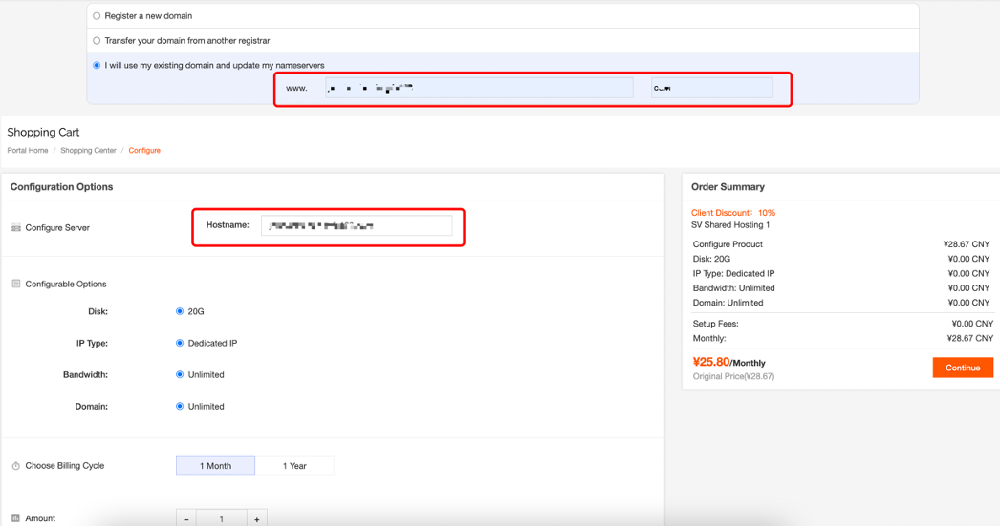
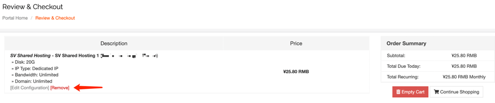
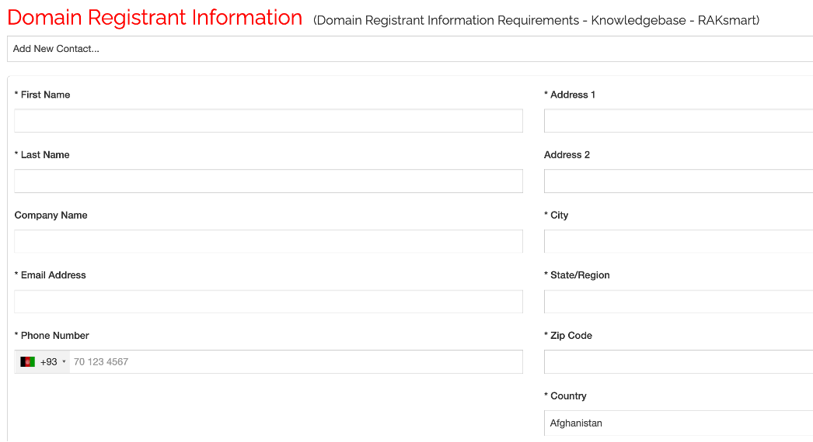
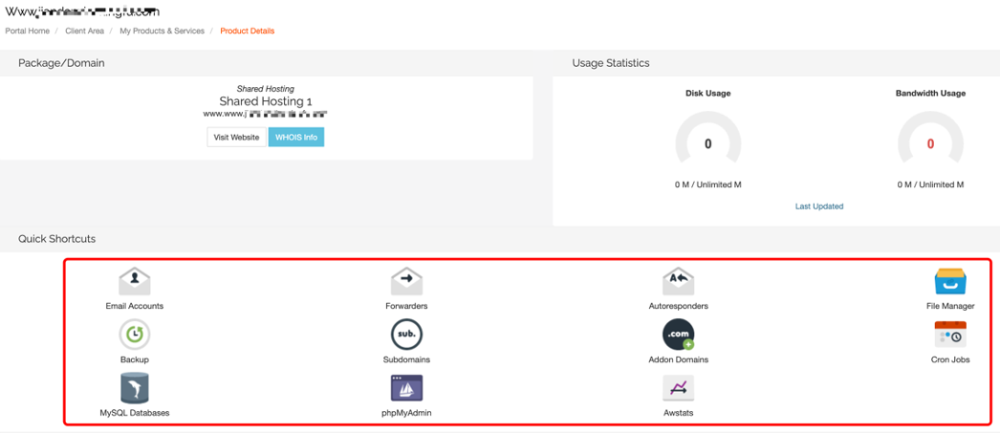

# How to purchase shared hosting

1.Purchase Service - Domain and Website - Shared Hosting - Select the configuration and region based on your requirements - Order Now

2.Pick one out of 3 options: Register a New Domain / Transfer a Domain / Existing Domain Resolution

3.Configuration Setting

The Hostname field cannot be empty; you must enter the domain name here to proceed.

4.Confirm Information

You can remove unnecessary configurations or edit configuration information. 

5.Domain registrant information with a \* symbol is mandatory. Please complete per the instructions provided.

Only numbers, letters, and spaces are allowed

6.After confirming the payment, please wait for successful activation.

7.Click on any item in the snapshot to access the control panel.

