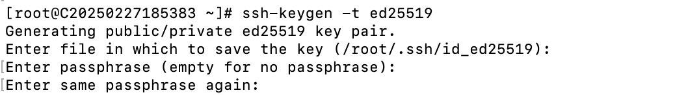
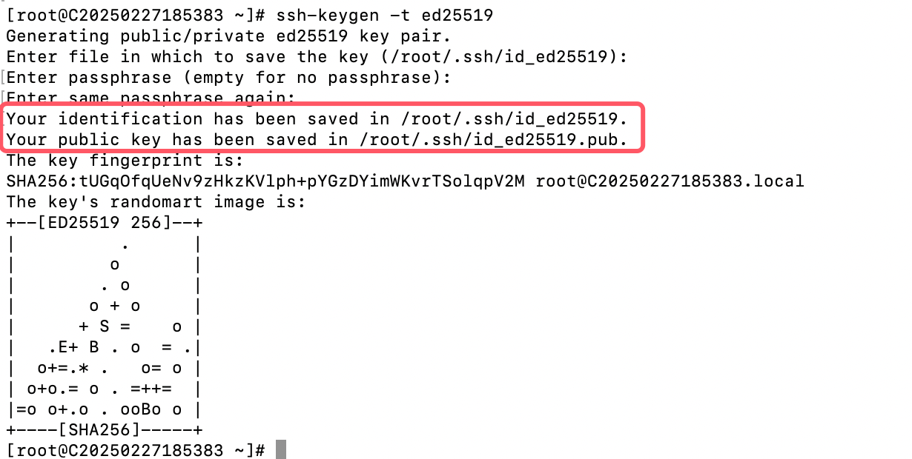
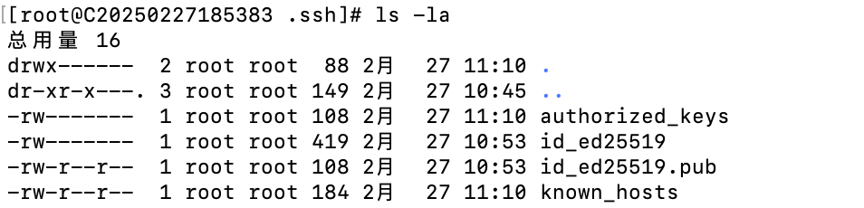

# How to generate an SSH key pair

The main purpose of key-based authentication for remote connections is to enhance security, simplify the login process, and support automation. Compared to password authentication, key authentication offers the following advantages:

    1.Higher security, resisting brute-force attacks and man-in-the-middle attacks.

    2.No need to remember passwords, preventing password leaks.

    3.Support automated tasks and batch management.

    4.Provides fine-grained access control and permission management.

Therefore, key-based authentication is the best practice for remote server connections, especially in production environments or scenarios requiring high security.

This article introduces the process from generating a key pair to using the key for remote login.

### I. Generate an SSH Key Pair

1. On the client machine (the machine you will use to log in remotely), execute the following commands:

#ssh-keygen -t rsa -b 4096

Or, use the more secure Ed25519 algorithm (recommended):

#ssh-keygen -t ed25519

2. When generating the key, you will be prompted to enter a passphrase. This is not required, but it is recommended to add a passphrase to enhance security. If you prefer not to enter a passphrase each time you log in, you can simply press Enter to skip it.

Example:

    After generating the key, two files will be created in the user's `~/.ssh` directory:

- Private key: `id_rsa` or `id_ed25519`
- Public key: `id_rsa.pub` or `id_ed25519.pub`
- The private key (`id_rsa`) is stored locally, while the public key (`id_rsa.pub`) needs to be uploaded to the server.

##

### II. Copy the Public Key to the Remote Server

Next, you need to copy the public key to the `~/.ssh/authorized_keys` file on the remote server.

### Method 1: Use `ssh-copy-id` (recommended)

`ssh-copy-id` is the simplest way to copy the public key. Assuming your remote server's IP address is `192.168.1.100` and the username is `root`, execute the following commands:

#ssh-copy-id -i ~/.ssh/id\_rsa.pub root@192.168.1.100  

Or:

#ssh-copy-id -i ~/.ssh/id\_ed25519.pub root@192.168.1.100

Then enter the password for the remote server. Once completed, the public key will be automatically added to the `~/.ssh/authorized_keys` file on the remote server.

For example:

###

### Method 2: Manually Copy the Public Key If the `ssh-copy-id` command is unavailable, you can manually copy the public key to the remote server:

1. Run the following commands locally to view the public key content:

#cat ~/.ssh/id\_rsa.pub

Or

#cat ~/.ssh/id\_ed25519.pub

  2. Log in to the server remotely:

#ssh [root@192.168.1.100](mailto:root@192.168.1.100)

     3. On the remote server, edit the `~/.ssh/authorized_keys` file:

#mkdir -p ~/.ssh

#chmod 700 ~/.ssh

#vi ~/.ssh/authorized\_keys

     4. Paste the local public key into the `authorized_keys` file, then save and exit.

Modify permissions:

#chmod 600 ~/.ssh/authorized\_keys

[Next, we will introduce how to log in remotely with a private key from macOS, Windows, and different remote tools.](https://billing.raksmart.com/whmcs/index.php?rp=/knowledgebase/977/%E5%A6%82%E4%BD%95%E4%BD%BF%E7%94%A8%E7%A7%81%E9%92%A5%E8%BF%9B%E8%A1%8C%E8%BF%9C%E7%A8%8B%E7%99%BB%E5%BD%95.html)
