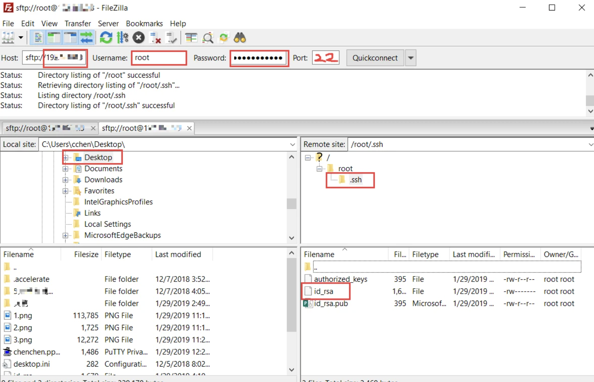
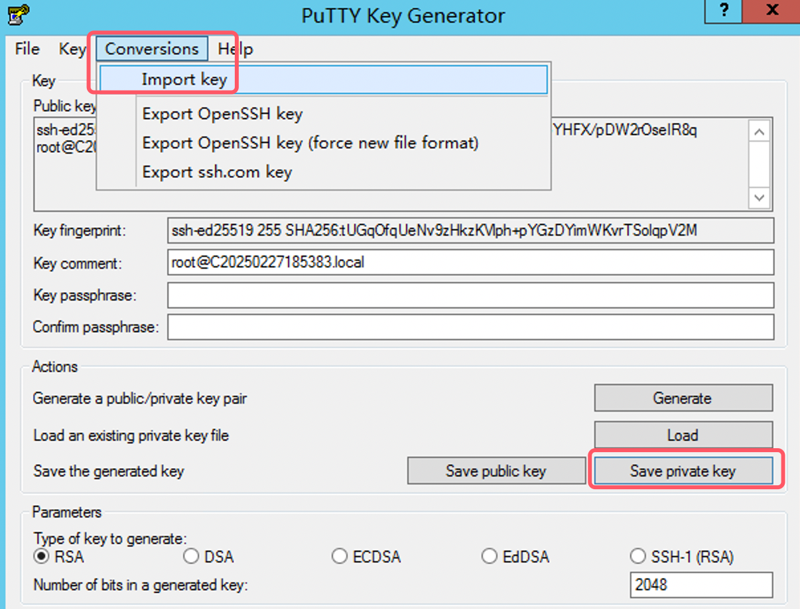
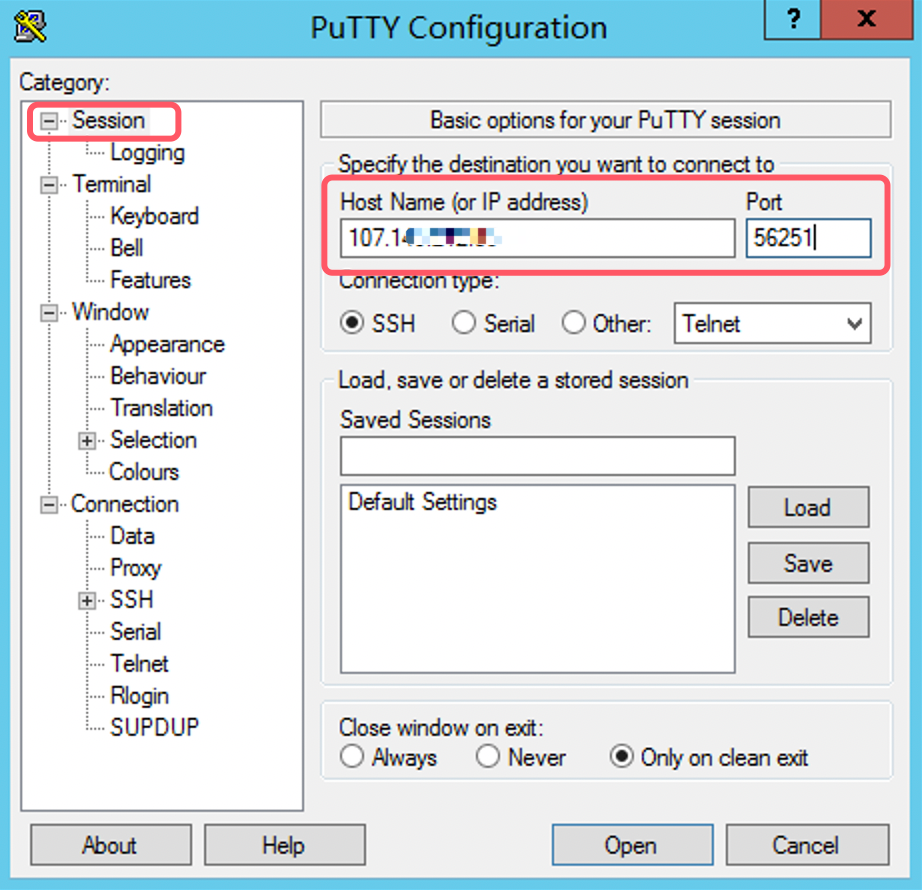
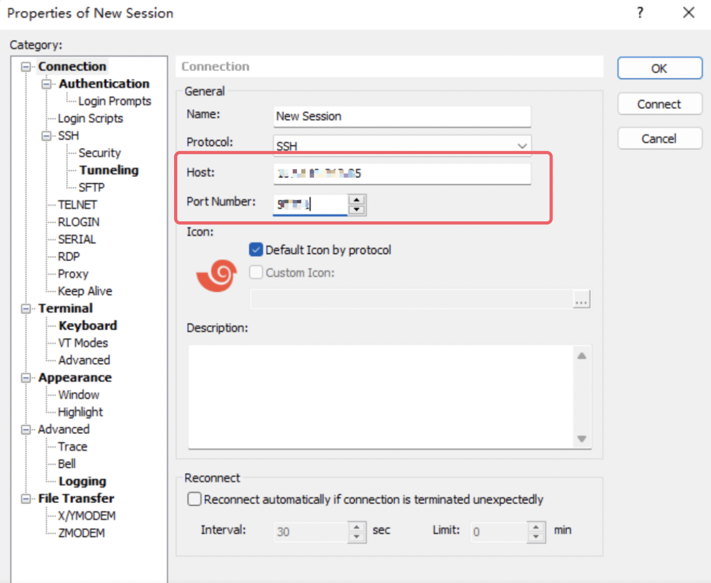
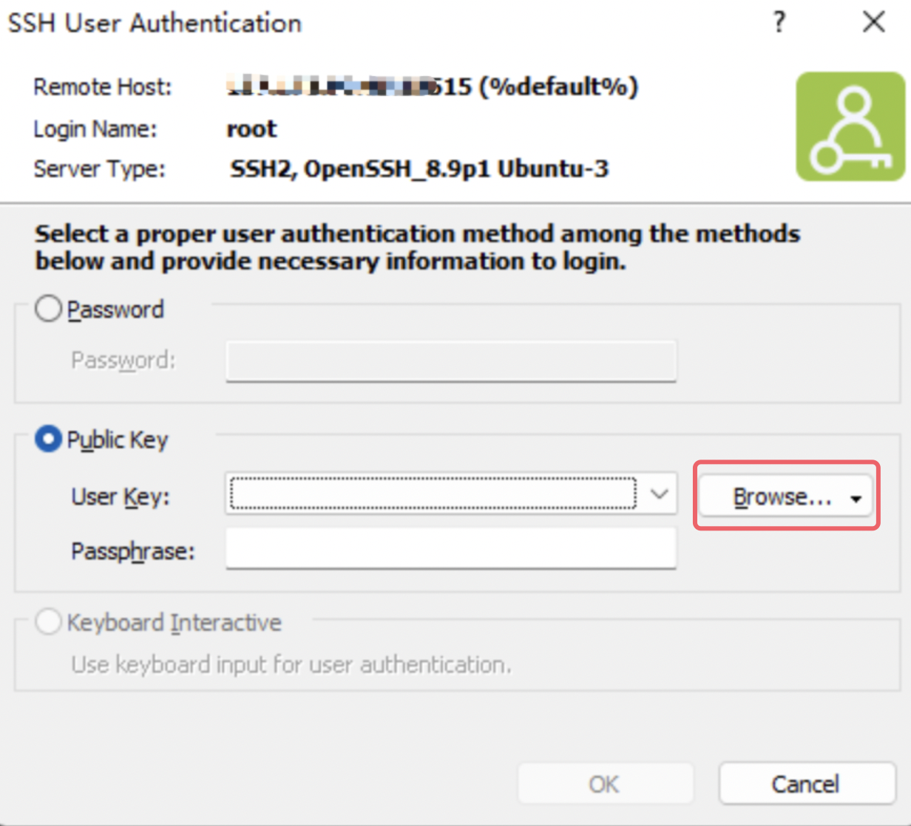

# How to use a private key for remote login

## **This article introduces how to use a private key for remote login with different systems and remote tools**

## Configure the SSH service to allow key-based login

On the **remote server**, ensure that the configuration of SSH allows key authentication:

1. Edit the file `/etc/ssh/sshd_config` :

#sudo vi /etc/ssh/sshd\_config

    2. 确保以下行存在，并且没有被注释（没有 `#`）：Make sure the following lines exist and uncommented(no `#`):

PubkeyAuthentication yes

AuthorizedKeysFile .ssh/authorized\_keys

PasswordAuthentication no # when you wish to disable password authentication

# I. Login Method via Mac Terminal

## 1. Download the private key from the remote server

1.1 Use the SCP command to download the private key

Assuming the remote server's IP address is 192.168.1.100, the username is root, and the private key file is located at /root/.ssh/id\_ed25519 on the remote server, you can use the SCP (Secure Copy Protocol) to download the private key to your Mac.

Execute the following command on **the Mac terminal**:

#scp root@192.168.1.100:/root/.ssh/id\_ed25519 ~/.ssh/id\_ed25519

- **`root@192.168.1.100`：The remote server's username and IP address.**
- **/root/.ssh/id\_ed25519:The path to the private key on the remote server.**
- **`~/.ssh/id_ed25519`:The path where the private key is stored on the local Mac computer.**

**If you want to specify the remote server's port, use `-P` (uppercase P) followed by the port number.**

#scp -P 56251 root@192.168.1.100:/root/.ssh/id\_ed25519 ~/.ssh/id\_ed25519

**1.2 Enter the password.**

When executing the above command, the system will prompt you to enter the remote server's password. After entering the password, the private key will be securely copied to the local `~/.ssh/` directory.

**For example:**

****

## 2.Ensure the correct permissions for the private key.

2.1 SSH requires the private key file to have specific permissions. Ensure the private key's permissions are set to 600, meaning only the file's owner can read and write it.

Execute the following command on **the Mac terminal**:

#chmod 600 ~/.ssh/id\_ed25519

## 3. Use the private key to log in to the remote server

3.1 Use the `ssh` command to connect it

Now that you have downloaded **the private key** to your **Mac** and set the correct permissions, you can use **SSH** to connect to the remote server.

Run the following command:

#ssh -i ~/.ssh/id\_ed25519 root@192.168.1.100

- **`-i ~/.ssh/id_ed25519`: Specify the private key file.**
- **`root@192.168.1.100`: The remote server's username and IP address.**
- **If you need to specify the SSH port of the remote server, add `-p 56251` at the end.**

**For example:**

If the private key does not have a passphrase, SSH will log in directly. If a passphrase is set, the system will prompt you to enter it.

# II. windows system

## 1. Download the private key to a Windows system.

Download private key using SCP or FileZilla.

- If you have SSH access, you can use SCP or FileZilla to download the private key from the remote server to Windows.
- For example, to download the key to your local machine using FileZilla:

# III. Putty connection method.

## 1.Download and install PuTTY and PuTTYgen：

1.1 Open PuTTYgen, load the downloaded id\_rsa private key file, and save it.

1.2 Finally, click *Save private key* to generate the private key file.

###

## 2.Configure the session:

## Open PuTTY

2.1 Enter the server's IP address in the Host Name (or IP address) field.

2.2 Enter the SSH port (e.g., 56251) in the Port field.

2.3 Select **SSH** in the **Connection type**.

## 3. Load the private key:

3.1 在左侧菜单中，依次展开 **Connection > SSH > Auth**。

3.2 在 **Private key file for authentication** 中，点击 **Browse**，选择你保存的 `.ppk` 文件（如 `id_ed25519.ppk`）。

## 4. Connect to server：

4.1 Click ***Open*** to start the connection.

4.2 Enter the username (e.g., root) and press Enter.

4.3 If everything goes well, you should be successfully logged into the server.

# 四、xshell connection method

## Open Xshell:

1. Create a new session:

Click ***File*** > ***New*** on the menu bar to open the New Session window.

2. Configure connection information:

In the Connection tab:

- **Name**: Enter the session's name.
- **Protocol**: Select **SSH**.
- **Host**: Enter the server's IP address (for example, 107.149.212.85).
- **Port Number**: Enter the SSH port (for example, 56251).

3. **Configure Authentication**

- **User key**: Click ***Browse*** and select the private key file you downloaded to your local computer (such as id\_ed25519).
- If the private key has a password, enter its password in **Password**.

