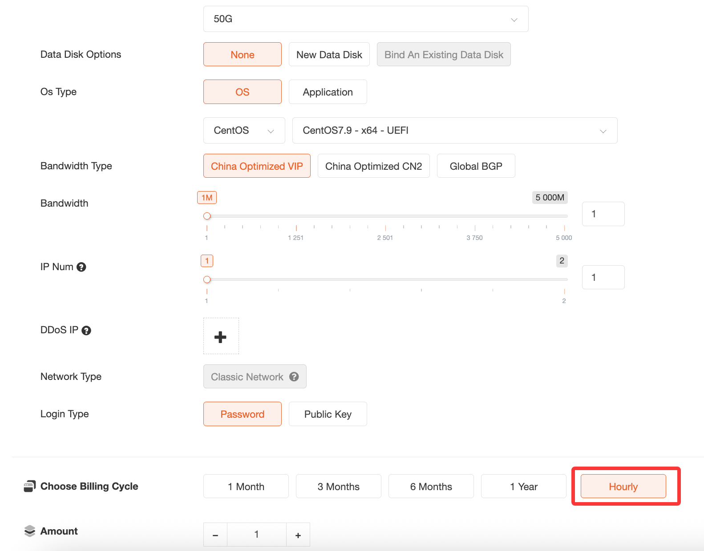

# VPS (hourly billing) product purchase and  its notes

Ⅰ. Purchase

Order Hosting  - VPS - Choose  the hourly billing cycle.

Ⅱ. Product Notes

Hourly-billed VPS products follow the principle of pay-first-use-later, and fees are automatically deducted from the account balance.

If the account balance is insufficient to cover the product fees, the machine will be automatically suspended and terminated after 24 hours (during the suspension period, if the account balance is replenished, the machine will automatically deduct the fees and resume operation). No further automatic deductions will occur after the service is terminated.

Ⅲ. Order Cancellation

If the machine is no longer in use, you can directly apply for cancellation in the backend.

If there is any remaining internal balance, it will be automatically refunded to the platform account balance after the machine is cancelled.
