# 快速入门

## 购买 VPS

本文介绍如何通过 RakSmart 官网 VPS 入口和控制台入口购买 VPS 。

---

### 准备工作

1. 注册 RakSmart 账号，详细步骤可参考[注册 RakSmart 账号](https://cn.raksmart.com/login/index.html)。

2. 为账户充值，确保账户有足够的资金，以免购买产品失败。具体操作，请参考[为 RakSmart 账号充值](钱包管理.md#为%20RakSmart%20账号充值)。

   > **说明**
   >
   > 目前仅 VPS 支持小时计费。小时计费会从账户余额中扣款，为了保证业务连续性，请保持余额充足。

3. 了解 RakSmart 产品和配置项、计费周期、付款方式等信息，参考[购买 RakSmart 产品](购买%20RakSmart%20产品.md#购买%20RakSmart%20产品))。

---

### 通过官网 VPS 入口购买

您可以直接通过 RakSmart 官网 VPS 入口购买所需配置。

---

#### 操作步骤

1. 使用注册的 RakSmart账号登录 [RakSmart 官网](https://cn.raksmart.com/)。

2. 将鼠标悬停在顶部导航 **VPS**，打开产品下拉列表。

   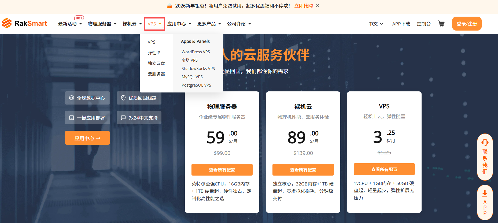

3. 单击 **VPS**，进入 VPS 产品页面。

   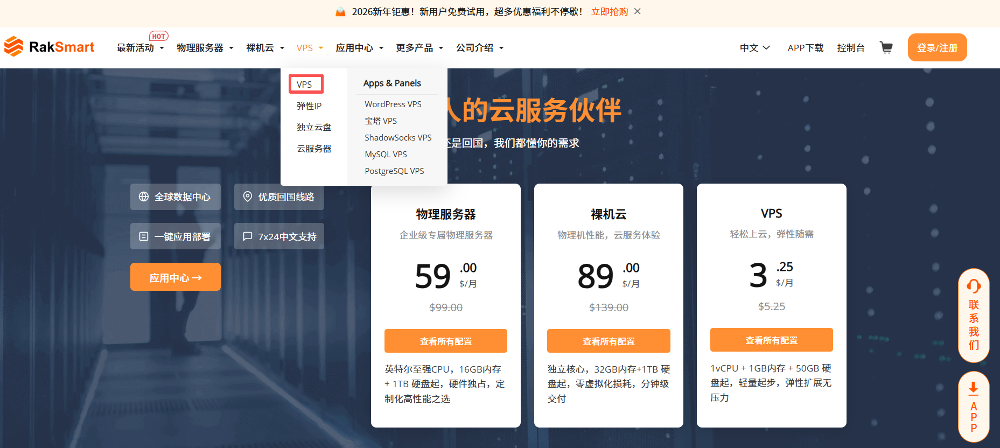

4. 单击**立即订购**。

   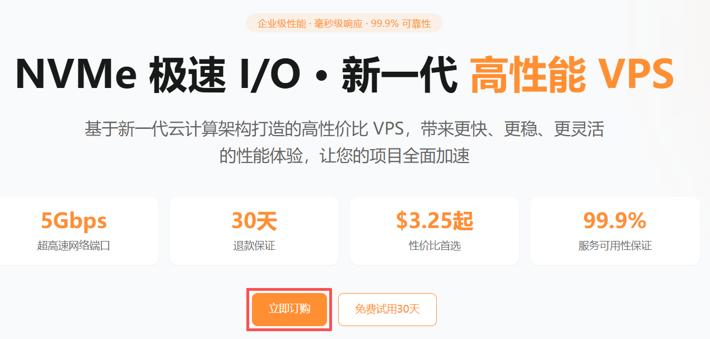

5. 在**配置**购物车页面，参考如下信息完成自定义产品配置。各配置项详细说明，请参考[配置项及付款流程说明](#配置项及付款流程说明)。

   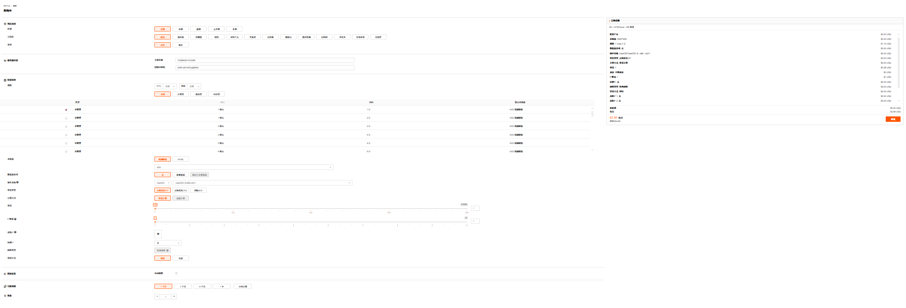

6. （可选）您也可以在上述**VPS的产品页面**，选择一个推荐产品配置，单击**立即购买**。

   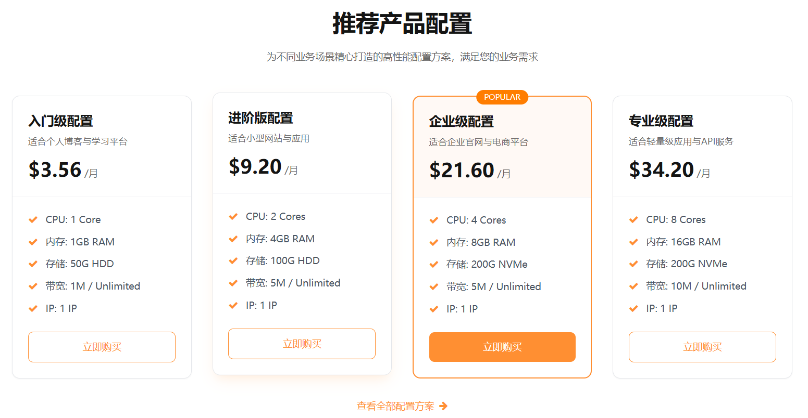

---

### 通过控制台入口购买

本文主要介绍通过 RakSmart 控制台购买中心入口购买 VPS 。

1. 使用注册的 RakSmart 账号登录 [RakSmart 官网](https://cn.raksmart.com/login/index.html)。

   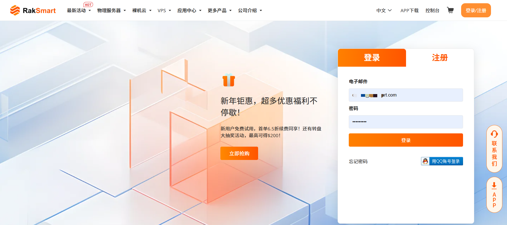

2. 在顶部导航右侧，单击**控制台**，进入控制台客户中心页面。

   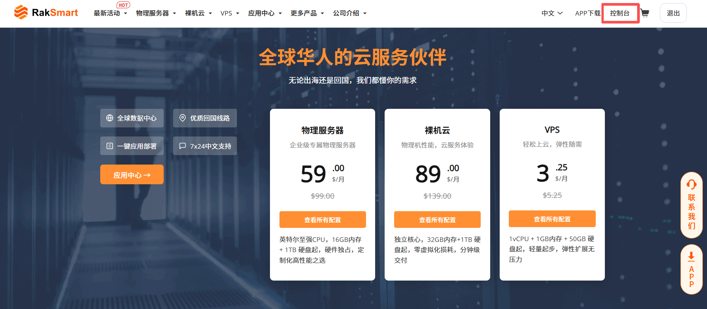

3. 单击**购买中心**，进入**购物车**页面。

   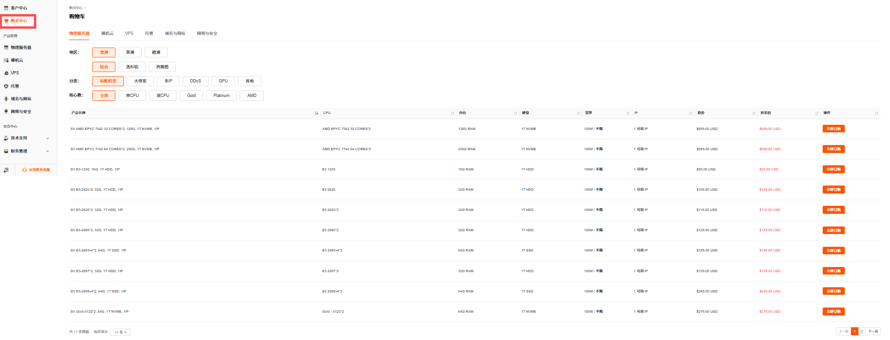

4. 在顶部标签页，单击 **VPS** -> **VPS**，进入**配置**页面。

   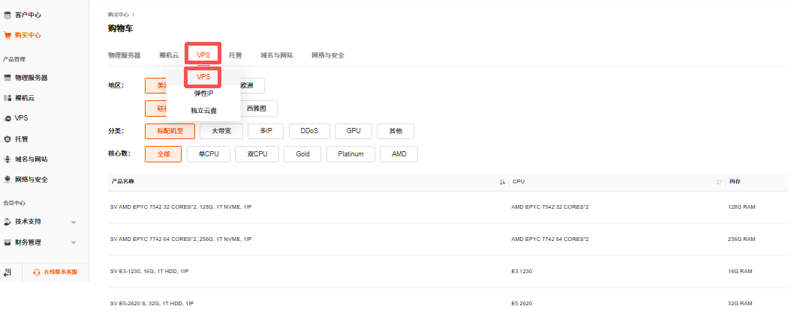

5. 根据业务需求完成产品配置选择。配置方法和付款流程的详细介绍可参考[通过官网 VPS 入口购买](#通过官网%20VPS%20入口购买)。
   

---

### 配置项及付款流程说明

1. 选择地区选项

   选择购买 VPS 的区域、可用区和类型。

   <table width="100%">
      <tr style="text-align: left;">
        <th width="20%">配置项</th>
        <th width="80%">说明</th>
      </tr>
      <tr>
        <td>区域</td>
        <td>请就近选择靠近您业务的区域。VPS 购买后无法更换区域，请谨慎选择。</td>
      </tr>
      <tr>
        <td>可用区</td>
        <td>请就近选择靠近您业务的可用区，可减少网络时延，提高访问速度。VPS 购买后无法更换可用区，请谨慎选择。</td>
      </tr>
       <tr>
        <td>类型</td>
        <td>指服务器的资源分配模式，决定了硬件资源的占用权限。根据您的业务规模和成本预算选择合适的 VPS 类型。 -共享：VPS 实例共享 CPU 资源，成本低但性能易受其他用户影响； -独享：VPS 实例独占 CPU 资源，性能稳定可控，适合对稳定性要求高的业务。</td>
      </tr>
    </table>

2. 服务器设置

   主机名称与控制台密码默认由系统生成，支持自定义修改。

3. 配置选项

   请参考如下信息完成配置**配置选项**。

   <table width="100%">
          <tr style="text-align: left;">
            <th width="20%">配置项</th>
            <th width="80%">说明</th>
          </tr>
          <tr>
            <td>规格</td>
            <td>RakSmart 提供多种类型的 VPS 供您选择，针对不同的应用场景，可以选择不同的规格。</td>
          </tr>
          <tr>
            <td>系统盘</td>
            <td>根据需要选择系统盘的类型。RakSmart 支持的系统盘有两种： - HDD：成本较低，读写速度适中，适合对性能要求不高、预算有限的场景。 - NVME：采用高速固态存储技术，读写速度是机械硬盘的数倍，能显著提升系统响应速度，适合对性能要求较高的业务。</td>
          </tr>
           <tr>
            <td>数据盘选项</td>
            <td>用于存储用户数据、日志和其他应用程序等非系统相关的数据。支持配置新数据盘和绑定已有数据盘。</td>
          </tr>
           <tr>
            <td>操作系统</td>
            <td>服务器运行的系统环境，可选类型包括： - Linux 系统：CentOS、 Ubuntu、Debian、Rocky、Almalinux； - Windows 系统：Windows Server Datacenter 版本。</td>
          </tr>
           <tr>
            <td>带宽类型</td>
            <td>服务器接入的公网线路类型，包含大陆优化 VIP、精品 CN2 和国际 BGP，分别针对中国访问优化、跨境访问等不同场景。</td>
           <tr>
            <td>计费方式</td>
            <td>- 带宽计费：按照网络带宽大小来收取费用的一种计费模式；带宽越大，费用越高。 - 流量计费：按 VPS 实例运行期间实际产生的流量计算费用。</td>
          </tr>  
           <tr>
            <td>带宽</td>
            <td>网络线路在单位时间内能够传输的数据总量。带宽数值越大表示传输能力越强，即在单位时间内传输的数据量越多。</td>
           </tr>
           <tr>
            <td>IP数量</td>
            <td>默认配置 1 个公网 IP，支持额外配置。</td>
          </tr>
           <tr>
            <td>高防IP</td>
            <td>指具备 DDoS 攻击防护能力的独立公网 IP 地址。可根据业务需求自主选择。</td>
          </tr>
   			<tr>
            <td>站群IP</td>
            <td>一组独立的公网 IP 地址，适合搭建多站点业务，可避免单 IP 风险，提升多站点的搜索引擎友好度。</td>
          </tr>
   			<tr>
            <td>登录方式</td>
            <td>支持选择密码登录或更安全的密钥登录。</td>
          </tr>
        </table>

4. 附加信息配置

   根据您的业务需求，选择是否开启自动续费的开关。若开启系统将自动从您的账户余额扣款续费；否则到期后服务将暂停。

5. 选择付款周期

   选择服务的购买时长，支持月付、季度付、半年付和年付。

6. 设置服务器数量

   调整购买服务器的台数。

7. 完成配置填写后，单击**立即购买**。

   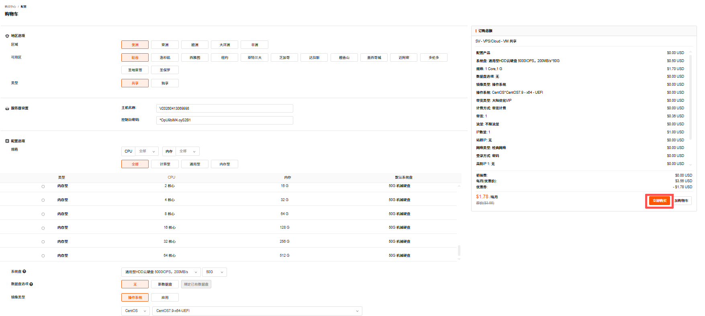

8. 在确认产品页面支持选择优惠券（若有）和输入备注信息；确认没有问题后，勾选**我已阅读并同意**服务条款，单击**结算**。

   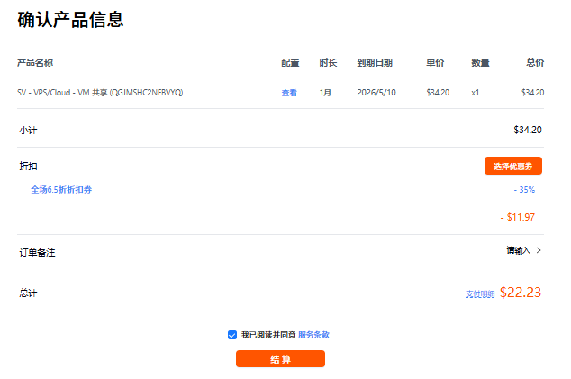

9. 在**支付**页面，选择某一个付款方式支付或者使用余额支付。

   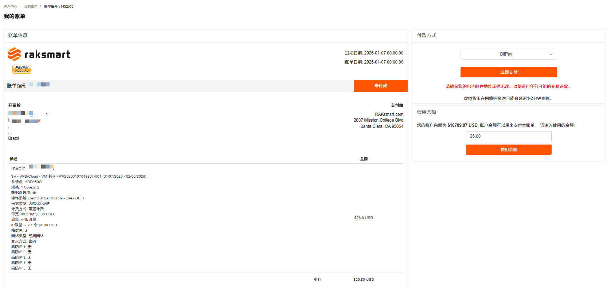

10. 支付完成后如下图所示。

    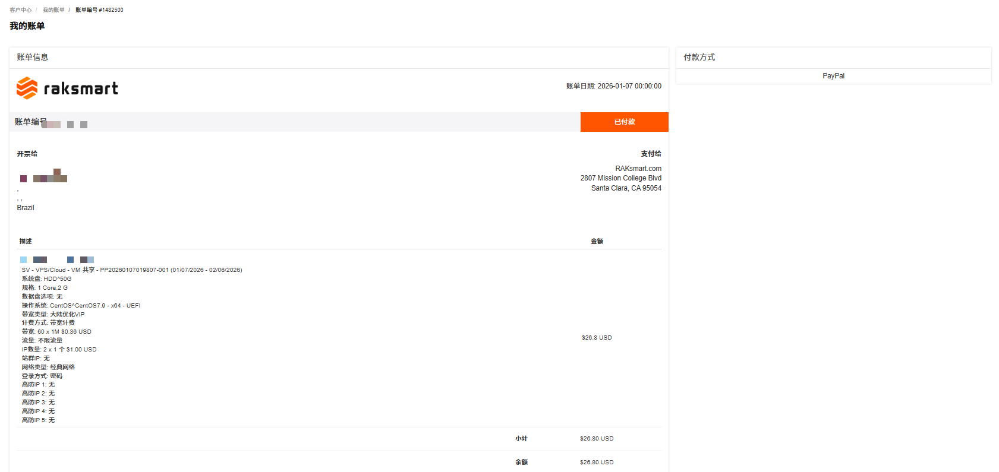

---

### 操作结果

1. 返回控制台，在左侧导航**产品管理**区域单击 **VPS**，进入**我的产品与服务**页面。

2. 选择**地区**或**状态**，或在搜索框中输入需要查找的 VPS 信息。当目标 VPS 的状态由**审核中**变为**有效的**时，即可以正常使用此 VPS 。

   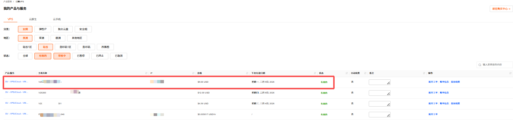

---

### 后续操作

开通 VPS 成功后，您可以开始使用 VPS 。详细内容可参考[登录 VPS](#登录%20VPS)。

## 登录 VPS

根据购买时选择的 VPS 操作系统类型的不同，您可以选择 Windows 登录方式或 Linux 登录方式。

---

### 前提条件

已购买并开通 VPS 。详细内容可参考[购买 VPS](#购买%20VPS)。

---

### 登录 Windows VPS

Windows VPS 支持通过控制台 VNC 登录和远程桌面登录。

#### 方式 1：通过控制台 VNC 登录

控制台 VNC 是连接 VPS 的可视化操作界面，可进行系统操作、文件管理等操作。

1. 登录 [RakSmart 控制台](https://billing.raksmart.com/whmcs/clientarea.php?language=chinese-cn)。

2. 在控制台左侧导航**产品管理**区域，单击 **VPS**，进入**我的产品与服务**页面。此页面默认展示当前区域全部已购买的 VPS 。

   

3. 你可以通过地区或状态查找目标VPS 。单击**产品/服务**名称，进入此 VPS 的产品详情页面。

   

4. 单击 **VNC**，进入 VNC 连接面板。

   

5. 在 Windows 系统登录界面，输入服务器密码，完成登录。

   

#### 方式 2：使用远程桌面登录

本例以 Windows 系统自带的远程桌面连接应用作简要说明。

1. 在本地 Windows 电脑上，按 **Win + R** 键打开**运行**对话框，输入 **mstsc**，单击**确定**，进入**远程桌面连接**页面。

   

2. 在**计算机**输入框中，输入 Windows 服务器的公网 IP 地址，如：192.168.1.1。默认的远程桌面端口默认为 3389，如果服务器修改了默认的端口，则需在 IP 加上冒号和本机端口号，如：192.168.1.1:3390。

   

3. 单击**连接**。

4. 在弹出的窗口中，输入服务器的**管理员账号**（通常是 Administrator）和对应的密码，单击**确定**。

   

---

### 登录 Linux VPS

登录 Linux VPS 包含使用控制台 VNC 功能登录和使用 SSH 客户端远程登录两种方式。

#### 方式 1：通过控制台 VNC 功能连接服务器

控制台 VNC 是连接 VPS 的可视化操作界面，可进行系统操作、文件管理等操作。

1. 登录 [RakSmart 控制台](https://billing.raksmart.com/whmcs/clientarea.php?language=chinese-cn)。

2. 在顶部导航右侧，单击**控制台**，进入控制台**客户中心**页面。

   

3. 在左侧导航**产品管理**区域，单击 **VPS**，进入**我的产品与服务**页面。

   

4. 你可以通过**地区**或**状态**查找目标VPS 。单击**产品/服务**名称，进入此 VPS 的**管理产品**页面。

   

5. 单击 **VNC**。

   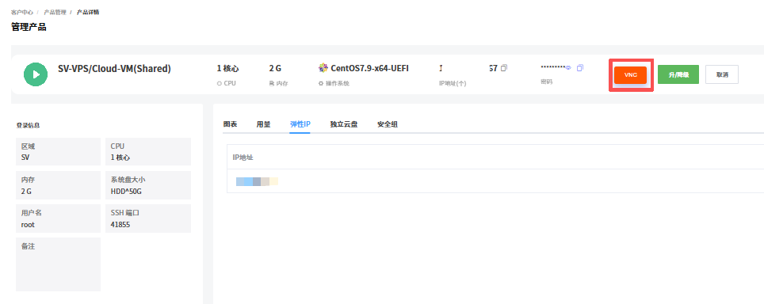

6. 在确认运行页面勾选确认信息，单击 **Run**。进入连接命令行界面。

   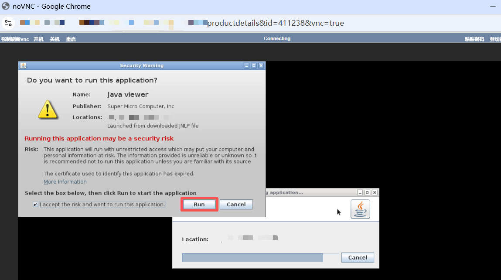

7. 在命令行页面输入用户名和密码。用户名默认为 root，密码可查看购买 VPS 时 RakSmart 发送的产品信息邮件。

   

8. 连接服务器成功。

   

#### 方式 2：使用 SSH 客户端远程连接 VPS

此方式是指使用 SSH 客户端工具，在本地设备上通过网络远程访问 VPS ，登录系统进行命令行操作的过程。

##### 前提条件

本地设备已安装 SSH 客户端：

- 本地设备为 Windows 系统时可使用 PuTTY、Xshell；
- 本地设备为 Mac/Linux 系统时可使用自带终端。

##### 操作步骤

1. 打开本地 SSH 客户端工具。

   

2. 在连接配置中填写如下信息。

   <table width="100%">
      <tr style="text-align: left;">
        <th width="20%">配置项</th>
        <th width="80%">说明</th>
      </tr>
      <tr>
        <td>名称</td>
        <td>服务器主机名。</td>
      </tr>
      <tr>
        <td>主机地址</td>
        <td>服务器主 IP。</td>
      </tr>
       <tr>
        <td>端口</td>
        <td>端口：默认 SSH 端口为 22；</td>
      </tr>
   	<tr>
        <td>方法</td>
        <td>支持密码、公钥和 Keyboard Interactive方式，选择其中一种方式。</td>
      </tr>
   	<tr>
        <td>用户名</td>
        <td>root（对应操作系统用户名）。</td>
      </tr><tr>
        <td>密码</td>
        <td>服务器连接密码。可在产品信息邮件中查找对应密码。产品信息邮件会在产品购买开通后由 RakSmart 发送给用户。</td>
      </tr>
    </table>

3. 单击**确定**，远程连接服务器成功如下图所示。

   
